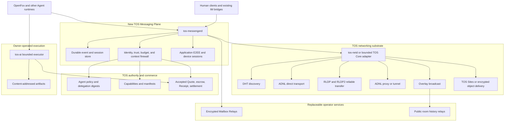

# TOS Decentralized Agent-Native Messenger Architecture

**Document status:** Draft target architecture and implementation inventory  
**Status date:** 2026-08-19  
**Candidate protocol family:** `tos.messaging.*`  
**Relationship to TOS Service Protocol:** complementary; this document does not change the authority model of `tos_service_v1`

## 1. Purpose

This document defines how the existing TOS ecosystem can be extended into a
decentralized, Agent-native Messenger for human-to-Agent and Agent-to-Agent
communication.

The design starts from infrastructure that already exists in the TOS
repositories:

- finalized Agent and Capability identity on TOS;
- bounded controller policies and delegation digests;
- DHT, ADNL, RLDP/RLDP2, Overlay, ADNL proxy/tunnel, and TOS Sites networking
  primitives;
- Agent Packet V1 and signed Contact Cards;
- A2A and MCP adapters;
- Quote, escrow, Receipt, and settlement objects;
- the `tos-ai` bounded execution and artifact foundation; and
- the OpenFox always-on Agent runtime.

The missing product is not another blockchain. It is an off-chain messaging
plane that uses TOS for identity, authorization, revocation, optional commerce,
and independently verifiable service outcomes.

This document deliberately distinguishes existing implementation from proposed
work. It must not be used to advertise a target feature as deployed merely
because a lower-level primitive already exists.

## 2. Status convention

- **✅ Implemented** — qualifying code and repository evidence exist for the
  stated component. Public deployment or independent operator acceptance may
  still be governed by `ROADMAP.md`.
- **🟡 Partial** — a reusable primitive, reference implementation, or design
  exists, but Messenger-specific behavior or production acceptance is missing.
- **⬜ To be developed** — no qualifying implementation for the stated
  Messenger component was found.

Status in this document is narrower than release readiness. For example, ADNL
code may be implemented while a production Mailbox Relay product using ADNL is
still pending. Likewise, a local adapter may be implemented while an external
interoperability gate remains incomplete.

## 3. Executive decision

TOS should add a dedicated **Messaging Plane** between Agent runtimes and the
existing networking substrate:

```text
Human clients / OpenFox / other Agent runtimes
                       |
                       v
              TOS Messaging Plane
     sessions, E2EE, inboxes, rooms, event logs,
     delivery semantics, policy, and local history
                       |
                       v
       DHT / ADNL / RLDP / Overlay / TOS Sites
                       |
                       v
      TOS identity / authorization / settlement
```

The core architectural rule is:

> TOS finality establishes who an Agent is and what authority it has. The
> Messenger establishes a private, asynchronous, durable conversation with
> that Agent. A transport, Gateway, Relay, or UI never becomes identity or
> payment authority.

The initial product should be an OpenFox-to-OpenFox Messenger with direct ADNL
transport, application-layer end-to-end encryption, durable local state, and a
replaceable encrypted offline Mailbox Relay. Group rooms, public channels,
mobile clients, and Relay economics should follow after the one-to-one path is
accepted.

## 4. Current implementation inventory

### 4.1 Already implemented and reusable

| Foundation | Status | Existing evidence | Reuse in the Messenger |
|---|---:|---|---|
| Finalized Agent and Capability objects | ✅ | `NATIVE_IDENTITY_V1.md`, Native Registry state machines, `tos`, and `tos-service-protocol` | Permanent Agent identity, live/tombstoned checks, controller authorization, Capability ownership |
| Weighted Ed25519 controller policies and purpose separation | ✅ | `NATIVE_IDENTITY_V1.md` | Keep root and policy keys outside the messaging daemon; authorize bounded messaging keys through delegation |
| Off-chain delegation documents committed by digest | ✅ | `NATIVE_IDENTITY_V1.md` | Bind a Messaging Endpoint delegation without storing endpoint details or message data on-chain |
| DHT implementation and DHT server | ✅ | `tos/dht`, `tos/dht-server` | Publish and resolve short-lived signed locators and content digests |
| ADNL peer, channel, address, proxy, and tunnel primitives | ✅ | `tos/adnl` | Direct node transport and network-level routing primitives |
| RLDP and RLDP2 reliable transfer | ✅ | `tos/rldp`, `tos/rldp2` | Reliable transfer of larger envelopes, history segments, descriptors, and attachments |
| Overlay broadcast primitives | ✅ | `tos/overlay`, including simple, FEC, Plumtree, and two-step broadcast implementations | Future public channels and Relay mesh distribution |
| TOS Sites and RLDP HTTP proxy primitives | ✅ | `tos/ton-http-proxy`, `tos/rldp-http-proxy`, and TOS Core documentation | Serve signed descriptors, prekey bundles, encrypted attachments, and public room history |
| Agent Packet V1 signing and strict wire codec | ✅ | `tos-service-protocol/pkg/agentpacket` | Reuse for independently signed task/control packets and optional Accepted Quote binding |
| Signed Contact Card reference implementation | ✅ | `tos-service-protocol/pkg/agentpacket/contact.go` | Bootstrap HTTPS discovery and provide migration input for a richer Messaging Contact Descriptor |
| Finalized Agent verification for packets | ✅ | `tos-service-protocol/pkg/agentpacket` | Reject unknown, revoked, or unauthorized senders before application delivery |
| A2A and MCP execution adapters | ✅ | `tos-ai/pkg/a2aadapter`, `tos-ai/pkg/mcpadapter` | Preserve standard task and tool semantics inside a Messenger conversation |
| Shared cross-transport Native Execution Gate | ✅ | `tos-ai` and `NATIVE_EXECUTION_GATE_V1.md` | Prevent one funded purchase from executing twice when submitted over different transports |
| Bounded execution, content-addressed artifacts, and at-most-once job journal | ✅ | `tos-ai` | Execute paid work safely after Messenger policy and finalized escrow checks |
| OpenFox always-on runtime and existing human IM channels | ✅ | `tosnetwork/openfox` | First Agent runtime and human bridge for the Messenger |

### 4.2 Partially implemented foundations

| Foundation | Status | What exists | What is still missing |
|---|---:|---|---|
| Agent Packet as a general chat envelope | 🟡 | Sender/recipient Agent IDs, mandatory Capability ID, nonce, sequence, payload digest, signature, optional Quote commitment, and strict JSON | No conversation or room identity, no application E2EE, no multi-device model, no delivery ACK model, and no ordinary-chat profile without a Capability |
| Agent Packet replay protection | 🟡 | Reference `ReplayGuard` rejects repeated `sender_agent_id + nonce` during process lifetime | The current reference guard is in-memory; a production Messenger needs an atomic durable replay and deduplication journal that survives restart and multi-process deployment |
| Contact Card discovery | 🟡 | Signed Agent ID, network tuple, one HTTPS endpoint, optional Capability IDs, and bounded expiry | No ADNL ID, Messaging Endpoint ID, device set, prekey bundle, Mailbox Relay set, protocol negotiation, or key-rotation metadata |
| ADNL proxy and tunnel support | 🟡 | Proxy/tunnel protocol code exists in TOS Core | A supported home/site reverse-tunnel service, operator runbook, health model, quotas, abuse controls, and multi-operator failover remain product work |
| Overlay for rooms | 🟡 | Broadcast and peer-management primitives exist | No Messenger room identity, membership state, roles, encryption epochs, moderation, history synchronization, or room-level conformance tests |
| TOS service commerce | 🟡 | Core Quote, escrow, Receipt, settlement, SDK, and execution-gate implementations exist | Current-domain public evidence and independent external acceptance remain governed by `ROADMAP.md`; Messenger session and Relay service profiles are not defined |
| OpenFox economic bridge | 🟡 | Architecture and required interfaces are documented in `OPENFOX_ECONOMIC_BRIDGE_V1.md` | A production TOS Messenger channel, durable conversation integration, and fresh OpenFox buyer/provider acceptance session are not implemented |
| Mobile TOS clients | 🟡 | Owner-controlled mobile service-client architecture is documented | Messenger session storage, push wake-up, multi-device key management, room UI, and messaging conformance are not implemented |
| Attachment storage primitives | 🟡 | TOS Sites, RLDP, and `tos-ai` content-addressed artifact storage exist | A private Messenger attachment format, encryption policy, retention, authorization, scanning, and garbage collection are missing |

### 4.3 Messenger components that must be developed

| Messenger component | Status |
|---|---:|
| Messaging Endpoint delegation schema and verifier | ⬜ To be developed |
| Messaging Contact Descriptor and DHT locator profile | ⬜ To be developed |
| One-to-one application-layer end-to-end encryption | ⬜ To be developed |
| Multi-device session and key-rotation model | ⬜ To be developed |
| Durable conversation event store and replay journal | ⬜ To be developed |
| Delivery, storage, application, and optional read acknowledgements | ⬜ To be developed |
| Encrypted offline Mailbox Relay | ⬜ To be developed |
| Multi-Relay redundancy and failover | ⬜ To be developed |
| Private group encryption and membership epochs | ⬜ To be developed |
| Public Agent channels over Overlay with history synchronization | ⬜ To be developed |
| Messenger-specific encrypted attachment protocol | ⬜ To be developed |
| OpenFox `tos-messenger` channel adapter | ⬜ To be developed |
| Agent message policy engine and prompt-injection firewall | ⬜ To be developed |
| Native desktop, Web, iOS, and Android Messenger clients | ⬜ To be developed |
| Relay/attachment Capability and bounded service-payment profiles | ⬜ To be developed |
| Cross-implementation positive vectors and adversarial corpus | ⬜ To be developed |
| Independent multi-operator interoperability evidence | ⬜ To be developed |

## 5. Goals and non-goals

### 5.1 Goals

The Messenger should provide:

1. persistent TOS Agent identity independent of any Gateway, Relay, domain, or
   device;
2. direct Agent-to-Agent communication when both endpoints are reachable;
3. encrypted asynchronous delivery when either endpoint is offline;
4. application-layer end-to-end encryption independent of ADNL, HTTPS, or Relay
   transport;
5. one-to-one conversations, multi-device synchronization, private rooms, and
   public Agent channels;
6. typed Agent events rather than text-only messages;
7. A2A and MCP interoperability without replacing their task or tool semantics;
8. optional binding to Accepted Quotes, escrow, Receipts, and settlement;
9. replaceable discovery services and Mailbox Relays;
10. safe integration with OpenFox and physical edge AI nodes; and
11. an implementation status and acceptance model that never confuses a core
    primitive with a complete product.

### 5.2 Non-goals

The Messenger must not:

- store ordinary messages, contacts, private room membership, model traces, or
  attachments on-chain;
- introduce a second source of Agent, Capability, payment, or Receipt authority;
- require one central Gateway or one central Relay;
- settle every token, progress update, or chat message on-chain;
- treat ADNL channel encryption as sufficient application E2EE;
- give remote messages automatic tool, wallet, host, sensor, or actuator
  authority;
- replace A2A task semantics or MCP tool semantics;
- expose raw controller, wallet, executor, or hardware custody keys to the
  Messenger; or
- put blockchain consensus in a physical AI real-time control loop.

## 6. System architecture



### 6.1 Authority plane — ✅ implemented foundation

Finalized TOS state remains the sole canonical authority for:

- Agent identity, controller policy, delegation digests, recovery, and
  revocation;
- Capability ownership, version commitments, and revocation;
- Accepted Quote terms and selected execution authority;
- escrow, Receipt, dispute, release, refund, and settlement state; and
- the network domain and reviewed contract code.

No DHT record, Contact Descriptor, Relay receipt, chat history, push
notification, Gateway response, or local database may override these facts.

### 6.2 Messaging plane — ⬜ to be developed

`tos-messengerd` should own:

- local messaging keys and device sessions, but not Agent controller or wallet
  keys;
- end-to-end encryption;
- conversation and room state;
- durable send, receive, retry, replay, and deduplication journals;
- Relay selection and failover;
- attachment encryption and retrieval;
- typed event validation;
- local trust, approval, and rate policy; and
- an authenticated owner-private API for Agent runtimes and clients.

### 6.3 Network adapter — 🟡 partial

The underlying networking implementations exist, but a bounded product API for
Messenger clients is still needed. The adapter should expose only operations
required by the Messenger, for example:

```text
ResolveDHT
PublishDHT
OpenADNLSession
SendADNLDatagram
SendRLDPObject
ServeRLDPObject
JoinOverlay
PublishOverlayEvent
SubscribeOverlay
GetReachability
```

The adapter should run behind an owner-private Unix socket or equivalent local
boundary. It must not expose validator, wallet, container runtime, or arbitrary
host-control APIs to a remote Agent.

## 7. Data placement and privacy boundary

| Location | Permitted data | Prohibited authority or data |
|---|---|---|
| TOS finalized state | Agent policy, delegation digest, Capability commitments, Accepted Quote, escrow, Receipt, settlement | Chat plaintext, contact graph, private room membership, session keys, ordinary delivery ACKs |
| DHT | Short-lived signed locator, descriptor digest, Relay locator, expiry | Message bodies, complete history, secret prekeys, canonical identity facts |
| ADNL/RLDP/HTTPS transport | Application ciphertext and public routing data | Decrypted message content unless the endpoint is the intended recipient |
| Mailbox Relay | Opaque mailbox identifier, bounded ciphertext, expiry, storage token, delivery state | Plaintext, session keys, Agent controller keys, canonical payment state |
| TOS Sites or object storage | Signed public descriptors, public room history, encrypted attachments, encrypted history chunks | Private attachment keys or unencrypted private history |
| Local Agent/device store | Session state, message history, contact policy, replay journal, attachment keys, owner approvals | Unbounded remote-controlled execution authority |
| Gateway or search index | Derived discovery views and routing hints | Canonical Agent, Capability, Quote, balance, or message-history authority |

Bulk message data remains off-chain. Optional on-chain commitments are allowed
only for explicit high-value workflows, such as an Accepted Quote or Receipt,
not as a default message log.

## 8. Identity and key hierarchy

### 8.1 Existing Agent identity — ✅ implemented

The permanent identity is the finalized TOS `AgentID`. Existing bounded,
weighted Ed25519 policies, purpose separation, revocation, recovery, and
delegation digests remain unchanged.

### 8.2 Messaging Endpoint identity — ⬜ to be developed

A Messaging Endpoint is an online service authorized by an Agent. It is not the
Agent itself and must be independently replaceable and revocable.

A provisional `MessagingEndpointDelegationV1` document should contain at least:

```text
schema
network_domain
agent_id
messaging_endpoint_id
messaging_identity_public_key
adnl_id or transport-key commitment
allowed_protocol_versions
allowed_event_classes
not_before
expires_at
maximum_session_lifetime
contact_descriptor_policy_digest
mailbox_policy_digest
```

The existing Agent account should commit only the immutable delegation digest.
The full document remains off-chain. A verifier must:

1. resolve the Agent from finalized TOS state;
2. reject a tombstoned Agent;
3. obtain the exact delegation document bytes;
4. reproduce the committed digest;
5. verify scope, time bounds, network domain, and intended purpose; and
6. verify that the delegation was authorized under the live Agent policy.

Root Agent controller keys should remain in a wallet or dedicated signer. The
online endpoint key may authenticate Messenger descriptors and sessions but
must not automatically control Agent policy, Capabilities, escrow, or wallet
funds.

### 8.3 Device identity — ⬜ to be developed

Each OpenFox host, mobile client, desktop client, or edge terminal should have a
separate Device ID and device key authorized by one Messaging Endpoint. Device
addition and removal must be visible to other devices and must trigger session
or group-key changes where required.

### 8.4 Session keys — ⬜ to be developed

Session keys are ephemeral application-layer keys derived by an audited
asynchronous handshake. They are not published on-chain and are not reused as
Agent, Capability, wallet, or execution keys.

## 9. Discovery and addressing

### 9.1 Existing discovery — 🟡 partial

The current signed Contact Card proves that a live Agent controller authorized
one HTTPS endpoint for a bounded period. This is useful as a bootstrap and QR
or file exchange format, but it is not sufficient for a decentralized
multi-device Messenger.

### 9.2 Messaging Contact Descriptor — ⬜ to be developed

A provisional `MessagingContactDescriptorV1` should contain:

```text
schema
network_domain
agent_id
messaging_endpoint_id
delegation_digest
supported_messaging_versions
supported_a2a_versions
supported_mcp_versions
adnl_id
optional_https_endpoint
prekey_bundle_digest
mailbox_relay_set_digest
attachment_service_digest
maximum_envelope_bytes
issued_at
expires_at
endpoint_signature
```

The descriptor is signed and non-canonical. Its validity always depends on the
current finalized Agent and delegation state.

### 9.3 DHT locator profile — ⬜ to be developed over ✅ DHT primitives

DHT should be used to locate a current descriptor, not to store chat history.
A bounded DHT value should contain only the data required to retrieve and
verify the full descriptor, for example:

```text
schema
network_domain_digest
agent_id_digest
messaging_endpoint_id
descriptor_digest
descriptor_locator
expires_at
endpoint_signature
```

The complete descriptor and prekey bundle may be fetched through TOS Sites,
RLDP, HTTPS, a QR code, a local file, or another authenticated rendezvous path.
All paths must produce the same digest-authenticated bytes.

### 9.4 Resolution algorithm — ⬜ to be developed

A client resolving another Agent should:

1. resolve the Agent and its live delegation digests from finalized TOS state;
2. obtain one or more candidate Messaging Contact Descriptors;
3. match the network tuple and delegation digest;
4. verify endpoint signature, expiry, and protocol bounds;
5. resolve the ADNL locator or approved fallback route;
6. fetch and verify the prekey bundle;
7. apply local trust and inbox policy; and
8. establish or resume an end-to-end encrypted session.

A stale DHT value may cause temporary unavailability, but it must never restore
a revoked endpoint or change Agent identity.

## 10. Transport strategy

### 10.1 Direct path — 🟡 product integration pending

When both endpoints are reachable, the preferred path is direct ADNL transport.
RLDP/RLDP2 should be used for reliable larger transfers. The same encrypted
Messaging Event must retain its Event ID and semantics if route selection
changes.

### 10.2 Proxy or tunnel path — 🟡 product service pending

Existing ADNL proxy/tunnel primitives may provide reachability for home and
edge nodes. A production service still needs:

- endpoint enrollment and revocation;
- health and reachability reporting;
- bounded bandwidth, connection, and storage quotas;
- abuse prevention and operator isolation;
- Relay discovery and failover;
- deployment and recovery runbooks; and
- independent multi-operator tests.

### 10.3 Offline path — ⬜ to be developed

If direct delivery fails, the sender deposits the same application ciphertext
with one or more Mailbox Relays selected by the recipient. The recipient pulls
or is awakened by a platform push hint, verifies and decrypts locally, commits
the durable Event ID, and acknowledges delivery.

### 10.4 HTTPS fallback — 🟡 bootstrap only

The current Agent Packet HTTP adapter and Contact Card can support early
interoperability and controlled fallback. HTTPS must not become the only route
or the source of Agent authority. Redirects, origins, response sizes, timeouts,
and credentials remain bounded.

## 11. Application-layer end-to-end encryption

**Status: ⬜ To be developed.**

ADNL or TLS transport encryption protects a connection hop. It does not provide
complete Messenger E2EE when messages are stored by an offline Relay, routed
through a proxy, synchronized across devices, or transported by different
protocols.

The cryptographic profile must provide:

- asynchronous session establishment while the recipient is offline;
- mutual binding to finalized Agent identity and an authorized Messaging
  Endpoint;
- forward secrecy and post-compromise recovery;
- authenticated device addition, removal, and key rotation;
- replay and out-of-order handling;
- encrypted attachments;
- algorithm identifiers and a bounded upgrade path;
- a migration path for hybrid post-quantum key establishment; and
- independent test vectors and security review.

The implementation must use reviewed cryptographic libraries and a standardized
prekey-and-ratchet design. It must not invent a new cipher, MAC, signature, or
ratchet construction. The exact cryptographic suite is an M0 freeze decision,
not a choice implied by this architecture document.

For private groups, the project should select a reviewed group key-management
protocol with membership epochs and post-removal confidentiality rather than
fan-out of one long-lived shared key.

## 12. Messaging event model

### 12.1 Outer Relay Envelope — ⬜ to be developed

A Relay should see only the minimum routing and resource information required
to store ciphertext:

```text
RelayEnvelopeV1 {
  schema
  opaque_mailbox_id
  message_id
  ciphertext
  ciphertext_size
  expires_at
  optional_storage_token
}
```

The Relay Envelope is not an Agent signature, payment Receipt, or proof that an
application accepted the message.

### 12.2 Inner Messaging Event — ⬜ to be developed

After decryption, the recipient obtains a typed event such as:

```text
MessagingEventV1 {
  schema
  network_domain
  conversation_id
  event_id
  sender_agent_id
  sender_messaging_endpoint_id
  sender_device_id
  room_id_optional
  thread_id_optional
  reply_to_event_id_optional
  causal_parents
  created_at
  expires_at_optional
  event_kind
  idempotency_key_optional
  content
  attachment_references
  service_binding_optional
}
```

The normal message authentication mechanism is the end-to-end encrypted
session. High-value control events may additionally carry an independently
verifiable Agent or delegated-endpoint signature.

### 12.3 Initial event kinds — ⬜ to be developed

The first implementation should support a small typed set:

```text
text
conversation.invite
conversation.accept
presence.hint
agent.task.request
agent.task.progress
agent.task.result
approval.request
approval.grant
approval.deny
a2a.message
mcp.call
mcp.result
artifact.offer
artifact.reference
service.quote.reference
service.escrow.reference
service.receipt.reference
delivery.ack
application.ack
room.invite
room.membership.commit
room.message
```

Unknown event kinds are preserved only when policy explicitly allows forward
compatibility. They must not be interpreted as tool calls, approvals, or
payments by default.

### 12.4 Relationship to Agent Packet V1 — 🟡 reuse, not replacement

Agent Packet V1 should remain a compact, independently signed Agent-to-Agent
packet with optional commercial binding. It is suitable for a task or control
object that must be verified outside a live session.

The Messenger should not force ordinary conversation events into Agent Packet
V1 because the current packet requires a Capability ID and lacks conversation,
room, device, encryption, and delivery semantics. A `agent.task.request` event
may carry either:

- exact Agent Packet V1 bytes;
- an Agent Packet digest plus retrieval reference; or
- an A2A message mapped under the existing adapter rules.

No Messenger schema should be added as a second canonical object family inside
`tos.service.v1/native.proto`.

## 13. Delivery, ordering, and acknowledgements

**Status: ⬜ To be developed, with a 🟡 Agent Packet replay prototype.**

### 13.1 Delivery semantics

Transport delivery should be **at least once**. Application processing should
be idempotent through a durable claim on the authenticated Event ID and sender
endpoint. A network retry must not create a second application event or a
second paid execution.

The local store must atomically persist:

- inbound ciphertext identity;
- verification and decryption outcome;
- sender/endpoint binding;
- Event ID and conversation ordering metadata;
- application-delivery state; and
- acknowledgement state.

A process restart, device restart, Relay retry, or route switch must not erase
replay protection.

### 13.2 Ordering

One-to-one conversations may use per-device sequence numbers plus causal parent
references. Private rooms require epoch and sender ordering. Public channels
should use signed event identities and deterministic local presentation rather
than pretending that all publishers share one trusted server clock.

### 13.3 Acknowledgement classes

The wire protocol should distinguish:

- `StoredAck` — a Relay durably stored the ciphertext;
- `DeliveryAck` — a recipient device durably accepted and deduplicated the
  event;
- `ApplicationAck` — an Agent runtime accepted the typed event;
- `ReadAck` — an optional user-facing read indication; and
- TOS `Receipt` — a canonical commercial result commitment under an Accepted
  Quote.

A Stored, Delivery, Application, HTTP, ADNL, or read acknowledgement must never
be treated as a TOS Receipt or settlement authorization.

## 14. Encrypted Mailbox Relay

**Status: ⬜ To be developed.**

A decentralized Messenger still requires servers when recipients are offline.
Decentralization means that Relays are replaceable and cannot read messages or
own identity, not that no Relay process exists.

A reference `tos-mailboxd` should:

- accept only bounded opaque ciphertext envelopes;
- use recipient-generated opaque mailbox identifiers;
- enforce per-mailbox size, count, rate, and retention limits;
- return a signed storage acknowledgement;
- support pull, bounded long-poll, or wake-up hints;
- delete or expire ciphertext according to authenticated recipient policy;
- expose no Agent controller, wallet, or execution custody;
- maintain crash-safe storage and deletion journals; and
- publish a signed Relay descriptor and optional TOS Capability.

Recipients should select two or more independently operated Relays for higher
availability. The sender may deposit the same message with each selected Relay;
the recipient's durable Event ID deduplication prevents duplicate application
delivery.

Relay metadata privacy should be improved progressively through opaque mailbox
identifiers, key rotation, batching, bounded padding, and optional sender
privacy. The first version must document which metadata remains visible rather
than claiming perfect traffic-analysis resistance.

## 15. Rooms and channels

### 15.1 Private rooms — ⬜ to be developed

Private rooms require:

- a stable Room ID;
- signed invitations;
- explicit member and role state;
- membership epochs;
- forward-secure group encryption;
- removal that blocks access to later epochs;
- bounded administrator and moderator powers;
- multi-device membership synchronization; and
- deterministic conflict and recovery behavior.

Room membership should remain off-chain by default. A room may optionally bind
an on-chain organization or Capability, but doing so must not publish private
conversation state.

### 15.2 Public Agent channels — 🟡 Overlay primitive implemented; product pending

Public channels may use TOS Overlay for event propagation and RLDP/TOS Sites for
content-addressed history segments. The Messenger must still define:

- publisher authorization;
- channel roles and moderation;
- event signatures and deduplication;
- history segment commitments;
- catch-up and gap repair;
- spam and resource policy; and
- Relay/operator failover.

Overlay broadcast success is not proof that a publisher was authorized or that
a message is canonical payment state.

## 16. Attachments and artifacts

**Status: 🟡 reusable storage primitives; Messenger profile ⬜ to be developed.**

Private attachments should be encrypted before upload. The content address
should commit to ciphertext; the decryption key and plaintext metadata remain
inside the encrypted Messaging Event. Delivery may use RLDP, TOS Sites, or a
bounded storage provider.

The attachment profile must define:

- maximum size and chunking;
- ciphertext digest and optional plaintext digest disclosure policy;
- media type and filename handling;
- per-recipient or per-room key wrapping;
- expiry and deletion behavior;
- interrupted download recovery;
- decompression, archive, parser, and content-bomb limits; and
- sandbox or scanning rules before an Agent consumes the content.

`tos-ai` content-addressed artifact primitives may be reused at the library
level, but a Messenger attachment is not automatically a software-work
Artifact or a canonical Receipt input.

## 17. Agent runtime and prompt-injection boundary

### 17.1 OpenFox integration — ⬜ Messenger adapter to be developed

OpenFox should be the first Agent runtime. A new channel should connect through
an authenticated owner-private local API:

```text
OpenFox
   |
   | Unix socket or equivalent local authenticated IPC
   v
tos-messengerd
```

OpenFox decides whether and how to respond, which model or tool to use, whether
owner approval is required, and whether to purchase or sell a service.
`tos-messengerd` decides how to discover, encrypt, transmit, store, deduplicate,
and deliver events.

Existing Telegram, WeCom, WeChat, Feishu, and other OpenFox human channels can
serve as owner-control bridges while the native TOS clients are being built.
They do not become TOS Agent identity providers.

### 17.2 Context firewall — ⬜ to be developed

A valid signature proves origin, not safety. A legitimate Agent can send a
malicious prompt, attachment, tool request, or payment request.

Before remote content reaches an Agent loop, the Messenger integration must:

1. validate the event schema and authenticated sender/endpoint;
2. classify the event kind;
3. apply contact, room, rate, Capability, and budget policy;
4. mark remote text and attachments as untrusted input;
5. prevent content from entering a system or developer instruction channel;
6. require structured tool and approval objects;
7. route side-effecting operations through owner policy and local approval;
8. bind paid execution to finalized Quote and escrow state; and
9. log a privacy-minimized decision record.

Remote text must never grant MCP tools, wallet signing, shell access,
containerd access, file access, sensor access, or actuator authority merely by
being signed.

### 17.3 Physical AI safety — 🟡 edge execution foundation exists; Messenger profile pending

A physical edge node may run OpenFox and `tos-messengerd`, but Messenger events
must terminate at a local policy and safety boundary. The Messenger must not
replace the local real-time controller or safety interlock. Raw sensors and
actuators remain unavailable unless a separately authorized, bounded local
Capability permits a specific operation.

## 18. A2A, MCP, and TOS commerce integration

### 18.1 Separation of responsibilities

```text
TOS Messenger
  = identity-bound sessions, E2EE, asynchronous delivery, rooms, and history

A2A
  = Agent task, progress, artifact, result, and cancellation semantics

MCP
  = Agent-to-tool invocation semantics

TOS Service Protocol
  = identity, Capability, Quote, escrow, Receipt, dispute, and settlement
```

No layer replaces the authority of another.

### 18.2 Paid task flow — 🟡 foundations implemented; Messenger path pending

```text
Agent A resolves Agent B and its Capability from finalized TOS state
    -> requests and validates a Quote Proposal
    -> commits and funds the Accepted Quote escrow
    -> establishes or resumes a TOS Messenger session
    -> sends an encrypted typed task event carrying A2A or Agent Packet data
    -> Agent B passes the purchase through the shared Native Execution Gate
    -> tos-ai executes once and returns encrypted progress/result events
    -> the execution authority creates the canonical Receipt
    -> release, refund, or dispute is resolved from finalized TOS state
```

The Messenger may carry references to Quote, escrow, and Receipt objects, but
it cannot create them through a chat acknowledgement.

### 18.3 Session economics — ⬜ profiles to be developed

Do not settle per message. Preferred patterns are:

```text
one finalized Quote and bounded budget
    -> many encrypted off-chain events
    -> one or a few canonical Receipts
    -> one final settlement
```

Separate service profiles may later cover Mailbox Relay storage, attachment
storage, public-channel history, or premium routing. Each profile must use the
existing Capability, Quote, escrow, Receipt, and settlement authority model.

## 19. Repository and process boundaries

### 19.1 Existing repositories

| Repository | Messenger responsibility |
|---|---|
| `tos` | Keep consensus and generic DHT/ADNL/RLDP/Overlay/TOS Sites primitives; expose a bounded local adapter if required |
| `tos-service-spec` | Record authority compatibility, integration rules, status, and acceptance requirements; do not add general chat objects to the Native Registry schema |
| `tos-service-protocol` | Reuse finalized resolvers, Agent identity verification, Agent Packet, and commercial builders; do not become a central chat database |
| `tos-service-gateway` | Optional derived discovery or HTTPS routing; no canonical message history or identity authority |
| `tos-ai` | Preserve the bounded executor, artifacts, A2A/MCP adapters, and shared at-most-once execution Gate |
| `openfox` | Add the first `tos-messenger` channel, owner policy, and Agent-loop integration |
| `android` / `ios` | Add owner-controlled Messenger clients after the protocol and daemon are stable |

### 19.2 New implementation repository — ⬜ to be developed

Create a dedicated implementation repository, provisionally
`tosnetwork/tos-messenger`, rather than placing the full Messenger runtime in a
validator, Gateway, or execution-worker repository.

Suggested layout:

```text
cmd/tos-messengerd
cmd/tos-mailboxd
cmd/tos-messenger-cli

pkg/identity
pkg/directory
pkg/netadapter
pkg/session
pkg/e2ee
pkg/envelope
pkg/eventlog
pkg/mailbox
pkg/room
pkg/attachments
pkg/policy
pkg/contextfirewall
pkg/a2abridge
pkg/mcpbridge
pkg/openfoxbridge
pkg/store
```

A separate `tos-messaging-spec` repository may be created after M0 if the wire
protocol needs independent governance. Until then, this document is an
incubation design and must not be treated as a frozen wire specification.

## 20. Security requirements and negative tests

### 20.1 Existing reusable tests — ✅ or 🟡

- strict Agent Packet and Contact Card JSON decoding;
- sender key authorization against finalized Agent state;
- sender and recipient live-state checks;
- packet nonce replay rejection during reference-process lifetime;
- bounded Agent Packet payloads;
- A2A/MCP shared execution-gate replay protection;
- bounded executor and artifact-store conformance; and
- finalized Quote, escrow, Receipt, and settlement checks.

### 20.2 Required Messenger test matrix — ⬜ to be developed

The Messenger cannot be accepted without negative tests covering at least:

1. revoked Agent, Endpoint, and Device keys;
2. stale DHT locators and stale Contact Descriptors;
3. descriptor substitution across network domains;
4. prekey replay, exhaustion, and equivocation;
5. duplicate, reordered, delayed, expired, and cross-Relay messages;
6. process and host crash during send, store, pull, decrypt, and ACK phases;
7. multi-process durable replay claims;
8. malicious Relay deletion, withholding, reordering, and duplication;
9. oversized envelopes, attachments, decompression bombs, and parser abuse;
10. group member removal and access to later epochs;
11. compromised device removal and session recovery;
12. Gateway or Relay takeover without controller keys;
13. metadata leakage and documented residual traffic-analysis exposure;
14. cross-transport duplicate task submission;
15. prompt injection, tool escalation, wallet requests, and unsafe attachments;
16. message ACK presented as a forged TOS Receipt;
17. chain-finality disagreement and network-domain mismatch;
18. offline edge node reconnect and bounded reconciliation; and
19. remote attempts to control physical sensors or actuators outside local
    policy.

Every positive vector must have an independent encoder/decoder or verifier.
Every security-sensitive state transition must have crash and replay tests.

## 21. Implementation plan

### M0 — Architecture, threat model, and protocol freeze

**Status: ⬜ To be developed.**

Deliver:

- frozen authority and data-placement rules;
- formal threat model;
- Messaging Endpoint delegation schema;
- Contact Descriptor and DHT locator schema;
- selected reviewed cryptographic suites;
- one-to-one envelope and event schemas;
- durable replay and event-store contract;
- typed errors and retry dispositions;
- positive vectors and an adversarial corpus; and
- repository ownership and versioning rules.

Accept when two independent implementations reproduce all hashes and reject all
negative vectors.

### M1 — Direct one-to-one Messenger

**Status: ⬜ To be developed over ✅ networking primitives.**

Deliver:

- `tos-messengerd`;
- finalized Agent and Endpoint verification;
- direct ADNL transport plus bounded HTTPS development fallback;
- application E2EE;
- durable local event and replay journals;
- text and basic typed Agent events; and
- OpenFox local IPC prototype.

Accept when two independently operated Agents exchange encrypted messages,
restart both processes, resend duplicates, rotate one Endpoint key, and recover
without a central Gateway or message database.

### M2 — Offline Mailbox and multi-Relay failover

**Status: ⬜ To be developed.**

Deliver `tos-mailboxd`, opaque mailbox identifiers, bounded encrypted storage,
Stored/Delivery/Application ACKs, two-Relay redundancy, retention, quotas,
abuse controls, and crash recovery.

Accept when a recipient remains offline, receives the message after reconnect,
processes it once despite duplicate Relay delivery, and continues after one
Relay is removed.

### M3 — OpenFox, A2A, MCP, and commercial execution

**Status: 🟡 existing execution foundations; Messenger integration ⬜.**

Deliver the OpenFox channel, context firewall, typed A2A/MCP events, Agent
Packet carriage, Quote/escrow references, execution-gate integration, result
return, and Receipt verification.

Accept when an independent OpenFox buyer pays an independent provider, sends
the task through the encrypted Messenger, receives the result, and a third
resolver reconstructs settlement without a shared private database.

### M4 — Multi-device and private rooms

**Status: ⬜ To be developed.**

Deliver device authorization, device removal, history synchronization, private
room membership, group encryption epochs, role policy, and member-removal
conformance.

Accept when a removed device and removed room member cannot decrypt later
events, while remaining devices recover from offline gaps.

### M5 — Public Agent channels over Overlay

**Status: 🟡 Overlay primitive implemented; channel product ⬜.**

Deliver signed channel events, publisher and moderator roles, Overlay
propagation, content-addressed history segments, gap repair, anti-spam policy,
and multi-operator history Relay failover.

Accept when independently operated nodes converge on valid events despite one
malicious or unavailable Relay and reject unauthorized publishers.

### M6 — Native clients

**Status: ⬜ To be developed.**

Deliver Web/desktop, Android, and iOS clients with secure local key storage,
background recovery, QR/contact import, owner approvals, room UI, attachment
handling, and independent finality checks for commercial events.

Accept when changing the selected Gateway or Mailbox Relay does not change
Agent identity, keys, conversation authority, or payment interpretation.

### M7 — Relay and storage economics

**Status: ⬜ To be developed.**

Deliver Mailbox Relay, attachment storage, and public-history Capability
profiles; bounded Quote and quota-token flows; usage evidence; Receipt rules;
and operator accounting.

Accept when one funded service agreement covers many off-chain messages, usage
is bounded and independently auditable, and no per-message on-chain transaction
is required.

## 22. Work-package matrix

| ID | Work package | Target repository | Status |
|---|---|---|---:|
| MSG-001 | Threat model and non-negotiable invariants | `tos-service-spec` | ⬜ |
| MSG-002 | Messaging Endpoint delegation schema and vectors | `tos-service-spec` / future messaging spec | ⬜ |
| MSG-003 | Contact Descriptor and DHT locator profile | future messaging spec | ⬜ |
| MSG-004 | Bounded local TOS network adapter | `tos` / `tos-messenger` | 🟡 primitives exist |
| MSG-005 | One-to-one E2EE profile and vectors | future messaging spec | ⬜ |
| MSG-006 | Durable event, replay, and retry journal | `tos-messenger` | ⬜ |
| MSG-007 | Relay Envelope and Messaging Event codec | `tos-messenger` | ⬜ |
| MSG-008 | Direct ADNL and RLDP transport integration | `tos-messenger` | 🟡 primitives exist |
| MSG-009 | HTTPS bootstrap/fallback adapter | `tos-messenger` | 🟡 Agent Packet HTTP adapter exists |
| MSG-010 | Encrypted Mailbox Relay | `tos-messenger` | ⬜ |
| MSG-011 | Multi-Relay selection and failover | `tos-messenger` | ⬜ |
| MSG-012 | Delivery/Application ACK state machine | `tos-messenger` | ⬜ |
| MSG-013 | Encrypted attachment profile | `tos-messenger` | 🟡 storage primitives exist |
| MSG-014 | OpenFox channel and local IPC | `openfox` | ⬜ |
| MSG-015 | Context firewall and approval policy | `openfox` / `tos-messenger` | ⬜ |
| MSG-016 | A2A event bridge | `tos-messenger` / `tos-ai` | 🟡 A2A execution adapter exists |
| MSG-017 | MCP event bridge | `tos-messenger` / `tos-ai` | 🟡 MCP execution adapter exists |
| MSG-018 | Agent Packet carriage profile | `tos-messenger` / `tos-service-protocol` | 🟡 Agent Packet exists |
| MSG-019 | Quote/escrow/Receipt reference profile | `tos-messenger` / `tos-service-protocol` | 🟡 commerce foundation exists |
| MSG-020 | Multi-device synchronization | `tos-messenger` | ⬜ |
| MSG-021 | Private room protocol | `tos-messenger` | ⬜ |
| MSG-022 | Public channel Overlay integration | `tos-messenger` / `tos` | 🟡 Overlay exists |
| MSG-023 | Desktop/Web client | new or selected client repository | ⬜ |
| MSG-024 | Android client | `android` | ⬜ |
| MSG-025 | iOS client | `ios` | ⬜ |
| MSG-026 | Relay and storage Capability profiles | `tos-service-spec` | ⬜ |
| MSG-027 | Cross-implementation conformance harness | multiple | ⬜ |
| MSG-028 | Independent multi-operator acceptance deployment | deployments and runbooks | ⬜ |

## 23. Minimum viable demonstration

The first public demonstration should prove the complete TOS differentiation,
not merely show a chat UI:

```text
Human owner
   -> existing OpenFox human channel or local UI
   -> OpenFox Agent A
   -> TOS Messenger E2EE session
   -> direct ADNL or encrypted offline Relay
   -> OpenFox Agent B
   -> finalized Capability and funded Accepted Quote
   -> tos-ai bounded execution
   -> encrypted progress and result events
   -> canonical Receipt and settlement on TOS
   -> independently resolved history
```

Minimum acceptance conditions:

- Agent A and Agent B are controlled by different operators;
- identity and Endpoint delegation are checked from finalized TOS state;
- the Relay, if used, cannot decrypt the message;
- both Messenger daemons survive restart without duplicate application events;
- changing or disabling one Relay does not change Agent identity;
- the task cannot execute twice through A2A, MCP, or Agent Packet retries;
- delivery acknowledgements are visibly distinct from the commercial Receipt;
- the result Artifact is content-addressed and verified; and
- a third party reconstructs Quote, escrow, Receipt, and settlement without the
  original Gateway or private Messenger database.

## 24. Non-negotiable invariants

1. Finalized TOS state is the only authority for Agent identity, delegation,
   Capability, Accepted Quote, escrow, Receipt, and settlement.
2. Ordinary message bodies, private contact graphs, private room membership,
   and session keys do not become consensus input.
3. DHT stores locators and digests, not message history.
4. ADNL, RLDP, HTTPS, and Relays transport application ciphertext; transport
   encryption does not replace Messenger E2EE.
5. Agent controller, wallet, and execution custody keys never belong to a
   Gateway, Relay, remote peer, or general Messenger process.
6. A Gateway, Relay, HTTP response, ADNL acknowledgement, DeliveryAck,
   ApplicationAck, or ReadAck is never a TOS Receipt.
7. Network delivery may be at least once; application events and paid execution
   must remain idempotent and crash-safe.
8. A signed remote message remains untrusted content until local policy admits
   its event kind and requested side effects.
9. Remote messages cannot bypass the Native Execution Gate or local physical
   safety controls.
10. Every Relay and Gateway is replaceable without changing Agent identity,
    session authority, or commercial truth.
11. No feature is marked implemented without code, tests, and the acceptance
    evidence required for that layer.

## 25. Open decisions for M0

The following decisions remain explicitly unresolved and therefore **⬜ To be
developed/frozen**:

- exact one-to-one E2EE cryptographic suite and library;
- hybrid post-quantum key-establishment migration schedule;
- group encryption protocol and maximum initial room size;
- Messaging Endpoint and Device identifier derivation;
- DHT key derivation, update rule, and locator size bounds;
- prekey publication, replenishment, and equivocation detection;
- durable store format and multi-process locking contract;
- Mailbox Relay sender privacy, quota token, and anti-spam model;
- push notification privacy for iOS and Android;
- public channel ordering and moderation policy;
- private-history backup and recovery model;
- attachment retention and deletion guarantees;
- whether the wire specification remains in this repository or moves to an
  independently governed `tos-messaging-spec` repository; and
- the independent implementations and operators required for acceptance.

## 26. Completion criterion

The decentralized Agent-native Messenger is complete only when independently
operated Agents can discover one another from TOS-backed identity, establish an
application-layer encrypted session, communicate directly or through
replaceable offline Relays, survive crashes and duplicates, use typed A2A/MCP
workflows, complete an optional paid TOS service lifecycle, and independently
verify the resulting commercial state without sharing a central account,
message, or payment database.

Until those conditions are met, the project should describe itself precisely:
TOS already has substantial identity, networking, execution, and settlement
foundations; the decentralized Messenger product and its security acceptance
remain active development work.
