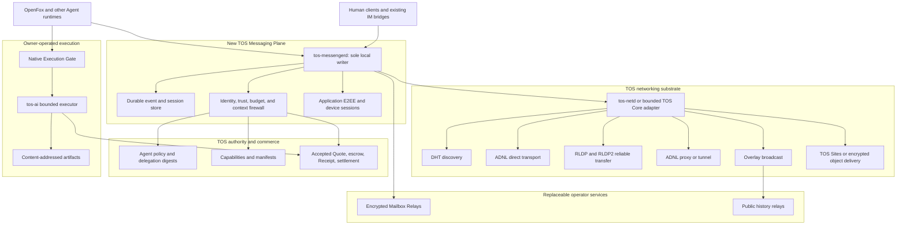

# TOS Decentralized Agent-Native Messenger Architecture

**Document status:** Incubation architecture and implementation inventory  
**Status date:** 2026-08-20
**Candidate protocol family:** `tos.messaging.*`  
**Relationship to TOS Service Protocol:** complementary; this document does not change the authority model or normative schema of `tos_service_v1`

## 1. Purpose

This document defines how the existing TOS ecosystem can be extended into a
decentralized, Agent-native Messenger for human-to-Agent and Agent-to-Agent
communication.

The design starts from infrastructure that already exists in the TOS
repositories:

- finalized Agent and Capability identity on TOS;
- bounded controller policies and delegation digests;
- DHT, ADNL, RLDP/RLDP2, Overlay, ADNL proxy/tunnel, and TOS Sites networking
  primitives;
- Agent Packet V1 and signed Contact Cards;
- A2A and MCP execution adapters;
- Quote, escrow, Receipt, and settlement foundations;
- the `tos-ai` bounded execution and artifact foundation; and
- the OpenFox always-on Agent runtime.

The missing product is not another blockchain. It is an off-chain messaging
plane that uses TOS for identity, authorization, revocation, optional commerce,
and independently verifiable service outcomes.

This document deliberately distinguishes existing implementation from proposed
work. It must not be used to advertise a target feature as deployed merely
because a lower-level primitive exists.

## 2. Status convention

- **✅ Implemented** — qualifying code and repository evidence exist for the
  stated component. Public deployment or independent operator acceptance may
  still be governed by `ROADMAP.md`.
- **🟡 Partial** — a reusable primitive, reference implementation, or design
  exists, but Messenger-specific behavior or production acceptance is missing.
- **⬜ To be developed** — no qualifying implementation for the stated
  Messenger component was found.
- **🔒 Roadmap-locked** — design may be reviewed, but implementation or
  commercial acceptance is blocked by the current TOS Service Protocol roadmap.

Status in this document is narrower than release readiness. For example, ADNL
code may be implemented while a production Mailbox Relay product using ADNL is
still pending. Likewise, a local adapter may be implemented while an external
interoperability gate remains incomplete.

## 3. Governance and delivery boundary

`docs/ROADMAP.md` is the authority for TOS Service Protocol gate ordering and
acceptance evidence. This Messenger document is an incubation design:

- it does not add a `tos_service_v1` object or alternate authority path;
- it does not count as evidence for Gate C, D, E, F, or G;
- it does not reorder the software-work commercial lifecycle;
- it does not authorize work merely by describing it; and
- Relay, attachment-storage, and inbox-bond commercial profiles remain locked
  until the Expansion Gate permits them.

Separately approved technical incubation may explore reachability, E2EE,
single-writer local storage, and OpenFox-to-OpenFox transport without changing
TOS Service Protocol gate status. Such work must remain isolated from canonical
Registry, Quote, escrow, Receipt, and settlement semantics.

The implementation sequence in this document therefore distinguishes:

```text
technical messaging milestones
  identity binding, reachability, E2EE, delivery, storage, rooms

commercial messaging profiles
  Relay lease, attachment storage, inbox bond, paid history service
```

The first category can be prototyped as incubation when separately approved.
The second category inherits the Expansion Gate lock unless `ROADMAP.md` and
`PRODUCT_STRATEGY.md` are explicitly changed.

## 4. Executive architecture decision

TOS should add a dedicated **Messaging Plane** between Agent runtimes and the
existing networking substrate:

```text
Human clients / OpenFox / other Agent runtimes
                       |
                       v
              TOS Messaging Plane
     sessions, E2EE, inboxes, rooms, event logs,
     delivery semantics, policy, and local history
                       |
                       v
       DHT / ADNL / RLDP / Overlay / TOS Sites
                       |
                       v
      TOS identity / authorization / settlement
```

The core architectural rule is:

> TOS finality establishes who an Agent is and what authority it has. The
> Messenger establishes a private, asynchronous, durable conversation with
> that Agent. A transport, Gateway, Relay, push provider, or UI never becomes
> identity or payment authority.

The first technical product should be an OpenFox-to-OpenFox Messenger with:

- finalized Agent and delegated Messaging Endpoint verification;
- a route strategy selected from measured reachability data;
- application-layer end-to-end encryption;
- one single-writer `tos-messengerd` per local state directory;
- durable local event and replay state;
- direct, tunnel, Relay, or bounded HTTPS delivery according to policy; and
- no dependency on a central Gateway or central message database.

Group rooms, public channels, native mobile clients, and commercial Relay
profiles should follow only after their prerequisites are accepted.

## 5. Current implementation inventory

### 5.1 Already implemented and reusable

| Foundation | Status | Existing evidence | Reuse in the Messenger |
|---|---:|---|---|
| Finalized Agent and Capability objects | ✅ | `NATIVE_IDENTITY_V1.md`, Native Registry state machines, `tos`, and `tos-service-protocol` | Permanent Agent identity, live/tombstoned checks, controller authorization, Capability ownership |
| Weighted Ed25519 controller policies and purpose separation | ✅ | `NATIVE_IDENTITY_V1.md` | Keep root and policy keys outside the messaging daemon; authorize bounded messaging keys through delegation |
| Off-chain delegation documents committed by digest | ✅ | `NATIVE_IDENTITY_V1.md` | Bind a Messaging Endpoint delegation without storing endpoint details or message data on-chain |
| DHT implementation and DHT server | ✅ | `tos/dht`, `tos/dht-server` | Publish and resolve short-lived signed locators and content digests |
| ADNL peer, channel, address, proxy, and tunnel primitives | ✅ | `tos/adnl` | Direct node transport and network-level routing primitives |
| RLDP and RLDP2 reliable transfer | ✅ | `tos/rldp`, `tos/rldp2` | Reliable transfer of larger envelopes, history segments, descriptors, and attachments |
| Overlay broadcast primitives | ✅ | `tos/overlay`, including simple, FEC, Plumtree, and two-step broadcast implementations | Future public channels and optional ciphertext distribution |
| TOS Sites and RLDP HTTP proxy primitives | ✅ | `tos/rldp-http-proxy`, including `DNSResolver` and `PeerCapabilityRouting`, plus `tos/doc/TosSites.md` | Serve signed descriptors, prekey bundles, encrypted attachments, and public history segments |
| Generic HTTP stack and simple HTTP proxy | ✅ | `tos/http`, containing the `toshttp` library and `http-proxy` executable | Bootstrap and fallback HTTP transport only; it links neither ADNL nor RLDP and is not a TOS Sites component |
| Agent Packet V1 signing and strict wire codec | ✅ | `tos-service-protocol/pkg/agentpacket` | Independently signed task or control packets with optional Accepted Quote binding |
| Signed Contact Card reference implementation | ✅ | `tos-service-protocol/pkg/agentpacket/contact.go` | Bootstrap HTTPS discovery and migration input for a richer Messaging Contact Descriptor |
| Finalized Agent verification for Agent Packets | ✅ | `tos-service-protocol/pkg/agentpacket` | Reject unknown, revoked, or unauthorized senders before application delivery |
| A2A and MCP execution adapters | ✅ | `tos-ai/pkg/a2aadapter`, `tos-ai/pkg/mcpadapter` | Preserve standard task and tool semantics inside a Messenger conversation |
| Shared Native Execution Gate | ✅ | `tos-service-protocol/pkg/executiongate` | Verify finalized escrow, Agent, Capability, manifest, transport binding, signer authorization, and one purchase claim |
| A2A-to-MCP duplicate-execution test | ✅ | `tos-ai/pkg/adapterinterop/interop_test.go` | Proves A2A and MCP contend for one purchase slot and execute the runner once |
| Bounded execution and content-addressed artifacts | ✅ | `tos-ai/pkg/executor`, `tos-ai/pkg/artifactstore` | Execute paid work after Messenger policy and finalized escrow checks; re-verify SHA-256 addressed content on read |
| Crash-safe single-owner software-work journal | ✅ | `tos-ai/pkg/softwarework/journal.go` and `tos-ai/internal/dirlock` | Reuse atomic file creation, fsync, rename, private-directory, and process-ownership patterns |
| OpenFox always-on runtime and existing human IM channels | ✅ | `tosnetwork/openfox` | First Agent runtime and human-control bridge for the Messenger |

### 5.2 Partially implemented foundations

| Foundation | Status | What exists | What is still missing |
|---|---:|---|---|
| Agent Packet as a general chat envelope | 🟡 | Sender/recipient Agent IDs, mandatory Capability ID, nonce, sequence, payload digest, signature, optional Quote commitment, and strict JSON | No conversation or room identity, application E2EE, multi-device model, delivery ACK model, or ordinary-chat profile without a Capability |
| Agent Packet replay protection | ✅ | `tos-messenger/pkg/agentpacketbridge` verifies the exact Agent Packet bytes and durably claims `sender_agent_id + nonce`, including pending-state restart recovery | Live transport coverage remains part of the broader bridge work, not this replay primitive |
| Agent Packet execution-gate integration | 🟡 | `tos-ai/pkg/agentpacketadapter` owns the Native Execution Gate mapping; `tos-messenger/pkg/agentpacketbridge` supplies verified replay-safe input; `tos-ai` `a3c06d5`/`a9928de` prove the complete three-transport matrix; Messenger `41f53ab` and OpenFox `cbe9f51c` add a canonical bounded Unix handoff into an independently verifying mode-`0600` provider socket and the same shared Gate; Messenger `cb97f0d` makes the daemon consume admitted `agent.packet` Events under a durable application lease while excluding them from the model/runtime inbox, and config v7 retains that v6 assembly | The selected live inbound transport and independently operated evidence remain open |
| Reusable local journal pattern | ✅ | `softwarework.Journal` supplied the original durability pattern; `tos-messenger/pkg/eventlog` now implements the Messenger-specific sole-writer event, ACK, replay, retry, expiry, session, device, room, approval, mandate, budget, and negotiation state | It deliberately remains a single-process store rather than a concurrent cross-process claim database |
| Contact Card discovery | 🟡 | Signed Agent ID, network tuple, one HTTPS endpoint, optional Capability IDs, and bounded expiry | No ADNL ID, Messaging Endpoint ID, device set, prekey bundle, Mailbox Relay set, protocol negotiation, admission policy, or rotation metadata |
| ADNL proxy and tunnel support | 🟡 | Proxy/tunnel protocol code exists in TOS Core | A supported home/site reverse-tunnel service, operator runbook, health model, quotas, abuse controls, and multi-operator failover remain product work |
| Overlay for rooms or channels | 🟡 | Broadcast, peer-management, private/semiprivate construction, and membership-certificate primitives exist; `tos-messenger/pkg/room` supplies Messenger room identity, signed authority, and bounded epoch-bound roles; typed moderation plus the durable ledger enforce auditable `hide`/`restore`, and OpenFox durably retracts already-applied history and action authority; `pkg/group`, `rust/openmls-driver`, `pkg/eventlog`, and `pkg/mlslab` implement pinned OpenMLS suite `0x0001`, crash-safe state, and a three-OpenFox encrypted/restart loop; OpenFox `ed1fcc75` separates that loop into three independently restartable Agent processes | Independent Driver review, room/public-channel history synchronization, and real Relay/Overlay integration remain open; direct same-Endpoint device history is implemented separately |
| TOS service commerce | 🟡 | Software-work Quote, escrow, Receipt, settlement, SDK, and execution-gate foundations exist | Relay lease, attachment storage, public history, and inbox-bond profiles do not exist and cannot be inferred from the software-work profile |
| OpenFox economic bridge | 🟡 | Architecture and required interfaces are documented in `OPENFOX_ECONOMIC_BRIDGE_V1.md`; the production Messenger channel consumes authenticated direct/room input and submits reply semantics to daemon-owned event construction. Messenger `40e06ff`/`dcfca91` and OpenFox `cfa58ee7`/`6ae673bf` add daemon-assembled finalized-Quote verification, make it a mandatory post-funding/pre-dispatch native-buyer gate including crash recovery, and verify the deterministic funded escrow directly without a locator prewrite. OpenFox `755fbf2d` assembles the production buyer's frozen 2-of-3 chain authority graph. Protocol `94d38f8` and OpenFox `8d0bcedf`/`3fae4f91` add exact custody-reviewed escrow deployment and strict `prepare → inspect → deploy-prepare → deploy-broadcast → fund → dispatch → terminal settlement` production commands, durable leases, signed policy verification, Messenger spend/Quote gates and three transports | Fresh independent buyer/provider commerce sessions, selected live transport, and independently reconstructed settlement evidence remain missing |
| Mobile TOS clients | 🟡 | Owner-controlled mobile service-client architecture is documented | Messenger session storage, best-effort push wake-up, multi-device keys, room UI, and messaging conformance are missing |
| Attachment storage primitives | 🟡 | TOS Sites, RLDP, and `tos-ai` content-addressed artifact storage exist; `tos-messenger/pkg/attachments` adds the private encrypted format and a crash-safe bounded local ciphertext store with retention and garbage collection | Authenticated remote storage, locator/SSRF policy, remote deletion guarantees, sandbox/scanner integration, and live transfer remain open |

### 5.3 Messenger components that must be developed

Status and evidence below reflect the `tos-messenger` incubation repository,
whose `docs/ROADMAP.md` tracks the implementation against this list. A row is
✅ only when the behaviour is implemented **and** tested end to end; a primitive
or contract-and-refutation harness without the closed behaviour is 🟡 with the
gap named. None of this counts as gate evidence (Section 3).

| Messenger component | Status | Evidence and gap |
|---|---:|---|
| M0-R measured reachability study and route-strategy decision | 🟡 Partial | `tos-messenger` `pkg/reachability`, `pkg/probe`, and `cmd/tos-reachability*` implement signed paired evidence, predeclared policy gates, UDP/ADNL collectors, hold/reconnect/echo phases, filtering observations, tunnel fallback, and native-sidecar cross-checks; mobility/reliable-transfer coverage and the ≥3-operator real-network study remain open |
| Messaging Endpoint delegation schema and verifier | ✅ Implemented | `tos-messenger` `pkg/identity`, `pkg/tosaddr`; production daemon startup now builds the upstream strict-majority finalized Agent resolver, verifies its exact local delegation before opening either socket, and enforces the resulting outbound event-class grant |
| Messaging Contact Descriptor and DHT locator profile | 🟡 Partial | `tos-messenger` now retains the route-neutral chain in daemon config v7: bounded explicit Agent→delegation and descriptor-policy files are reread and checked against finalized commitments, followed by the production native DHT locator, hardened HTTPS descriptor/prekey source, strict per-Agent policy stage, and durable device admission. Messenger `ba98bc7` makes the stock daemon assemble the protected HTTPS root, native DHT client, committed policy/template and external signer from a separate strict operator document while deriving authority fields from the live finalized delegation. DHT bootstrap verification, file substitution, policy substitution, network-representation conversion, scheduled finalized revocation rechecks, lifecycle cleanup, vectors, and adversarial cases are tested. Live independently operated multi-node discovery evidence remains |
| One-to-one application-layer E2EE | 🟡 Partial | `tos-messenger` `pkg/e2ee` implements and vectors the approved `tos.messaging.e2ee.x3dh-aes256gcm-dr.v1` construction and clears its fourteen-property refutation harness; independent cryptographic review and second-language consumption remain wire-freeze gates |
| Multi-device session and key-rotation model | 🟡 Partial | `tos-messenger` separates device-local private prekey generations from public-only complete-set aggregation; daemon config v7 retains the v5 roster/suite/cadence contract and owns a third capability-separated listener; startup recovers plans/finalization and never discards live partial material. `directory.GenerationPublisher` and `daemon.OpenWithGenerationPublisher` schedule the exact durable generation through prekey object → content-addressed Descriptor → signed inner locator → native DHT, using deterministic renewal buckets and a strict external Endpoint signer client. Messenger `ba98bc7` exposes that path through stock `tos-messengerd -publication-operator-config`; `b76376e` adds deterministic bounded cross-observer fork evidence and a stock finalized-authority verifier. Messenger `3bf27ae` adds owner-authorized direct history pages over the existing authenticated device-pair ratchet: only applied inbound/delivered outbound Events are exported, stable cursor/digest chains survive restart, and a daemon-only consumer commits immutable display history outside all Agent/tool/approval/commerce paths. `17cd7f6` adds a three-Event bounded Owner-only read and stock CLI so checkpoint-reachable display state is observable without entering pending/claim or changing application state. Exact retry, target/cursor/signature substitution, roster revocation, delegation-class bypass, chain gaps/damage, recursive/local-only content and room history fail closed. Room/MLS history is deliberately not inferred. Independently operated publication/evidence exchange and live message/history transport remain open pending M0-R |
| Single-writer durable conversation store and replay journal | ✅ Implemented | `tos-messenger` `pkg/eventlog` |
| Delivery, storage, application, and optional read acknowledgements | ✅ Implemented | Distinct strict StoredAck, DeliveryAck, ApplicationAck, and optional ReadAck profiles exist; durable delivery/application/read state is separate from Relay storage, and no ACK is a TOS Receipt (`pkg/mailbox`, `pkg/payload`, `pkg/eventlog`, `internal/vectors`) |
| Encrypted offline Mailbox Relay | 🟡 Partial | `tos-messenger` `bd07dee` implements the runnable seam over the route-neutral crash-safe opaque store and scoped Endpoint→capability authentication: a finalized-state authority rereads and checks the exact delegation commitment on every operation; `pkg/mailboxapi` and `tos-mailboxd` add strict 2 MiB request/16 MiB response service frames, an eight-envelope amplification ceiling, private Unix listener/client, signed StoredAck, durable restart-safe nonce claims, quotas, list/delete, vectors, and adversarial cases. The post-M0-R public transport binding and independent operator evidence remain open |
| Multi-Relay redundancy and failover | 🟡 Partial | `pkg/mailbox.StoreRedundant` plus `mailboxapi.DepositClient` exercise distinct pinned Relay identities across separate service listeners: exact signed ACKs meet 2-of-2, one stopped listener permits only an explicit 1-of-2 threshold, and an unmet 2-of-2 fails. Live independently operated Relay failover evidence is missing |
| Private group encryption and membership epochs | 🟡 Partial | `a4922ab` adds typed `room.moderation` and a durable moderation ledger over the existing bounded administrator/moderator roles; `4541a19` wires that ledger into production admission, re-verifies the current finalized authority delegation, applies each monotonic decision before queueing, and excludes hidden queued targets. OpenFox `35bdac89` independently decodes the control, waits for a durable per-session overlay before completing its lease, projects hidden applied history as a tombstone, removes its action lineage, supports restore/restart, and conservatively cancels an active room turn. Per-target revisions never delete immutable Events, while replay/gap, untrusted controls and damaged state fail closed. Pinned OpenMLS supplies its secrecy/PCS corpus, sequential invitations, per-Agent state owners, encrypted OpenFox chat, bounded capacity, and two independently keyed durable Mailbox stores with exact 2-of-2 StoredAcks and offline catch-up. Still open: authenticated independently operated network Relay evidence after M0-R, independent review, and second implementation |
| Public Agent channels over Overlay with history synchronization | 🟡 Partial | Messenger `a2cd605` adds the route-neutral `pkg/publicchannel` candidate: network/finalized-authority channel IDs; Endpoint-signed publisher/moderator profiles with digest-linked adjacent epochs and fork detection; independently signed content-addressed Events; per-publisher sequence plus cross-publisher causal parents; arrival-order-independent history commitments; immutable moderation projection; exact missing-ID repair; strict bounded profile/Event/head JSON; and adversarial convergence, gap, fork, role and substitution tests. Messenger `e358dfd` adds the private single-writer durable ledger: signed profiles and verified content-addressed Events precede atomic checkpoints, histories may grow but not forget committed Events, and restart cross-checks canonical heads against immutable manifests before re-verifying every Event. Profile/history rollback, equal-epoch fork, damage, orphan objects and concurrent writers fail closed under race tests. Actual Overlay/RLDP/Sites binding, anti-spam, vectors, independent review/operation and second implementation remain open |
| Messenger-specific encrypted attachment protocol | 🟡 Partial | `pkg/attachments` and `artifact.encrypted` implement fresh-key AES-256-GCM chunks, position/shape/metadata AAD, ordered ciphertext manifests, secret E2EE References, expiry/resume policy, strict Event binding and vectors. A private crash-safe local ciphertext store now adds pre-write lease/object/byte/retention quotas, hash-checked fetch, restart recovery, local deletion and fail-closed expired/unreferenced GC without persisting keys or plaintext metadata. Authenticated remote storage, locator SSRF policy, remote deletion/retention guarantees, sandbox/scanner and live transfer remain open; commercial storage remains locked |
| OpenFox `tos-messenger` channel adapter | 🟡 Partial | `tos-messenger` `9219ddb` and OpenFox `a8f0e633` run three channels through three private OpenMLS proxies and an opaque local Relay: sequential third-member invitation, bidirectional replies, tamper refusal, Relay plaintext/private-state exclusion and full restart are tested. OpenFox `ed1fcc75` adds one-channel-per-process operation, private mode-`0600` control/transcript state, caller-stable retry IDs, bounded catch-up reply triggers and fail-visible persistence/send errors. OpenFox `c47a98e0` upgrades those three processes to actual AgentLoop routing/session/model response publication with separate private workspaces and a local deterministic provider; lab cursor advancement waits through stable reply/transcript persistence, and exact completed replay skips a second turn. Deployed Alice/Bob/Carol produced one opening plus exactly two `openfox-agent-loop` Event-bound replies; Alice restart retained the same opening and one reply per peer, session files were owner-only, and the Relay plaintext scan remained clean. OpenFox `42221c02` independently consumes canonical production `room.message`; Messenger `030b9c3` and OpenFox `37b3197b` add strict daemon-owned direct/room event construction and authenticated reply submission with operator-bound routes, restart-stable Event IDs, and substitution refusal. OpenFox `35bdac89` adds the authenticated non-model moderation control and durable applied-history retraction boundary. OpenFox `aa6fe1f7` makes ordinary application leases equally durable: the lease completes only after an atomic fsynced Event-ID/content/provenance session record; exact crash replay skips a second model turn, substitution and non-durable history fail closed, busy sessions remain retryable outside volatile steering, and hard abort retains acknowledged input. Session directories/files are owner-only and recognized legacy files are tightened on open. OpenFox `7fd3ac11` preserves that verified origin through the actual AgentLoop turn and binds its final response to the current inbound Event, so strict production `Send` validation now holds end to end. The selected post-M0-R transport binding and independently operated real-network evidence remain open |
| Agent message policy engine and prompt-injection firewall | ✅ Implemented | `tos-messenger` supplies the action evaluator, authenticated owner queue, and `0541723` online-challenge/offline-sign/online-submit workflow. OpenFox `fbb052df` supplies durable non-model-controlled provenance, fail-closed lineage, classified tool enforcement, owner waits, and one-shot claims; `4736f2c7` makes exact-term custody/key-use wrapping mandatory in the native buyer; `7fe6ec10` supplies independently checked authenticated daemon ingress. Messenger `40e06ff`/`dcfca91` and OpenFox `cfa58ee7`/`6ae673bf` additionally require an exact finalized Accepted Quote after funding and before task dispatch without trusting or persisting the runtime's escrow locator. Plaintext lab messages deliberately receive no such authority |
| First-contact admission policy and sybil resistance | ✅ Implemented | `tos-messenger` `3c6a329`: daemon config v5 explicitly derives the finalized policy digest from its allow-list/rosters and bounds; owner-signed offline invite creation returns a random 256-bit bearer while only a domain-separated digest persists; the first authenticated sender/Event claim is crash-safe and exact-retry idempotent; Relay deposits sign the opaque token; direct/Relay parity and malformed, expired, spent, scope and substitution cases are tested. The recommended v1 rule is known contacts + invite introduction + owner hold otherwise. PoW remains deferred pending abuse measurements and Inbox Bonds stay Expansion-Gate locked |
| Agent Packet-to-Execution-Gate adapter and three-transport replay tests | 🟡 Partial | `tos-messenger` carries exact Agent Packet V1 bytes under `agent.packet`, verifies finalized authority, binds packet/Event sender and live recipient, and durably claims sender+nonce with pending recovery. The complete concurrent/ordered transport matrix proves one Gate permits one runner execution. A proxy-free bounded Unix receiver sends only canonical Packet bytes to an owner-private OpenFox provider socket; OpenFox independently reverifies finalized authority before its existing adapter reaches that Gate. Messenger `cb97f0d` now leases admitted packets in the daemon, retries provider failure, completes both durable claims after acceptance, survives restart without re-execution, and atomically excludes the kind from runtime listing/direct claim, so Packet bytes cannot enter AgentLoop/model text. Live inbound transport and independent-operation evidence remain open |
| Native desktop, Web, iOS, and Android Messenger clients | ⬜ To be developed | — |
| Relay, attachment, history, and inbox-bond commercial profiles | 🔒 Roadmap-locked | Expansion Gate |
| Cross-implementation positive vectors and adversarial corpus | 🟡 Partial | `tos-messenger` `internal/vectors` provides positive vectors plus decode- and verify-layer adversarial corpora, and `pkg/e2ee/testdata` adds deterministic positive/adversarial suite vectors; all are self-verifying, but no second implementation has consumed them |
| Independent multi-operator interoperability evidence | ⬜ To be developed | needs a second implementation |

Progress snapshot (2026-08-21, audited through `tos-messenger` `e358dfd`,
OpenFox `3fae4f91`, and `tos-ai` `a9928de`): the component inventory is **5/20 ✅**, with
12/20 🟡, 2/20 ⬜, and 1/20 🔒. Partial rows retain their implemented
sub-results without being promoted to ✅ before the whole stated behaviour is
implemented and tested end to end.

Weighted implementation completion is now **about 89% (bounded estimate
87–91%)**, up from the prior approximately 88% audit. The cumulative increase is the
executable encrypted OpenFox/private-room seam plus the durable private-room
role/moderation policy, production OpenFox room-message consumption, and
runnable authenticated Mailbox service boundary, followed by daemon-owned
outbound construction, authenticated OpenFox reply submission, and production
moderation admission, durable OpenFox applied-history retraction, and the
separation of the local three-Agent loop into restartable OS processes with
durable idempotent operator control, plus the production Agent-session
application handshake and owner-private local history, followed by preserving
authenticated Messenger provenance and exact Event reply binding through the
real AgentLoop response path, followed by executing the encrypted three-process
group acceptance through three actual durable AgentLoop runtimes, followed by
complete concurrent and ordered three-transport Gate arbitration evidence,
followed by the typed Messenger-to-OpenFox provider Unix handoff and the
daemon-owned admitted-event lease/retry/completion assembly, then the
owner-authorized funding/wallet escrow-locator write boundary, followed by the
daemon-v7 exact finalized-Quote runtime read and OpenFox's mandatory
post-funding/pre-dispatch verification with complete protocol-field mapping and
crash-recovery recheck, then direct code-authenticated finalized reading of the
known deterministic escrow without an owner locator prewrite or runtime-persisted
authority, followed by one production buyer authority graph that shares the
frozen 2-of-3 chain view, finalized resolvers, independent checkpoints and
owner-private budget journal across preparation, capability checking and
settlement reads, then the custody-verified StateInit deployment boundary and
strict owner-private staged production CLI through finalized exact funding,
authorized three-transport dispatch and terminal settlement recovery; it is not
an entire component-row promotion. Messenger `ba98bc7` additionally closes the
stock public-generation resource assembly gap without importing Endpoint
private keys or configurable identity authority, and `b76376e` adds portable
cross-observer fork proof and a finalized-authority stock verifier. Messenger
`3bf27ae` further closes route-neutral direct-device history export/import with
owner-signed paging, stable restart cursors, immutable display-only storage and
daemon-only consumption over the existing Double Ratchet; it does not claim
room-history authority or live-network delivery. `17cd7f6` makes only committed
display state observable through a bounded Owner read, still outside every
execution queue. Messenger `a2cd605` then moves the public-channel row from
blank to partial with a route-neutral signed authority/event/history candidate;
`e358dfd` closes its local durability gap with rollback-resistant profile and
history checkpoints plus full restart re-verification. Because no Overlay path
exists, this remains an infrastructure rather than user-visible product
increment. Product readiness remains
approximately **67%**: local users
can exercise real encrypted group behaviour, while public discovery/transport,
independent operation and wire-freeze evidence remain the dominant gates.

The live local OpenFox acceptance was rechecked on 2026-08-21 after the history
work: all seven supervised Agent/proxy/Relay processes were active with zero
restarts. Alice opening `msg_841d…7f60` produced exactly Bob
`msg_6e59…d3ee` and Carol `msg_af43…e409`, both bound to that opening; all
three durable transcripts/cursors converged to 45/50. Reusing the exact request
ID returned the same opening and added no transcript record. This is same-host
process/restart evidence, not selected transport or independent-network
evidence.

### 5.4 Scenario acceptance

The tables above track parts; the Messenger is accepted by scenarios. The two
canonical scenarios below define what "agents can talk" means for this
architecture, and each names the exact dependency chain still standing between
the implemented parts and a conversation. A scenario is ✅ only when the whole
flow runs end to end on a real network between independently operated agents,
and nothing in it counts as gate evidence until then (Section 3).

**S1 — Two OpenFox agents discover each other and hold a one-to-one
conversation.** Already standing: Agent/Endpoint/Device identity; descriptor
and locator formats, explicit finalized delegation/policy bootstrap plus
production DHT/HTTPS refresh retained by daemon config v7; the approved
one-to-one E2EE construction and its vectors;
envelopes, payload codecs, and durable delivery stores; the conversation-to-
commerce path riding the same events; and an OpenFox-native local acceptance
channel that proves room-addressed bus integration and restart cursors without
claiming a production route. The blocking chain, in dependency order:
(1) live independently operated discovery evidence; (2) the multi-operator
M0-R study produces a route finding —
Section 11 forbids building the transport
first; (3) the production transport that finding selects, over the native
stack; (4) independent E2EE review and second-language vector evidence; and
(5) binding the now daemon-owned OpenFox outbound seam to the selected
production route and proving delivery/recovery between independent operators.

**S2 — Three OpenFox agents converse in a private room, the third member
invited by a membership-epoch transition.** Already standing beyond S1:
membership epochs with durable rollback/gap and current-authority signature
enforcement; signed adjacent-epoch authority transfer; admission-gate
membership refusal; the MLS 1.0 selection; the two-clock application adapter,
raw-genesis BasicCredential/group-id candidate vectors, per-device leaf authority,
succession plan and durable KeyPackage/Welcome/commit/ratchet state; pinned
OpenMLS founding, sequential third-member join, replacement/removal/self-update,
no-past/no-future secrecy, exporter separation, encrypted bidirectional messages
and full process/journal restart; the route-neutral Mailbox store; and a
three-OpenFox local process demonstration in which distinct private MLS state
owners perform sequential invitations and three separately supervised OpenFox
Agent processes exchange ciphertext through an opaque Relay, reject tampering,
reply exactly once to an Event-bound probe, and preserve stable retry identity
through restart. OpenFox `c47a98e0` additionally sends those probes through a
real durable AgentLoop in every process and proves completed-replay model
idempotency. This closes the
local encrypted acceptance seam but not the public S2 gate. Blocking, beyond
everything S1 lacks: (6) independent Driver review and second-implementation
evidence; (7) bind KeyPackage/Welcome/PrivateMessage delivery to authenticated
real Relay retrieval after the post-M0-R transport decision.

The M0-R study and independent evidence need external operators/reviewers;
every other link is buildable code once its predecessors land. Canonical
network representation, E2EE construction, Mailbox authority, first-contact
default, room authority, and MLS implementation boundary are no longer waiting
for an owner selection.
`tos-messenger/docs/ROADMAP.md` tracks both scenarios under "Scenario
acceptance".

## 6. Goals and non-goals

### 6.1 Goals

The Messenger should provide:

1. persistent TOS Agent identity independent of any Gateway, Relay, domain, or
   device;
2. direct communication when measured network conditions permit it;
3. encrypted asynchronous delivery when either endpoint is offline or
   unreachable;
4. application E2EE independent of ADNL, HTTPS, Proxy, Relay, or push transport;
5. one-to-one conversations, multi-device synchronization, private rooms, and
   public Agent channels;
6. typed Agent events rather than text-only messages;
7. A2A and MCP interoperability without replacing their task or tool semantics;
8. optional binding to Accepted Quotes, escrow, Receipts, and settlement;
9. replaceable discovery services and Mailbox Relays;
10. safe integration with OpenFox and physical edge AI nodes; and
11. implementation status that never confuses a primitive with a complete
    product.

### 6.2 Non-goals

The Messenger must not:

- store ordinary messages, contacts, private room membership, model traces, or
  attachments on-chain;
- introduce a second source of Agent, Capability, payment, or Receipt authority;
- require one central Gateway or one central Relay;
- settle every token, progress update, or chat message on-chain;
- treat ADNL channel encryption as sufficient application E2EE;
- give remote messages automatic tool, wallet, host, sensor, or actuator
  authority;
- replace A2A task semantics or MCP tool semantics;
- claim that Agent Packet already provides a complete Messenger;
- expose controller, wallet, executor, or hardware-custody keys to the
  Messenger;
- put blockchain consensus in a physical AI real-time control loop; or
- claim mobile push is decentralized, reliable, or part of message authority.

## 7. System architecture



### 7.1 Authority plane — ✅ implemented foundation

Finalized TOS state remains the sole canonical authority for:

- Agent identity, controller policy, delegation digests, recovery, and
  revocation;
- Capability ownership, version commitments, and revocation;
- Accepted Quote terms and selected execution authority;
- escrow, Receipt, dispute, release, refund, and settlement state; and
- network domain and reviewed contract code.

No DHT record, Contact Descriptor, Relay receipt, chat history, push
notification, Gateway response, or local database may override these facts.

### 7.2 Messaging plane — 🟡 route-independent foundations implemented

`tos-messengerd` should own:

- local messaging keys and device sessions, but not Agent controller or wallet
  keys;
- E2EE;
- conversation and room state;
- durable send, receive, retry, replay, and deduplication journals;
- Relay selection and failover;
- attachment encryption and retrieval;
- typed event validation;
- local trust, approval, and rate policy; and
- an authenticated owner-private API for Agent runtimes and clients.

`tos-messenger` now implements the route-independent core of this plane:
identity and descriptor verification, the default one-to-one E2EE candidate,
durable event/session/device/room/negotiation state, typed payload validation,
admission and action policy, and authenticated owner/runtime Unix-socket APIs.
Transport routing, Relay selection/failover, attachment encryption, MLS group
state, and runtime/client integrations remain open, so the plane as a product
is still partial.

### 7.3 Network adapter — 🟡 primitives exist; product API pending

The adapter should expose only Messenger operations, for example:

```text
ResolveDHT
PublishDHT
OpenADNLSession
SendADNLDatagram
SendRLDPObject
ServeRLDPObject
JoinOverlay
PublishOverlayEvent
SubscribeOverlay
GetReachability
```

It should run behind an owner-private Unix socket or equivalent local boundary.
It must not expose validator, wallet, container runtime, or arbitrary host
control to a remote Agent.

## 8. Data placement and privacy boundary

| Location | Permitted data | Prohibited authority or data |
|---|---|---|
| TOS finalized state | Agent policy, delegation digest, Capability commitments, Accepted Quote, escrow, Receipt, settlement | Chat plaintext, contact graph, private room membership, session keys, ordinary delivery ACKs |
| DHT | Short-lived signed locator, descriptor digest, Relay locator, expiry | Message bodies, complete history, secret prekeys, canonical identity facts |
| ADNL/RLDP/HTTPS | Application ciphertext and public routing data | Decrypted content except at the intended endpoint |
| Mailbox Relay | Opaque mailbox ID, bounded ciphertext, expiry, storage token, delivery state | Plaintext, session keys, controller keys, canonical payment state |
| TOS Sites or object storage | Signed public descriptors, public history, encrypted attachments, encrypted history chunks | Private attachment keys or unencrypted private history |
| Local Agent/device store | Session state, message history, contact policy, replay journal, attachment keys, owner approvals | Unbounded remote-controlled execution authority |
| Gateway or search index | Derived discovery views and routing hints | Canonical Agent, Capability, Quote, balance, or message-history authority |

Bulk message data remains off-chain. Optional on-chain commitments are allowed
only for explicit high-value workflows, not as a default message log.

## 9. Identity and key hierarchy

### 9.1 Existing Agent identity — ✅ implemented

The permanent identity is the finalized TOS `AgentID`. Existing bounded,
weighted Ed25519 policies, purpose separation, revocation, recovery, and
delegation digests remain unchanged.

### 9.2 Messaging Endpoint identity — ✅ implemented

A Messaging Endpoint is an online service authorized by an Agent. It is not the
Agent itself and must be independently replaceable and revocable.

The implemented `MessagingEndpointDelegationV1` contains:

```text
schema
network_domain
agent_id
messaging_endpoint_id
messaging_identity_public_key
adnl_id_or_transport_key_commitment
allowed_protocol_versions
allowed_event_classes
not_before
expires_at
maximum_session_lifetime
contact_descriptor_policy_digest
mailbox_policy_digest
```

The Agent account commits only the immutable delegation digest. The full
document remains off-chain. Verification must:

1. resolve the Agent from finalized TOS state;
2. reject a tombstoned Agent;
3. obtain exact delegation bytes;
4. reproduce the committed digest;
5. verify scope, time bounds, network domain, and purpose; and
6. verify authorization under the live Agent policy.

Root Agent controller keys remain in a wallet or dedicated signer. An online
Endpoint key may authenticate descriptors and sessions but must not
implicitly control Agent policy, Capabilities, escrow, or funds.

### 9.3 Device identity — 🟡 model, refresh, and revocation enforcement implemented

Each OpenFox host, mobile client, desktop client, or edge terminal should have a
separate Device ID and device key authorized by one Messaging Endpoint. Device
addition and removal must trigger session or group-key changes where required.

`tos-messenger/pkg/e2ee` implements signed per-device prekey sets, monotonic
device-set succession, permanent revocation tombstones, deterministic
per-device-pair sessions, and event fan-out; `pkg/eventlog` persists the set and
`pkg/admission` refuses a revoked device. `pkg/directory` provides the
route-neutral refresh manager and finalized-revocation recheck, while
`pkg/group` implements endpoint-authorized per-device MLS Leaf/KeyPackage
publication. Daemon-managed finalized delegation/policy bootstrap and production
TOS DHT plus bounded HTTPS descriptor/prekey refresh now populate the durable
device ledger. Live discovery evidence and independent review of the integrated
MLS Driver remain open.

Local v1 prekey replenishment rotates the complete retained device set as one
generation. Every bundle in a locally produced generation shares its issuance
and expiry watermark. A different non-retirement set at the same watermark is
an equivocation: neither digest order nor arrival order may choose a winner.
The local publisher refuses to create such a fork, and peer succession returns
both conflicting set digests when it observes one. Older watermarks remain
rollback failures; the existing equal-watermark pure-retirement exception adds
no material and only removes authority.

Private answering material is not Endpoint publication state. Each device
generates and atomically stores only its own opaque secret and signed public
contribution. The Endpoint first durably fixes the sorted roster, suite, and
issuance/expiry window, then accepts only matching already-signed public
bundles. Exact retries are idempotent; unplanned devices, invalid signatures,
same-device conflicts, incomplete finalization, rollback, and unsafe live-plan
replacement fail closed. Only an exact complete roster advances the separate
publication ledger, with crash recovery between the two durable records. Both
records are tested not to contain any private-material field. Endpoint
signatures use a narrow Ed25519 `crypto.Signer` and are verified before
persistence.

The separate `tos.messaging.prekey-device-request.v1` local API has only two
operations: read the current public plan/aggregate progress, or submit one
canonical existing signed bundle. It has no operation that creates a plan and
returns no collected bundle. A private Unix socket, Linux peer credentials,
16-KiB pre-allocation frame bounds, finite deadlines, strict request/response
JSON, canonical bundle bytes, and immediate complete-set finalization are
tested. Shared socket mechanics were moved below the owner/runtime API so this
third principal does not inherit either authority.

Daemon configuration v4 states this public publication policy independently
from discovery and message transport. `none` may carry no unused publication
fields. `prekeys` explicitly fixes a distinct socket, canonical 1–16-device
roster containing the installation's device, frozen suite identifier, bounded
generation lifetime, positive replenishment horizon, and a check interval no
longer than that horizon. There are no silent security-policy defaults.

The daemon planner owns only public records and has neither a signer nor a
private-key store. Startup durably creates a plan when none exists and repairs
a complete-but-unfinalized crash window. A partial live plan is preserved even
after entering its replenishment horizon; discarding submitted material before
expiry would let scheduling revoke a device silently. A finalized plan rotates
at the horizon, while an incomplete plan is replaced only after expiry. An
expired record may be read structurally to schedule replacement but is never
treated as current authority; live contributions are reauthenticated under the
current finalized delegation. Damaged state fails closed. The third listener
participates in the same open/run/close lifecycle as runtime and owner sockets,
and all three are forbidden anywhere beneath the locked state directory.

The daemon can now take an explicit `GenerationPublisher` composition and
reload the exact current public ledger artifact at startup and on a bounded
schedule. The publisher writes the prekey object first, the content-addressed
signed Descriptor second, and only then changes locator authority through the
native DHT adapter. Dependency or DHT failure is reported and retried; an
expired generation is not republished.

Activation is deterministic without inventing another mutable authority
record. Descriptor and locator validity advances in half-policy-lifetime
buckets inside the durable generation, and the publish interval must fit in
that half-window. A crash retry within one bucket therefore reproduces exact
signed bytes and cannot amplify immutable objects; a later bucket renews a
generation that outlives one Descriptor policy window. Repeated DHT operations
retain the same signed inner locator while refreshing the native outer cache
TTL.

A routine rotation retains that same device's prior answering material through
signed expiry because a sender may already have fetched it. Removing a device
instead drops only that device's current and retired secrets before recording
its local tombstone; the public aggregation ledger permanently tombstones its
Device ID. Cached prekeys cannot restore bootstrap authority, while another
device's secret state is unaffected. Expired material is logically pruned;
secure deletion of filesystem blocks and snapshots remains a deployment
property. Per-device retired generations and public tombstones are bounded,
and a full bound refuses transition rather than forgetting live authority.

The production static HTTPS sink writes immutable prekey objects and
content-addressed Descriptors under fixed same-origin paths. It rejects
alternate bundle ordering under one order-independent set digest, symlink or
writable directory substitution, conflicting bytes, and damaged objects; it
syncs and atomically installs exact retries. Descriptor activation validates
and signs the complete graph before mutation, writes prekeys first, Descriptor
second, and returns the signed inner locator only after both dependencies are
durable. A failed step leaves at most unreachable immutable objects, not an
authoritative dangling pointer.

This is the signed-prekey lifecycle selected for the existing v1 construction,
not a hidden one-time-prekey extension. Native DHT key-description and value
signatures now use a `crypto.Signer`; the pinned DHT client immediately verifies
each returned Ed25519 signature before network use, so the Endpoint private key
need not enter the publishing process. The strict external-signer client accepts
only bounded raw-message Ed25519 requests and verifies every 64-byte response
under the finalized 32-byte Endpoint public key. Messenger `ba98bc7` adds the
stock-command assembly: a separate strict
`tos.messaging.publication-operator.v1` document names only the public HTTPS
root, native DHT bootstrap, committed policy, signer socket, bounded cadence and
Descriptor capabilities. Startup obtains the Endpoint key and every identity,
network, delegation, ADNL and admission field from the live finalized
delegation; policy/template mismatches fail before DHT connection or HTTPS
mutation. Unknown fields (including attempted private-key injection), relative
paths, plaintext endpoints, ambiguous versions, invalid digests, policy and
protocol-version substitution are tested, and complete Messenger race/vet,
ADNL, OpenMLS and build gates passed. Loading private bytes from daemon JSON or
centralizing device secrets remains forbidden. Messenger `b76376e` then adds a
bounded `tos.messaging.device-fork-evidence.v1` exchange format and stock
assemble/verify tool. Evidence requires two independently signed
Descriptor→complete-set chains at one non-orderable freshness watermark; pure
retirement and ordered rotation cannot become accusations. Pair/bundle order is
normalized, all authority is re-derived from the verifier's finalized
delegation, and cache expiry cannot erase already signed proof while future
issuance remains refused. Independently operated publication and evidence
exchange remain deployment gaps. No canonical signed preimage changed in this
implementation round; both new operator/evidence documents have explicit v1
schemas.

Messenger `3bf27ae` implements direct-conversation history synchronization
between two current Devices of the same Endpoint. First principles select the
existing authenticated one-to-one Event/Double Ratchet transport: a parallel
X25519/AEAD history envelope would duplicate key derivation, nonce, associated-
data and rotation semantics without adding authority. The typed
`device.history.segment` Event belongs to delegation class `device.sync`; its
source identity, same-Endpoint recipient and symmetric device-pair session are
daemon-derived. Export is an Owner-only local operation whose single-use
Ed25519 decision covers target Device, Conversation, sequence, predecessor
digest, stable `(created_at_unix,event_id)` cursor, page bound, idempotency key
and expiry. The OpenFox runtime cannot request, list, claim or apply it.

Only admitted/applied inbound Events and durably delivered outbound Events are
eligible. Pending, held, rejected, queued, local-only, recursive-history and
Room Events are excluded. A segment contains at most 16 Events and 96 KiB of
canonical Event bytes, and one source-target-conversation chain is bounded to
4096 segments. The receiver requires both Devices in its sorted configured
roster, checks the outer authenticated identity/network/conversation against
the body, then stores canonical Event objects immutably. Ordered manifests are
committed before a checkpoint; queries follow only checkpoint-reachable
objects, deduplicate Event IDs, and fail closed on gaps, substitutions, damage
or restart conflicts. Imported history is display-only and never enters the
Agent loop, tools, approvals, Agent Packet Gate, or commerce adapters.
Messenger `17cd7f6` exposes only checkpoint-reachable imports through the
Owner socket and `tos-messenger-owner history`, capped at three worst-case
Events per local frame. The runtime socket has no listing operation; the read
creates no lease and changes no application state.

Room/MLS history remains explicitly out of scope for this v1 payload. A new MLS
leaf has no right to past epoch secrets, so importing plaintext room history
would silently invent a join-history policy. That work stays open until current
room authority freezes an explicit policy. Remote transport and independent
catch-up/restart evidence likewise remain gated by M0-R; local durable
construction is not reported as public delivery.

### 9.4 Session keys — 🟡 construction approved and implemented, not frozen

Session keys are ephemeral application-layer keys derived through an audited
asynchronous handshake. They are not published on-chain and are not reused as
Agent, Capability, wallet, or execution keys.

The default one-to-one candidate is implemented as an endpoint-authenticated,
X3DH-shaped X25519 handshake followed by HKDF/HMAC-SHA-256,
AES-256-GCM, and a persisted Double Ratchet. Deterministic wire and adversarial
vectors exist. Construction approval is recorded; independent review and a
second-language implementation are still required before its identifier is
frozen.

## 10. Discovery and addressing

### 10.1 Existing Contact Card — 🟡 partial

The current Contact Card proves that a live Agent controller authorized one
HTTPS endpoint for a bounded period. It is useful for bootstrap, QR, and file
exchange, but it is insufficient for a decentralized multi-device Messenger.

### 10.2 Messaging Contact Descriptor — 🟡 schema and verifier implemented

The implemented `MessagingContactDescriptorV1` contains:

```text
schema
network_domain
agent_id
messaging_endpoint_id
delegation_digest
supported_messaging_versions
supported_a2a_versions
supported_mcp_versions
adnl_id
optional_https_endpoint
prekey_bundle_digest
mailbox_relay_set_digest
attachment_service_digest
inbox_admission_policy_digest
maximum_envelope_bytes
issued_at
expires_at
endpoint_signature
```

The descriptor is signed and non-canonical. Its validity always depends on
current finalized Agent and delegation state.

`inbox_admission_policy_digest` commits to an off-chain policy document. It may
represent open, invite-only, allow-listed, proof-limited, or future economically
bonded first contact. The descriptor itself does not create payment authority.

### 10.3 DHT locator and HTTPS object profile — 🟡 production operations implemented

DHT locates a current descriptor; it does not store chat history. A bounded DHT
value contains only bounded retrieval and verification material:

```text
messaging_endpoint_id
descriptor_digest
descriptor_locator
issued_at
expires_at
endpoint_signature
```

`tos-messenger/pkg/directory.TOSDHT` now bridges this compact locator to the
pinned `tosutils-go/adnl/dht` client. It independently checks the requested
native TL key/name/index, Ed25519 owner hash, `dht.updateRule.signature`, native
key-description and value signatures, outer TTL/size bounds, and the inner
Endpoint signature. Publication requires a `crypto.Signer` exposing the exact
delegated Endpoint Ed25519 public key. The pinned `tosutils-go` client signs and
immediately verifies both native envelopes without requiring private-key export,
while the adapter caps each native cache value at one hour inside the
3660-second network bound and checks the returned key and positive replica
count. Longer-lived inner locators are republished in freshly signed outer
values.

The complete descriptor and prekey bundle may be fetched through TOS Sites,
RLDP, HTTPS, QR, a local file, or another authenticated rendezvous path. Every
path must produce the same digest-authenticated bytes.

The implemented production HTTPS profile follows the locator's exact descriptor
URL and publishes the descriptor-committed complete prekey set on that same
origin at:

```text
/.well-known/tos-messenger/prekeys/<lowercase-sha256-hex>.json
```

New signed Descriptors are immutable on that origin at:

```text
/.well-known/tos-messenger/descriptors/<lowercase-sha256-hex>.json
```

The DHT locator names the exact content-addressed Descriptor URL, avoiding a
window in which a mutable path serves new bytes while the DHT still commits the
old digest. The production write side validates both object addresses, requires
sorted device order for the otherwise order-independent prekey-set digest,
atomically installs exact bytes without overwrite, and makes the signed locator
available to its caller only after prekeys and Descriptor are durable in that
order.

The strict `tos.messaging.prekey-bundle-set.v1` JSON wrapper contains 1–16
existing signed per-device bundle objects and is bounded to 128 KiB. It is a
transport wrapper, not a new authority: the descriptor still commits the
order-independent canonical set of individual bundle digests under the
existing set domain. Positive vectors include wrapper bytes, canonical set
bytes, and digest; the adversarial corpus covers strict decode failures.

`tos-messenger/pkg/directory.HTTPSObjects` accepts only standard-port HTTPS
without credentials, query, or fragment; only status 200 `application/json`;
and finite connection, TLS, header, request, response, idle, and pool budgets.
It disables environment proxies, implicit compression, and every redirect.
Its DNS-pinning dialer rejects empty or mixed answer sets and every private,
loopback, link-local, multicast, unspecified, or carrier-grade NAT address.
A compromised origin can therefore deny discovery but cannot replace the
locator-committed descriptor or descriptor-committed signed prekeys.

Daemon configuration schema `tos.messaging.daemon-config.v4` states discovery
independently from transport. Production mode pins a bounded local DHT global
configuration and a finite explicit peer set. Each peer maps its Agent ID to a
delegation file and strict `tos.messaging.descriptor-policy.v1` file. This is
the unavoidable rendezvous bootstrap because an Agent ID cannot derive the
Endpoint-key DHT key; the files grant no authority. On every scheduled refresh
the daemon rereads both through a substitution-resistant bounded regular-file
reader, verifies the delegation against current finalized state, reproduces the
policy digest committed by that delegation, and only then follows DHT and HTTPS.
Startup requires at least one cryptographically accepted DHT bootstrap node and
owns the ephemeral ADNL/DHT and HTTPS resources through shutdown.

Messenger JSON retains the decided bare lowercase genesis hashes. Only the
upstream Native locator boundary receives `sha256:` syntax. The chain adapter
first proves a returned finalized state names that exact prefixed Native network
before copying it into the bare Messenger representation; a foreign network is
never overwritten into the configured one.

### 10.4 Resolution algorithm — 🟡 verifier and route-neutral refresh loop implemented

A client should:

1. resolve the Agent and live delegation digests from finalized TOS state;
2. obtain candidate Messaging Contact Descriptors;
3. match network tuple and delegation digest;
4. verify Endpoint signature, expiry, and protocol bounds;
5. resolve ADNL or an approved fallback route;
6. fetch and verify the prekey bundle;
7. evaluate local and recipient-published inbox policy; and
8. establish or resume an E2EE session.

A stale DHT value may cause temporary unavailability, but it must never restore
a revoked Endpoint or change Agent identity.

`tos-messenger/pkg/directory` implements strict descriptor/locator codecs,
signature and lifetime checks, DHT key/update rules, digest binding, and
republish validation. Its refresh manager drives re-resolution, deadlines,
invalidation, prekey verification, and finalized revocation rechecks through
bounded interfaces. The production DHT locator operation, live TL encoder
cross-check, strict per-Agent descriptor-policy and bundle-set publication,
bounded HTTPS fetcher, explicit file bootstrap, daemon lifecycle composition,
scheduled finalized-authority rechecks, and durable admission now exist. Live
independently operated multi-node discovery evidence remains open; none chooses
the post-M0-R message route.

## 11. M0-R reachability study and route-strategy gate

**Status: 🟡 Measurement and decision tooling implemented; the real study is
not run. This blocks M1 scope freeze and implementation start, not merely M1
acceptance.**

The architecture must not assume that direct ADNL is the normal path before it
is measured under consumer and mobile network conditions. The study must be
completed before the team freezes a direct-first, tunnel-first, or Relay-first
M1 design.

### 11.1 Required dimensions

The study must use a stratified matrix rather than one laboratory pair:

| Dimension | Required coverage |
|---|---|
| Address family | IPv4-only, IPv6-only where available, and dual stack |
| Public reachability | both public, one public, neither public |
| NAT behavior | full-cone or endpoint-independent, restricted, port-restricted, symmetric where observed |
| Carrier network | consumer ISP NAT, carrier-grade NAT, mobile carrier NAT |
| UDP policy | allowed, rate-limited, and blocked environments |
| Network mobility | Wi-Fi to mobile, mobile to Wi-Fi, address change, sleep/wake |
| Endpoint class | server, desktop, low-cost ARM/RISC-V edge device, mobile device |
| Mapping assistance | none, static port mapping, and any supported discovery/traversal mechanism |

Low-cost hardware is a cross-cutting endpoint dimension, not a substitute for a
network scenario.

### 11.2 Required metrics

Every sampled cell must record:

- sample size and operator diversity;
- direct session success rate;
- p50 and p95 session-establishment latency;
- p50 and p95 reconnect latency;
- session survival time;
- failure classification;
- Proxy/tunnel fallback share;
- Mailbox Relay fallback share;
- bounded HTTPS fallback share;
- CPU, memory, bandwidth, and energy cost where measurable; and
- exact client and network-adapter commits.

The study must predeclare minimum sample sizes and the thresholds that select:

```text
direct-first
proxy/tunnel-first
relay-first
hybrid by network class
```

Two public hosts are a smoke test, not acceptance evidence.

### 11.3 Architectural consequence

If direct establishment succeeds reliably across the target strata, direct
ADNL may be the normal online path. If it does not, Proxy/tunnel and Mailbox
Relay become primary delivery infrastructure and must move into the first
implementation scope with corresponding reliability, quota, abuse, and
operator requirements.

M1 work may not be substantially implemented and then use the final
reachability report to justify a different architecture after the fact.

## 12. Transport strategy

### 12.1 Route selection — ⬜ frozen after M0-R

The selected policy must preserve one encrypted Event ID and event semantics
when routes change. A provisional route order may be:

```text
measured viable direct ADNL
  -> approved ADNL proxy/tunnel
  -> recipient-selected Mailbox Relays
  -> bounded HTTPS bootstrap/fallback
```

The actual order is frozen only after M0-R.

### 12.2 Direct path — 🟡 primitives implemented; integration pending

ADNL is the direct transport candidate. RLDP/RLDP2 should carry reliable larger
objects. Direct transport cannot bypass Endpoint verification, E2EE, inbox
policy, durable deduplication, or the Native Execution Gate.

### 12.3 Proxy or tunnel path — 🟡 primitives implemented; service pending

A production service still needs:

- Endpoint enrollment and revocation;
- health and reachability reporting;
- bandwidth and connection quotas;
- abuse prevention and operator isolation;
- discovery and failover;
- deployment and recovery runbooks; and
- independent multi-operator tests.

### 12.4 Offline Mailbox path — 🟡 route-neutral storage and authorization implemented; network path pending

If direct delivery is unavailable, the sender deposits the same application
ciphertext with one or more recipient-selected Relays. The recipient pulls or
is awakened by a best-effort push hint, verifies and decrypts locally, commits
the Event ID, and acknowledges delivery.

`tos-messenger/pkg/mailbox` implements the crash-safe opaque store, signed
StoredAck, dedupe/conflict handling, quotas, retention, exact content-matched
deletion, and distinct-Relay redundancy thresholds. It also implements the
route-neutral authentication core: a live Endpoint signs a Relay/mailbox-
scoped independent Ed25519 capability key; grants separate deposit, read, and
delete; each bounded request signs the exact operation body and a fresh nonce;
the Relay claims that nonce durably before performing the operation. Mailbox
IDs, message IDs, StoredAcks, and storage tokens are never bearer credentials.
Positive vectors, decode/verify adversarial cases, and restart replay tests are
committed. The production finalized-state adapter, Relay listener, transport
binding, push hints, amplification policy, and independent-operator failover
evidence remain open.

### 12.5 HTTPS fallback — 🟡 bootstrap only

Agent Packet HTTP and Contact Card can support early interoperability.
Redirects, origins, response sizes, timeouts, and credentials remain bounded.
HTTPS must not become identity or payment authority.

## 13. Application-layer end-to-end encryption

**Status: 🟡 Default one-to-one construction approved, implemented, and
vectored; independent cryptographic review and second-language consumption
remain open before wire freeze.**

ADNL or TLS protects one transport connection. It does not provide complete
Messenger E2EE when ciphertext is stored by a Relay, routed through a Proxy,
synchronized across devices, or transported by different protocols.

The cryptographic profile must provide:

- asynchronous establishment while the recipient is offline;
- binding to finalized Agent identity and an authorized Endpoint;
- forward secrecy and post-compromise recovery;
- authenticated device addition, removal, and rotation;
- replay and out-of-order handling;
- encrypted attachments;
- algorithm identifiers and a bounded upgrade path;
- a hybrid post-quantum migration path; and
- independent vectors and security review.

Implementations must use reviewed libraries and standardized constructions.
They must not invent a new cipher, MAC, signature, ratchet, or group key
schedule.

### 13.1 Private-group selected construction

MLS 1.0, RFC 9420 / TreeKEM, is the selected construction for private groups
because it
provides membership epochs, forward secrecy, post-compromise security, and
authenticated add/remove operations under an untrusted delivery-service model.

This selection does not freeze a TOS-MLS wire profile. Cipher suite `0x0001`,
one device per leaf, separate logical room and MLS epochs, and untrusted Relay
carriage are selected profile details. The application-side two-clock adapter,
distinct endpoint-authorised per-device LeafNode/KeyPackage profile, succession
planner, candidate vectors, and crash-safe opaque state/KeyPackage/Welcome/
commit persistence are implemented. `50c104a` integrates pinned OpenMLS `0.8.1`
behind a bounded one-request process Driver for suite `0x0001`; a Go controller
checks the actual group/epoch, derives randomized Commit references, CASes both
commit and same-epoch ratchet state, and persists before exposing output. One
current authority Agent serializes
membership with an explicit signed single-step transfer. `31d4851` specifies
the raw-genesis BasicCredential/group-id candidate bytes and vectors and
enforces current-Endpoint-signed membership plus finalized-delegation-bound
transfer durably. Three-member founding/join/replacement/removal/self-update,
no-past/no-future secrecy, exporter agreement/separation, forged-Commit refusal,
encrypted bidirectional messages and full process/journal restart are tested.
Independent Driver review, real Relay evidence, candidate-vector
consumption, and a second implementation remain open.

## 14. Messaging event model

### 14.1 Outer Relay Envelope — ✅ implemented

A Relay should see only the minimum resource and routing information required
to store ciphertext:

```text
RelayEnvelopeV1 {
  schema
  opaque_mailbox_id
  message_id
  ciphertext
  ciphertext_size
  expires_at
  optional_storage_token
  optional_admission_token
}
```

`optional_admission_token` is an opaque, bounded token under the recipient's
published inbox policy. It is not automatically an on-chain commitment and
must not reveal sender identity, contact graph, conversation ID, or plaintext.
Its exact verifier and privacy properties are M0 decisions.

The Relay Envelope is not an Agent signature, payment Receipt, or proof that an
application accepted the message.

### 14.2 Inner Messaging Event — ✅ implemented

After decryption, the recipient obtains a typed event such as:

```text
MessagingEventV1 {
  schema
  network_domain
  conversation_id
  event_id
  sender_agent_id
  sender_messaging_endpoint_id
  sender_device_id
  room_id_optional
  thread_id_optional
  reply_to_event_id_optional
  causal_parents
  created_at
  expires_at_optional
  event_kind
  idempotency_key_optional
  content
  attachment_references
  service_binding_optional
}
```

The normal authentication mechanism is the E2EE session. High-value control
events may additionally carry an independently verifiable Agent or delegated
Endpoint signature.

### 14.3 Initial event kinds — ✅ implemented

```text
text
conversation.invite
conversation.accept
presence.hint
agent.task.request
agent.task.progress
agent.task.result
approval.request
approval.grant
approval.deny
a2a.message
mcp.call
mcp.result
artifact.offer
artifact.reference
service.quote.reference
service.escrow.reference
service.receipt.reference
delivery.ack
application.ack
room.invite
room.membership.commit
room.message
```

Unknown event kinds must not be interpreted as tools, approvals, payments, or
side-effect authority by default.

`tos-messenger/pkg/envelope` implements strict Relay Envelope and Messaging
Event codecs, content-addressed Event IDs, event-class delegation checks, local-
only authority kinds, and size/lifetime bounds. `pkg/payload` provides a strict,
canonical typed codec for every registered event kind, including the A2A/MCP
opaque wrappers and room, acknowledgement, artifact, and service references.

### 14.4 Relationship to Agent Packet V1 — 🟡 reuse, not replacement

Agent Packet V1 remains a compact, independently signed packet with optional
commercial binding. It is suitable for a task or control object that must be
verified outside a live session.

Ordinary conversation events should not be forced into Agent Packet V1 because
the current packet requires a Capability ID and lacks conversation, room,
device, encryption, and delivery semantics.

An `agent.task.request` may carry:

- exact Agent Packet V1 bytes;
- an Agent Packet digest plus retrieval reference; or
- an A2A message mapped under existing adapter rules.

No Messenger schema should be added as a second canonical object family inside
`tos.service.v1/native.proto`.

## 15. Local storage, delivery, ordering, and acknowledgements

### 15.1 Single-writer local-store decision — ✅ implemented for the first implementation

The first implementation uses one `tos-messengerd` process as the **sole writer
for one local state directory**.

OpenFox, CLI, desktop, Web, and owner-control processes use authenticated local
IPC. They do not open or mutate the Messenger database directly.

This decision matches the strongest reusable evidence available today:

- `tos-ai/pkg/softwarework/journal.go` demonstrates crash-safe file claims,
  fsync, atomic rename, and private state directories; and
- `tos-ai/internal/dirlock` demonstrates exclusive process ownership.

Those packages do **not** implement a shared multi-process claim store. The
Messenger may reuse their durability and ownership patterns, but it needs its
own event, retry, ACK, expiry, compaction, and migration state machine.

`tos-messenger/pkg/eventlog` now provides that Messenger-specific single-writer
journal, including private-directory ownership, durable inbound claims,
application leases, outbound retries and expiry, session commit ordering,
device and room ledgers, owner approvals, mandates, budgets, and negotiation
recovery. It deliberately remains a sole-writer store rather than a shared
multi-process database.

If a future release requires active-active writers on one host, it must define a
new transactional store, atomic uniqueness constraints, crash recovery, and
concurrent-process conformance. It may not describe the existing directory lock
as that implementation.

### 15.2 Delivery semantics

Transport delivery is at least once. Application processing is idempotent
through a durable claim on authenticated Event ID, sender Endpoint, and
conversation context.

The local store must atomically persist:

- inbound ciphertext identity;
- verification and decryption outcome;
- sender/Endpoint binding;
- Event ID and ordering metadata;
- application-delivery state;
- retry and expiry state; and
- acknowledgement state.

Restart, Relay retry, or route switch must not erase replay protection.

### 15.3 Ordering

One-to-one conversations may use per-device sequence numbers plus causal
parents. Private rooms require epoch and sender ordering. Public channels use
signed event identities and deterministic local presentation rather than one
trusted server clock.

### 15.4 Acknowledgement classes

The wire protocol distinguishes:

- `StoredAck` — a Relay durably stored ciphertext;
- `DeliveryAck` — a recipient device durably accepted and deduplicated it;
- `ApplicationAck` — an Agent runtime accepted the typed event;
- `ReadAck` — optional user-facing read state; and
- TOS `Receipt` — a canonical commercial result commitment under an Accepted
  Quote.

No transport or Messenger ACK is a TOS Receipt or settlement authorization.

## 16. Encrypted Mailbox Relay

**Technical status: 🟡 Route-neutral storage and redundancy core implemented;
network service pending. Commercial profile: 🔒 Roadmap-locked.**

A decentralized Messenger still requires servers when recipients are offline.
Decentralization means Relays are replaceable and cannot read messages or own
identity; it does not mean no Relay process exists.

A reference `tos-mailboxd` should:

- accept bounded opaque ciphertext envelopes;
- use recipient-generated opaque mailbox IDs;
- enforce size, count, rate, and retention limits;
- return a signed storage acknowledgement;
- support pull, bounded long-poll, or wake-up hints;
- delete or expire ciphertext under authenticated recipient policy;
- hold no Agent controller, wallet, or execution key;
- maintain crash-safe storage and deletion journals; and
- publish a signed Relay descriptor.

Recipients should select two or more independently operated Relays. Duplicate
Relay delivery is collapsed by durable Event ID deduplication.

The first release must document visible metadata rather than claim perfect
traffic-analysis resistance.

### 16.1 First-contact admission and sybil resistance — ✅ v1 technical policy implemented

Relay quotas protect Relay operators; they do not protect recipients. Agents
can generate contacts faster than humans can evaluate them, and each admitted
event may consume storage, policy checks, and model tokens.

The recipient therefore publishes an Inbox Admission Policy digest in its
Contact Descriptor. Initial policy modes should include:

```text
open with bounded rate limits
invite-token required
local allow-list
prior Accepted Quote or prior counterparty
optional bounded computational proof, if M0 selects one
future economically bonded first contact
```

A zero-cost open inbox must remain supported.

The selected v1 technical default is now implemented in `tos-messenger`
`3c6a329`. Daemon config v7 retains the v5 policy contract. It explicitly states
private sorted known/blocked rosters, content-size ceiling, and clock-skew ceiling, and startup
requires the public policy digest to match the finalized local Endpoint
delegation. The owner creates an expiring, optionally Agent-scoped invitation
through the challenge/offline-sign/submit boundary; only a domain-separated
SHA-256 digest of its random 256-bit bearer is stored. The first authenticated
sender and content-addressed Event ID claim it durably, exact retries remain
idempotent across restart, and another event falls back to owner hold. Relay
deposit authorization commits the opaque invite field, so substitution fails;
the same admission decision and one-shot behavior are tested on direct and
Relay routes. This closes MSG-030 without introducing PoW or an economic bond.

#### Current economic boundary

The existing fixed-price Software-Work Escrow cannot implement the proposed
first-contact bond. Its successful path releases the full fixed price to the
provider after a canonical software-work Receipt; its refund path follows the
committed objective timeout rule. It does not express:

- recipient acceptance followed by refund to the sender;
- rejection followed by forfeiture;
- arbitrary bond release without software-work execution; or
- a bidirectional inbox-admission outcome.

An economic first-contact mechanism therefore requires a separate,
roadmap-approved Inbox Admission Profile and may require a new bond escrow state
machine. It may reuse finalized Agent identity, asset identity, finality, and
chain-derived settlement principles, but it must not claim to reuse the current
software-work escrow unchanged.

#### Relay enforcement boundary

Direct and Relay paths must enforce the same recipient policy. The exact design
must balance abuse resistance with metadata privacy:

- a Relay may verify an opaque recipient-scoped admission token;
- the recipient may enforce identity or economic evidence after decryption;
- an on-chain reference in the outer envelope may leak linkable metadata; and
- any anonymous or zero-knowledge token construction requires separate review.

The v1 boundary is selected: known contacts use an allow-list, introductions
use one-time invite tokens, and every other unknown sender is held for owner
approval. The same decision must run before durable acceptance on direct and
Relay paths. A Relay cannot be said to enforce an on-chain sender bond when the
envelope carries no verifiable admission proof.

Economic first contact is **not** mandatory for the first Messenger demo. The
first demo may use invite-only or allow-listed contact plus bounded rate limits.

`tos-messenger/pkg/admission` now always consults a content-addressed contact
policy and honours allow, hold-for-owner, satisfy-policy, and deny outcomes;
`pkg/eventlog` enforces bounded pending and inbound quotas. The concrete
one-time invite credential, daemon configuration, direct/Relay enforcement
parity, and anonymous token privacy remain implementation work. PoW is not in
v1 without abuse measurements; any economic Inbox Bond remains locked.

### 16.2 Technical and commercial Relay milestones

The Relay work is split deliberately:

- **M2-T Technical Relay** — encrypted offline storage, redundancy, ACKs,
  retention, quotas, crash recovery, and failover. This is technical incubation.
- **M2-C Commercial Relay Lease** — a fixed-price Relay lease profile under
  TOS Service Protocol. This is blocked until the Expansion Gate opens or the
  governing strategy and roadmap are explicitly changed.

The minimal future commercial profile should start with a fixed-price lease:

```text
one approved Relay Capability
  -> one Quote for a fixed period and fixed maximum quota
  -> one objective lease-activation result
  -> one profile-specific Receipt and settlement
```

It should not begin with per-byte metering, availability proofs, or
operator-self-reported usage as settlement authority. Those belong to M7.

The existing software-work Receipt and escrow do not automatically become a
Relay Lease Receipt or Relay Lease escrow. A Relay profile needs its own frozen
manifest, objective acceptance evidence, Receipt semantics, vectors, and any
required contract changes.

## 17. Rooms and channels

### 17.1 Private rooms — 🟡 membership and OpenMLS cryptographic core implemented

Private rooms require:

- stable Room ID;
- signed invitations;
- explicit member and role state;
- membership epochs;
- forward-secure group encryption;
- removal that prevents decryption of later epochs;
- bounded administrator and moderator powers;
- multi-device synchronization; and
- deterministic conflict and recovery behavior.

Room membership remains off-chain by default.

`tos-messenger/pkg/room` implements stable Room IDs, ordered Agent membership
epochs, and domain-separated membership commitments. `pkg/eventlog` persists
strict single-step succession with rollback/gap refusal, and `pkg/admission`
enforces definitive non-membership. `pkg/group` and its conformance harness
provide the group-key contract and TOS-MLS application candidate: separate
room/MLS clocks, endpoint-authorized per-device Leaf/KeyPackage publication,
device succession to Add/Remove/Update, and durable opaque state,
KeyPackage/Welcome, commit ancestry, and same-epoch private ratchets. The
creator is the first room authority;
only the current authority may serialize membership or sign a single-step
authority transfer, and Relay order never supplies authority. OpenMLS suite
`0x0001` is implemented by pinned OpenMLS `0.8.1` behind a bounded process
Driver; raw-genesis BasicCredential/group-id bytes and signed authority are
checked at the boundary. `eventlog.MLSController` persists each Commit or
send/receive ratchet before returning output. The test matrix covers three
members, sequential join, replacement/removal/self-update, bidirectional
encryption, no-past/no-future secrecy, exporter agreement/separation,
wrong-AAD/forged-Commit/replay/authority-substitution refusal, explicit PCS,
and full restart. The bounded private-room role policy grants only epoch-bound
administrator/moderator powers, persists monotonic revisions, and invalidates
them after membership change. Typed moderation decisions now hide or restore
queued targets without deleting their immutable Events. Production admission
re-verifies the persisted current-authority delegation against finalized Agent
state and applies a valid monotonic decision before queue publication. A crash
between those operations is safe because exact moderation replay is idempotent;
an unchecked moderation Event can never enter the runtime queue. RoomRecord v3
persists that authority snapshot. Existing v2 room records lack it and therefore
fail closed until the operator resynchronizes or recreates the room instead of
silently trusting unverifiable authority. OpenFox consumes admitted moderation
as a typed non-model control and durably projects applied history: `hide`
produces a tombstone, removes action provenance, and cancels an active room
turn; `restore` recovers the stored original. Independent Driver review, real
Relay delivery/catch-up, and independent vector consumption
remain open.

#### Room membership is not Overlay membership

TOS Core exposes private and semiprivate Overlay construction and methods such
as `add_certificate` and `update_member_certificate`. These are transport-layer
membership primitives. They are not the Messenger room-membership state
machine and must not be mapped one-to-one without a separate design.

A removed room member may still receive later ciphertext from a network or
untrusted delivery service. The required security property is that the removed
member cannot authenticate, decrypt, or derive secrets for later epochs.
Transport delivery does not need to prove that it stopped receiving bytes.

#### First private-room transport decision

The first implementation defaults to per-device fan-out over one-to-one
sessions, combined with the selected group key-management protocol. Reasons:

- it avoids making Overlay membership a direct disclosure of Room membership;
- it reuses the first accepted delivery and retry path;
- it simplifies small-room offline delivery and device-specific ACK handling;
- it does not depend on Overlay membership certificates for MLS authorization;
  and
- it keeps the initial failure model bounded.

The cost is sender or Relay bandwidth proportional to member-device count, so
M0 must freeze an initial room-size limit.

This is an MVP routing choice, not a cryptographic security invariant. A later
revision may distribute opaque MLS ciphertext over an Overlay while preserving
separate MLS Room membership. It must document what membership and traffic
metadata Overlay peers can observe.

### 17.2 Public Agent channels — 🟡 route-neutral candidate implemented; product pending

Public channels may eventually use Overlay propagation and RLDP/TOS Sites
history, but Overlay success is not proof of publisher authority, history
completeness, moderation power, or payment state. Messenger `a2cd605` and
`e358dfd` therefore start above transport with `pkg/publicchannel`:

- `channel_<sha256>` commits the complete TOS network identity, one finalized
  authority Agent/Endpoint and a non-zero random seed;
- an authority-Endpoint-signed, bounded, sorted profile separately grants
  publisher and moderator powers only to finalized Endpoints whose delegations
  include `public.channel`; epoch 1 has no predecessor and each later epoch
  commits the exact prior signed-profile digest;
- two distinct profiles at one channel/epoch/predecessor are a fork. Neither
  arrival order nor digest order selects a winner;
- every public Event is signed by its finalized publisher Endpoint and
  content-addressed as `pce_<sha256>`. Each publisher owns one strict sequence;
  up to 16 sorted parent IDs express cross-publisher causality without a global
  sequencer;
- moderation requires both publisher and moderator grants, cites the immutable
  target post as a causal parent, and changes only the deterministic visible
  projection; and
- a complete bounded Event set has one sorted-ID history commitment independent
  of Relay arrival order. Exact missing IDs drive gap repair; a compact head is
  only a claim until fetched Events reproduce it through full verification; and
- a private single-writer store persists immutable signed profiles, Events and
  canonical manifests before atomic checkpoints. Profile epochs advance by one,
  histories never shrink, and restart accepts a head only when its immutable
  manifest matches byte-for-byte and every referenced Event fully re-verifies.

The candidate bounds one post to 64 KiB and a verified history to 65,536 Events
and 64 MiB of post bytes. Strict profile/Event/head JSON refuses unknown fields,
trailing bytes, Event-ID/signature/authority substitution, role escalation,
sequence gaps/forks, missing or future parents and unauthorized moderation.
Ed25519 authenticates publishers and moderators; it does not encrypt public
content. Hashes identify content and convergence sets; they do not grant roles.

Still open are a crash-safe profile/history ledger, Overlay/RLDP/TOS Sites
publication and retrieval, peer/resource/anti-spam rules, durable multi-Relay
failover, committed vectors, independent review/operation and a second
implementation. The commercial history-Relay profile remains Expansion-Gate
locked and is not inferred from these technical primitives.

## 18. Attachments and artifacts

**Status: 🟡 Messenger cryptographic profile and bounded local ciphertext
storage implemented; remote storage and content-safety integration pending.**

Private attachments are encrypted before upload. The content address commits to
ciphertext; the decryption key and plaintext metadata remain inside the E2EE
Messaging Event.

The profile must define:

- maximum size and chunking;
- ciphertext digest and optional plaintext-digest disclosure;
- media type and filename handling;
- per-recipient or per-room key wrapping;
- expiry and deletion behavior;
- interrupted download recovery;
- decompression, archive, parser, and content-bomb limits; and
- sandbox or scanning rules before Agent consumption.

`tos-messenger/pkg/attachments` now defines the cryptographic and recovery
core: bounded AES-256-GCM chunks with unique nonces and bound AAD,
ordered ciphertext manifests/content addresses, secret E2EE References,
optional plaintext-digest disclosure, safe display metadata, expiry, resume
planning, and recipient size/media policy. Its private crash-safe local store
adds pre-write lease/object/byte/retention quotas, hash-checked fetch, restart
recovery, local deletion, and fail-closed expired/unreferenced garbage
collection without persisting keys or plaintext metadata. It returns inert
authenticated bytes without decompressing, parsing, rendering, or scanning
them. Authenticated remote storage, remote deletion/retention guarantees,
locator fetch and SSRF policy, sandbox/scanner enforcement, and live
interrupted-transfer evidence remain open.

`tos-ai` artifact primitives may be reused at library level, but a Messenger
attachment is not automatically a software-work Artifact or Receipt input.

## 19. Agent runtime and prompt-injection boundary

### 19.1 OpenFox integration — 🟡 local acceptance plus production daemon boundary implemented

OpenFox should be the first Agent runtime:

```text
OpenFox and local clients
   |
   | authenticated owner-private IPC
   v
tos-messengerd: sole local state writer
```

OpenFox decides whether and how to respond, which model or tool to use, whether
owner approval is required, and whether to buy or sell a service.
`tos-messengerd` handles discovery, encryption, transport, storage,
deduplication, and typed delivery.

Existing human IM channels may serve as owner-control bridges. They do not
become TOS identity providers.

OpenFox now implements a `tos_messenger_lab` channel against
`tos-messenger/pkg/labgroup` and `pkg/mlslab`. In `openmls-proxy` mode three
independent channel instances connect to three distinct mode-`0600` private
Agent sockets. Bootstrap creates separate KeyPackages and adds peers through
sequential Welcome/Commit transitions. Each proxy persists its next MLS state
before publishing ciphertext or releasing plaintext; the shared Hub persists
only opaque messages and metadata. Exact retries reuse one ciphertext, and a
tampered ciphertext does not advance receiver state.

This is deliberately an acceptance seam, not a shortcut around Sections 11–13:
it proves local MLS/OpenFox composition and Relay opacity but does not use an
independently operated network route or the production daemon Event path. The
separate production receive adapter consumes typed Messaging Events over
authenticated local IPC while the daemon owns admission and deduplication;
outbound discovery and the post-M0-R transport binding remain outside the lab.
The production path is no longer receive-only: it accepts only replies whose
context names the exact authenticated Messenger Event being answered and whose
chat has an operator-configured conversation/room/session/recipient route.
OpenFox submits message semantics through local API v3 `outbox.compose`; the
daemon supplies its finalized Agent/Endpoint/Device identity, network tuple,
clock, kind, payload schema and content-addressed Event ID. Before queueing, a
single-writer composition record binds the first complete event and route to a
canonical idempotency key. Exact retries after restart return the original
Event ID; changed content, identity, network or recipient fails closed. With
`transport: none` the message remains durably queued and is never reported as
network-delivered.

The implementation snapshot is `tos-messenger` commit `d284f44` and OpenFox
commit `402e21ed`. `tos-messenger` passed `make verify`, including the race
suite, the ADNL target, and full build. OpenFox passed its complete `make check`
under the repository-pinned Go/linter versions and a post-fix scoped lint/test
run for the new channel and demo. Two consecutive process launches reused the
same durable hub and OpenFox cursor directory, returned `ok: true`, and selected
the same room
`room_3a930b4ad5f021e6ccb84390cf070afa0a06f762ec5f1d34056e0cf47d909e60`;
each transcript contained the creator message and one reply from each peer.
This is local integration and restart evidence only, not independent or
cryptographic acceptance evidence.

After OpenFox `7fe6ec10`, the enabled systemd user service remained
`active/running` with `NRestarts=0`. Two more process runs reused the same hub,
room, and OpenFox cursor directory and both returned `ok: true`; openings
`restart acceptance round 4a` and `4b` each received one reply from both peers.

OpenFox commits `fbb052df`, `4736f2c7`, and `7fe6ec10` are the follow-on
context-firewall snapshots. The first's full
`make check` passed under Go 1.25.12 and golangci-lint 2.10.1; focused
authorization, Messenger-client, tool, Agent, and service-bridge tests passed,
the new concurrency paths passed the race detector, and focused lint reported
zero issues. The stripped OpenFox executable grew from 52,766,908 to 52,819,198
bytes (+52,290 bytes, about 0.10%).
For `7fe6ec10`, focused channel tests passed under the race detector, focused
lint reported zero issues, a fixture produced by `tos-messenger` cross-checked
the independent Event/payload decoder, and the complete OpenFox `make check`
again passed including all modules, Web lint, and docs lint.

Messenger `50c104a` is the cryptographic private-room follow-on. Its pinned
OpenMLS `0.8.1` sidecar and Go controller passed the complete `make verify`
gate: race suite, ADNL target, Rust tests, Go↔Rust integration, and full build.
The integration creates three real MLS members, joins them across sequential
commits, exchanges messages in both directions, replaces one member device,
removes another, performs a PCS self-update, checks exporter separation and
no-past/no-future secrecy, rejects a forged Commit, wrong AAD, authority
substitution, Welcome and message replay, closes all three private journals, and resumes encrypted exchange after
restart. This is local cryptographic and crash-consistency evidence; it is not
real Relay/OpenFox or independent interoperability evidence.

Messenger `9219ddb` and OpenFox `a8f0e633` close that local composition gap.
One real Unix-socket run started an opaque Relay, three private MLS proxies and
three OpenFox channels. The founder invited both peers through MLS epochs 1 and
2; an opening and two replies completed with mode
`local-unix-openmls-ciphertext-relay`. A scan of Relay state found neither
conversation plaintext nor private MLS snapshots. All four Messenger processes
were then stopped and restarted from the same state, and a second opening plus
both replies completed. Automated tests also mutate a ciphertext and require
authentication failure with byte-identical receiver state, and require an
exact successful retry to reuse its Message ID without advancing the sender
ratchet. Messenger `make verify` and OpenFox's complete `make check` (all Go
modules, Web lint/tests and docs lint) passed. This remains local acceptance,
not independent real-Relay or second-implementation evidence.

The same commits are installed as enabled user services on the acceptance
host: `tos-messenger-openfox-mls-relay.service` plus separate Alice, Bob and
Carol proxy services. The previous plaintext lab service is disabled. All four
reported `active/running` with `NRestarts=0`; an installed-binary acceptance
round returned `ok: true` with the expected three-line transcript, and the
durable Relay state again contained none of the submitted plaintext. This is
operational continuity evidence for the local seam, with no claim of
independent operators or public-network availability.

OpenFox `ed1fcc75` strengthens process ownership above those proxies. The new
`openfox-messenger-lab-agent` command owns exactly one channel, durable cursor,
mode-`0600` transcript and mode-`0600` control socket per OS process. Stable
caller request IDs reach the Relay client-ID claim; Event-ID substitution,
oversized/unknown control input, transcript substitution, and catch-up ACK
storms are refused, while persistence or automatic-send failure terminates the
process visibly. On the acceptance host, Alice opened
`msg_83b447220c79b17cd42fd7565fa5a8c7046c08511ad604390ded63b7f99c97e9`;
Bob replied as
`msg_3bea726d375c46f185b9a01a02ab6d9c1a5ef60ce494333db73f324faee850ac`
and Carol as
`msg_afb74ec475b74ac1c39804cdc5b0fd8c41572119a533c3e50ec2910268f82f89`,
each binding the opening Event ID. After Alice restarted, replaying the exact
request returned the same opening Event ID, its durable transcript contained
one opening and exactly two bound replies, and an exact scan found none of the
three plaintexts in Relay state. The three Agent processes, three private
OpenMLS proxies and Relay all reported `active/running` with `NRestarts=0`.
OpenFox's full `make check` passed before deployment. A supervisor may report
`active` briefly before the replacement control socket is ready, so operators
must gate requests on `/v1/health`. This is stronger local process/restart
evidence, not independently operated or public-network acceptance.

OpenFox `c47a98e0` upgrades that installed three-process seam from deterministic
channel callbacks to three real Agent runtimes. Each process now owns a distinct
mode-`0700` workspace and starts `AgentLoop.Run` with a credential-free local
deterministic provider. An ingress boundary persists the Event before applying
the trigger policy; accepted probes then pass through normal OpenFox room/session
routing, durable history and model-response publication. The lab channel holds
cursor advancement until the stable reply has been accepted and the private
transcript records `runtime: openfox-agent-loop` plus the exact target Event.
Failure leaves the Event retryable. If a crash occurs after completion but
before cursor fsync, the durable reply proof makes exact replay skip a second
Agent turn; Event/content substitution still fails closed.

The deployed opening
`msg_4f4ec9a968c858be893510c86271cfb1e4957a39185eebf811c0692e49964e92`
received Bob reply
`msg_e4a072d7cab49c688f3263c7c3751a17a3ec3da188f1c1e02e6020d931f23eff`
and Carol reply
`msg_e0ff294a39b1ee4be98cd0f5388cda039cad3e05162d0723d2a693208a571963`.
Both sender transcripts marked the response as `openfox-agent-loop` and bound
it to the opening Event. Restarting Alice and replaying the exact caller request
returned the same opening ID; each peer still had exactly one bound reply and
Alice still had one opening. Agent session files were mode `0600`, an exact scan
found none of the three plaintexts in Relay state, and all three Agent processes,
three OpenMLS proxies and the Relay remained `active/running` with
`NRestarts=0`. OpenFox's full `make check`, focused repeated tests, race tests
and vet passed. This is genuine local OpenFox runtime composition, but the
provider is intentionally deterministic and the route is still same-host; no
public-model, independent-operator or production-transport claim follows.

OpenFox `aa6fe1f7` closes the remaining local application-lease crash window
for ordinary production `text` and `room.message` input. Bus publication alone
no longer completes the daemon lease. The Agent session store atomically binds
the verified Event ID to exact content and runtime-owned provenance, fsyncs the
record, and returns a one-shot application result; only then may the channel
complete the lease. Exact concurrent/restart replay is idempotent and does not
run the model twice, while Event-ID substitution, `history: off`, a missing
durable-store capability, and persistence failure leave the lease retryable.
A busy session likewise refuses volatile steering insertion and waits for a
daemon retry. A later hard abort retains the acknowledged input while still
rolling back abortable assistant/tool work. The JSONL directory is mode `0700`
and message/metadata/moderation files are mode `0600`; opening the store tightens
recognized legacy files. Focused tests and race tests cover these cases, and
OpenFox's complete `make check` passed all Go modules, Web checks and docs lint.
This closes a local durability boundary, not the missing public transport.

OpenFox `7fd3ac11` closes the next production composition gap in the real Agent
turn. Previously, direct channel calls could satisfy strict authenticated
`Send`, but the AgentLoop rebuilt a generic outbound context after model
execution and discarded the verified Messenger origin. The continuation target
now retains a private clone of the runtime-owned inbound context, and the final
response carries its exact Event/provenance while binding both outbound
`reply_to` fields to the current inbound Event ID. A full AgentLoop test proves
that relationship rather than bypassing the model turn. Focused tests passed
normally and under the race detector, focused `go vet` passed, and the complete
OpenFox `make check` again passed all Go modules, Web lint and docs lint. This
proves the local production receive/model/reply boundary; public route delivery
and independent-operator evidence remain open.

Messenger `030b9c3` and OpenFox `37b3197b` close the production local-outbound
construction gap without pretending to close transport. Tests cover daemon
identity/network ownership, direct and room payload construction, exact Room
ID and membership-epoch binding, content/recipient substitution, stable retry
through a full journal close/reopen, and the explicit no-transport queue state.
OpenFox route validation binds a chat to exact operator-selected identifiers,
requires authenticated inbound provenance, derives one stable reply key, calls
`outbox.compose`, and returns the daemon Event ID. Messenger `make verify`
passed the race suite, ADNL target, Rust/OpenMLS tests and full build; OpenFox's
complete `make check` passed all modules, lint, Web tests/lint and docs lint.
No production daemon was launched on the acceptance host because it has no
real finalized-chain configuration or selected live transport; static test
authority is not substituted for that missing operational prerequisite.
After installing the current Messenger/OpenFox acceptance binaries and
restarting all four user services, Relay, Alice, Bob and Carol reported
`active/running` with `NRestarts=0`. Room
`room_2f58a0e48fd6ff8f52653abc51cf3b87762f604a7af903bed5a110d8073d4fd5`
accepted opening `daemon-owned outbound cycle acceptance 2026-08-20T23:45Z`
and returned one reply from Bob and Carol in
`local-unix-openmls-ciphertext-relay` mode; an exact plaintext scan of the
durable Relay record was clean.

Messenger `4541a19` closes the production moderation-admission gap. The daemon
now requires ordinary admission (including any first-contact invite) to succeed,
loads and re-verifies the current room authority delegation against finalized
Agent state, and applies the signed role/revision decision before the Event can
be accepted into the runtime queue. Integration tests admit a target, hide it,
prove it absent from `ListPending`, and refuse a revision gap. The full
Messenger `make verify` gate passed, including the race suite, ADNL target,
Rust/OpenMLS tests and full build.

OpenFox `35bdac89` closes the applied-history retraction gap at the Agent
runtime boundary. Its independent canonical decoder separates
`room.moderation` from model text, and the daemon application lease completes
only after a per-session overlay is durable. The overlay is exact-replay
idempotent, gap-free, restart-safe and supports out-of-order tombstones. Hidden
content is absent from provider-facing history and from the action-authority
lineage; a hide conservatively aborts a running turn in that room. An authorized
restore recovers the immutable stored content. OpenFox's complete `make check`
passed all Go modules and tests, lint, Web backend/frontend checks and docs lint.
The rebuilt installed acceptance client then sent
`moderation retraction cycle acceptance 2026-08-21T00:18Z` in room
`room_2f58a0e48fd6ff8f52653abc51cf3b87762f604a7af903bed5a110d8073d4fd5`;
Bob and Carol each returned an acknowledgement in
`local-unix-openmls-ciphertext-relay` mode. The exact plaintext was absent from
the durable Relay file, and Relay/Alice/Bob/Carol remained `active/running`
with `NRestarts=0`. This is local encrypted process evidence, not public-network
or independent-operator evidence.

Messenger `7004f7b` adds the route-neutral redundant-delivery composition
vector. Two separately keyed and persisted Mailbox stores must both sign the
exact OpenMLS ciphertext. Carol then remains offline while Alice emits two PCS
commits, retrieves the same ordered opaque history from either store, catches
up both epochs and decrypts the next application message. Both Relay roots are
scanned against the two plaintexts and all three private MLS snapshots. This
fulfils the local multi-Relay/offline-epoch vector; it does not manufacture the
missing independent operators or route decision.

### 19.2 Context firewall — ✅ runtime, tool, custody, and authenticated ingress enforced

A valid signature proves origin, not safety. Before remote content reaches an
Agent loop, integration must:

1. validate schema and authenticated sender/Endpoint;
2. classify event kind;
3. apply contact, room, rate, Capability, and budget policy;
4. mark remote content as untrusted input;
5. prevent it from entering system or developer instruction channels;
6. require structured tool and approval objects;
7. route side effects through owner policy and local approval;
8. bind paid execution to finalized Quote and escrow state; and
9. log a privacy-minimized decision record.

Remote text must never grant MCP tools, wallet signing, shell, containerd, file,
sensor, or actuator authority merely by being signed.

`tos-messenger/pkg/firewall` implements typed provenance, effect ceilings,
content/instruction separation, mandate limits, and structured action decisions.
`pkg/localapi` and `pkg/eventlog` implement a bounded owner queue with
single-use signed challenges and one-shot approval/spend claims. OpenFox commit
`fbb052df` adds the trusted runtime half: authenticated origin metadata is kept
out of model-provider payloads but persisted with session history; the entire
durable context is folded into action provenance; missing, legacy, summarized,
conflicting, or oversized lineage fails closed. Built-in, MCP, hardware,
messaging, skill, and sub-Agent tools are effect-classified and checked before
execution, with a runtime-derived SHA-256 invocation key, bounded owner polling,
and a single `actions.claim`. `servicebridge.AuthorizedCustodySigner` likewise
commits complete quote, network, asset, decimal amount, mandate, and provenance
before funding, and routes settlement signing through `key-use`.

The integration deliberately selects the local daemon API rather than a Go
library dependency: Messenger and OpenFox pin different toolchains, and policy
must have one authority outside the Agent process. OpenFox `4736f2c7` makes the
Messenger authorizer and mandate mandatory in `nativeimpl.NewNativeBuyer`,
which installs the custody wrapper rather than accepting a bare signer.
Messenger `40e06ff` and OpenFox `cfa58ee7` close the next commercial authority
gap. Daemon config v7 optionally assembles the concrete escrow-backed Quote
resolver with its own code hash and rollback checkpoint. Runtime
`quotes.verify` accepts only a commitment plus the complete expected purchase
terms, resolves the Accepted Quote from finalized state, and returns audit
evidence only after every term and the local network ID plus both genesis hashes
match. It cannot record a locator, approve a spend, sign, fund, or dispatch.
OpenFox's Messenger client implements that verifier; `NewNativeBuyer` requires
it, and the lifecycle invokes it after exact finalized funding but before task
construction/dispatch. Recovery after an early-not-final read rechecks the Quote
without reacquiring the single funding lease. The native session now preserves
provider, Capability version/class, manifest, transport, full asset/network,
price, escrow/dispute and expiry fields and refuses proposal substitution before
calling buyersdk.
Messenger `dcfca91` and OpenFox `6ae673bf` remove the remaining execution-path
locator prewrite. OpenFox sends the deterministic funded escrow address with
the commitment/class/terms. Messenger treats it only as a candidate and asks
`toschain` to verify its canonical address, strict-majority finality, contract
code, StateInit and held commitment, then checks the returned account evidence
again before replying. The runtime operation remains read-only and does not
store the candidate; digest-only negotiation can still use the separately
owner-attested locator. Wrong-address, wrong-evidence-account, typed-nil startup,
and no-locator cases are covered by tests.
OpenFox `755fbf2d` then removes production dependency-injection ambiguity. Its
`NewChainBuyerStack` accepts exactly three chain endpoints with a strict 2-of-3
quorum and assembles one Registry locator, finalized Native/stablecoin/escrow
resolvers with separate rollback checkpoints, a pre-existing owner-private
budget journal, custody funding sender, Buyer SDK, capability validator and
settlement reader. `NewChainNativeBuyer` joins that durable stack to the
mandatory Messenger authorizer and finalized-Quote verifier. Construction is
read-only and therefore does not collapse the review boundaries: escrow
deployment, funding and verified task dispatch remain explicit staged
operations. Non-frozen endpoint shape, public budget state, missing stack and
normal/race paths are tested.
Protocol `94d38f8` adds the missing concrete deployment custody boundary.
`TOSCTLEscrowDeployer` asks pinned `tosctl` to build and sign without broadcast,
then independently parses the frozen StateInit shape and binds its exact code
and typed data references, buyer, Quote, deterministic address, empty body,
attached TOS and signed-message hash. A separate call broadcasts only those
bytes; ambiguous submission is never rebuilt or automatically replayed.
OpenFox `8d0bcedf` consumes it in the same chain authority graph and adds strict
owner-private configuration, reviewed code BOC/hash checks and the staged
`tos-service-purchase` command: `prepare`, read-only `inspect`,
`deploy-prepare`, `deploy-broadcast`, and `fund`. Purchase and deployment
artifacts reject unknown/trailing fields, broken integrity, BOC/linked identity
substitution and overwrite; their directory/file modes are `0700`/`0600`.
Funding still reconstructs the purchase against fresh finalized state and uses
the durable budget/idempotency journal. The protocol full `make verify` and
OpenFox nested normal/race/vet plus focused root/docs gates passed. This closes
the stock staged workflow through finalized funding.
OpenFox `3fae4f91` closes the remaining stock-command composition gap. A new
mode-`0700`/`0600`, fsync-and-atomic-replace purchase journal preserves the
funding and execution phases across process death. The owner policy now has a
domain-separated canonical preimage and a real Ed25519 verification boundary;
production composition rejects a non-empty placeholder signature and owns deep
copies of policy/negotiation inputs. The `fund` stage takes its durable lease,
maps terms through the same function as `AuthorizedCustodySigner`, and consumes
a Messenger mandate `spend` grant before reaching custody. `dispatch` accepts
A2A, MCP or Agent Packet only after strict policy/purchase/funding/task/source
handoffs, exact transport-binding match, fresh finalized capability/escrow
checks and Messenger `quotes.verify`; remote plaintext and environment proxies
are refused. A pending settlement remains non-terminal, while restart recovery
does not double-count the same budget reservation or dispatch an execution-phase
task again. Full tagged OpenFox tests/vet, focused races, nested normal/race/vet
and docs lint passed. This is an executable production code path, but no fresh
independently operated buyer/provider/live-node settlement evidence was created,
so the component remains 🟡.
The unrelated running group acceptance was rechecked after this change: all
seven Alice/Bob/Carol Agent/proxy plus Relay user services remained
`active/running` with `NRestarts=0`; each Agent reported the same
`room_2f58a0e48fd6ff8f52653abc51cf3b87762f604a7af903bed5a110d8073d4fd5`,
`reply_mode=agent-loop`, and a 42-entry transcript. Thus the commercial-path
work did not regress the already running three-OpenFox encrypted group loop.
OpenFox `7fe6ec10` established that final composition boundary for inbound
text, and the current adapter extends the same independent verification to
canonical `room.message`: it binds body/Event Room IDs and the non-zero
membership epoch before publishing typed group input. The production channel
takes a daemon application lease only after authentication and admission,
cross-checks returned metadata, independently recomputes the content-addressed
Event ID, strictly decodes the domain-separated canonical payload, and only
then sets typed authenticated origin. Substitution and cross-room payloads are
tested. Outbound production event construction now crosses the same narrow
daemon boundary and accepts only an authenticated reply plus an operator-bound
route; selected network transport and independent delivery evidence remain
channel/transport gaps, not context-firewall gaps.

### 19.3 Physical AI safety — 🟡 foundation exists; profile pending

A physical edge node may run OpenFox and `tos-messengerd`, but events terminate
at local policy and safety boundaries. Messenger must not replace real-time
controllers or safety interlocks. Raw sensors and actuators remain unavailable
unless a separately authorized local Capability permits a bounded operation.

## 20. A2A, MCP, Agent Packet, and TOS commerce

### 20.1 Separation of responsibilities

```text
TOS Messenger
  identity-bound sessions, E2EE, asynchronous delivery, rooms, and history

A2A
  Agent task, progress, artifact, result, and cancellation semantics

MCP
  Agent-to-tool invocation semantics

Agent Packet V1
  independently signed bounded task/control packet

TOS Service Protocol
  identity, Capability, Quote, escrow, Receipt, dispute, and settlement
```

No layer replaces another's authority.

### 20.2 Paid task flow — 🟡 foundations implemented; Messenger path pending

```text
Agent A resolves Agent B and Capability from finalized TOS state
  -> validates Quote Proposal
  -> commits and funds Accepted Quote escrow
  -> establishes or resumes a Messenger session
  -> sends encrypted typed task carrying A2A or Agent Packet data
  -> Agent B passes the purchase through the Native Execution Gate
  -> tos-ai executes once
  -> encrypted progress and result events return
  -> execution authority creates canonical Receipt
  -> settlement is resolved from finalized TOS state
```

The Messenger may carry references to Quote, escrow, and Receipt objects, but it
cannot create them through a chat acknowledgement.

### 20.3 Cross-transport replay status

Current evidence proves:

```text
A2A first execution
  -> MCP retry reaches the same Gate
  -> runner executes once

A2A / MCP / Agent Packet race concurrently
  -> all three claims reach one shared Gate
  -> exactly one transport succeeds
  -> runner executes once

A2A -> Agent Packet     MCP -> Agent Packet
Agent Packet -> A2A     Agent Packet -> MCP
  -> first transport executes
  -> second transport is refused by the same Gate
```

The Agent Packet-to-Execution-Gate mapping now exists in `tos-ai`, and
`tos-messenger` supplies exact E2EE carriage plus durable nonce replay recovery.
`tos-ai` commits `a3c06d5` and `a9928de` close the adapter-level matrix: the
concurrent race and every Agent Packet order produce one purchase claim winner
and one runner execution. The test uses the production adapters over one shared
Gate rather than three transport-local replay guards, and passed repeatedly,
under the race detector, and in the full `make verify` gate after rebasing onto
the current protocol dependency boundary. At that point the Messenger/OpenFox
typed receiver and the post-M0-R live transport were still missing; neither is
implied by adapter-level interoperation.

Messenger `41f53ab` and OpenFox `cbe9f51c` close the receiver-protocol half of
that assembly. `agentpacketbridge.NewUnixReceiver` sends only the canonical
signed Packet over a clean absolute Unix path with a bounded, proxy-free client;
every non-`202` response leaves the durable Messenger claim pending. The native
OpenFox provider can expose the same independently verifying Agent Packet HTTP
handler with `-messenger-agent-packet-socket`. Its parent directory must already
be owner-private; relative paths, symlinks, regular-file replacement and public
directories fail closed, the socket is mode `0600`, and shutdown removes it.
Possession of the local socket is not execution authority: the OpenFox handler
again verifies finalized packet identity/controller authority and replay before
the purchase-bound adapter reaches the shared Gate. No Packet bytes enter model
text.

Messenger `cb97f0d` closes the local production assembly independently of the
route decision. Daemon config v7 retains the v6 provider socket and bounded timeout;
the daemon lists admitted durable Events, atomically leases only
`agent.packet`, decodes the typed carriage, invokes the receiver, and completes
the application record only after the packet replay record and provider call
complete. A provider failure leaves the application lease and packet claim
recoverable; lease expiry retries it, and a crash after provider acceptance is
resolved by the completed packet claim before the application record is
finished. The general runtime both filters the kind from listings and is
atomically refused if it guesses the Event ID and attempts a direct claim, while
ordinary messages behind packet records remain visible across pagination. Race,
restart, provider-failure, runtime-bypass and full repository gates pass. What
remains is the selected post-M0-R live inbound transport and independently
operated evidence; Transport `none` deliberately creates no network route.

Messenger `0d5988f` makes the existing finalized-Quote resolver's local
commitment→escrow dependency writable by a real owner-side funding/wallet
workflow without accepting configuration as funding provenance. The new
owner-only `escrow-locations.record` operation and
`prepare-escrow-location` offline-signing command bind the exact Quote
commitment, funded escrow account, and caller-attested Capability class to a
single-use challenge. Exact funding retries are idempotent; an attempted
redirect conflicts; the runtime principal cannot write the mapping even with a
well-formed request. The record survives restart and remains only a locator for
the subsequent finalized chain read: it does not fund an escrow, prove that a
transaction occurred, or inject the quote resolver into live execution.

Messenger `40e06ff` now performs that execution injection without weakening the
owner boundary. The optional v7 escrow settings assemble `pkg/chainquote` in the
daemon, explicitly translate Messenger's bare genesis hashes to the Native SDK's
prefixed representation, and expose only the runtime read operation described
above. Provider substitution, complete foreign-network substitution, missing
configuration, malformed evidence, proposal-field substitution, early-finality
retry and restart/funding-lease bypass are refused in tests. Messenger's full
`make verify` passed (race, ADNL, Rust/OpenMLS, Go↔Rust and build); OpenFox's
focused race suite, nativeimpl full vet/test, root full vet/test, Web tests/lint
and docs lint passed. The host had only an older `golangci-lint` without the
repository's `fmt` subcommand, so formatting was verified by zero-output
`gofmt -l` rather than claiming an unrun `make check`.

The follow-up Messenger `dcfca91` and OpenFox `6ae673bf` passed the same focused
race suites; Messenger again passed complete `make verify`, and OpenFox again
passed nativeimpl vet/test plus root full vet/test, Web lint and docs lint. The
funded buyer no longer needs the owner-side locator ceremony to reach exact
Quote verification, but that ceremony remains valid for digest-only
negotiation and remains owner-only.

### 20.4 Session economics

Do not settle per message. Preferred patterns are:

```text
one finalized Quote and bounded budget
  -> many encrypted off-chain events
  -> one or a few profile-specific Receipts
  -> one final settlement
```

New Relay, storage, history, or inbox-bond services must define their own
profile-specific objective result and Receipt semantics. They cannot relabel a
software-work Receipt.

## 21. Mobile push boundary

**Status: ⬜ client integration pending.**

Apple and Android push services are a known non-replaceable platform dependency
for timely background wake-up. They are restricted to a contentless hint that
contains no:

- plaintext;
- session key;
- sender Agent or Device identity;
- conversation or Room identity;
- Quote, escrow, Receipt, or settlement state; or
- action authority.

Push is a latency optimization, not a delivery-correctness mechanism. Push may
be delayed, rate-limited, coalesced, or lost. The client must recover through
ordinary Messenger synchronization when the user opens the app, a permitted
background task runs, or another network activity occurs.

The project must disclose this residual centralization and must not call mobile
push a fully decentralized delivery path.

## 22. Repository and process boundaries

### 22.1 Existing repositories

| Repository | Messenger responsibility |
|---|---|
| `tos` | Keep consensus and generic DHT/ADNL/RLDP/Overlay/TOS Sites primitives; expose a bounded local adapter if required |
| `tos-service-spec` | Record authority compatibility, incubation status, integration rules, and acceptance requirements; do not add general chat objects to Native Registry schema |
| `tos-service-protocol` | Reuse finalized resolvers, Agent verification, Agent Packet, and commerce builders; do not become a chat database |
| `tos-service-gateway` | Optional derived discovery or HTTPS routing; no message-history or identity authority |
| `tos-ai` | Preserve bounded execution, artifacts, A2A/MCP adapters, and Native Execution Gate integration |
| `openfox` | Add first `tos-messenger` channel, owner policy, and Agent-loop integration |
| `android` / `ios` | Add owner-controlled clients after protocol and daemon stability |

### 22.2 New implementation repository — ✅ established

Create `tosnetwork/tos-messenger` rather than putting the runtime in a
validator, Gateway, or worker repository.

`tosnetwork/tos-messenger` now exists with `cmd/tos-messengerd` and the
route-independent identity, directory, E2EE, envelope, eventlog, admission,
policy, local API, room, reachability, and commerce foundations. Transport,
Mailbox, attachment, bridge, and client packages remain milestone work rather
than being implied by the repository's existence.

Suggested layout:

```text
cmd/tos-messengerd
cmd/tos-mailboxd
cmd/tos-messenger-cli

pkg/identity
pkg/directory
pkg/netadapter
pkg/session
pkg/e2ee
pkg/envelope
pkg/eventlog
pkg/mailbox
pkg/room
pkg/attachments
pkg/policy
pkg/contextfirewall
pkg/a2abridge
pkg/mcpbridge
pkg/agentpacketbridge
pkg/openfoxbridge
pkg/store
```

A separate `tos-messaging-spec` repository may be created after M0 if wire
protocol governance should be independent. Until then this remains incubation,
not a frozen specification.

## 23. Security requirements and negative tests

### 23.1 Existing reusable tests — ✅ or 🟡

- strict Agent Packet and Contact Card JSON decoding;
- sender authorization against finalized Agent state;
- sender and recipient live-state checks;
- in-process Agent Packet nonce replay rejection;
- bounded Agent Packet payloads;
- A2A/MCP shared execution-gate replay protection;
- bounded executor and artifact-store conformance;
- crash-safe single-owner software-work journal patterns; and
- finalized Quote, escrow, Receipt, and settlement checks.

### 23.2 Required Messenger matrix — 🟡 route-independent core covered

The Messenger cannot be accepted without tests covering at least:

1. revoked Agent, Endpoint, and Device keys;
2. stale DHT locators and Contact Descriptors;
3. descriptor substitution across network domains;
4. prekey replay, exhaustion, and equivocation;
5. duplicate, reordered, delayed, expired, and cross-Relay messages;
6. crash during send, store, pull, decrypt, application delivery, and ACK;
7. exclusive single-writer ownership and rejection of a second local writer;
8. authenticated IPC from multiple local clients to the sole writer;
9. malicious Relay deletion, withholding, reordering, and duplication;
10. oversized envelopes, attachments, decompression bombs, and parser abuse;
11. group member removal and inability to decrypt later epochs;
12. ciphertext still delivered to a removed member without confidentiality loss;
13. compromised device removal and session recovery;
14. Gateway or Relay takeover without controller keys;
15. metadata leakage and residual traffic-analysis documentation;
16. A2A/MCP/Agent Packet duplicate task submission once all adapters exist;
17. prompt injection, tool escalation, wallet requests, and unsafe attachments;
18. message ACK presented as a forged TOS Receipt;
19. finality disagreement and network-domain mismatch;
20. offline edge-node reconnect and bounded reconciliation;
21. remote physical-control attempts outside local policy;
22. lost, delayed, or duplicated mobile push hints; and
23. inbox-policy bypass attempts on direct and Relay paths.

Every positive vector needs an independent encoder, decoder, or verifier. Every
security-sensitive state transition needs crash and replay tests.

The current `tos-messenger` suite covers strict codecs and malformed inputs,
finalized delegation and bundle binding, revoked devices and room membership,
durable replay and crash recovery, exclusive ownership, authenticated owner
decisions, session commit ordering, E2EE tamper/replay/out-of-order and
compromise checks, policy escalation, reachability evidence forgery, and a real
three-member OpenMLS lifecycle with restart. The live transport, Relay,
attachment, remaining MLS conformance, client/push, and three-transport
execution cases remain open, and no second implementation has consumed the
committed vectors.

## 24. Implementation plan

### M0 — Architecture, threat model, and protocol freeze

**Status: 🟡 Route-independent M0 implementation is substantial. Canonical
genesis representation and the one-to-one construction are selected; protocol
freeze remains blocked by applying/versioning that representation everywhere,
independent cryptographic review, and second-implementation evidence.**

Deliver:

- authority and data-placement rules;
- formal threat model;
- Endpoint delegation schema;
- Contact Descriptor, inbox-policy commitment, and DHT locator schema;
- selected reviewed cryptographic suites;
- one-to-one envelope and event schemas;
- sole-writer local-store contract and IPC boundary;
- durable replay, retry, ACK, expiry, and migration contract;
- typed errors and retry dispositions;
- positive vectors and adversarial corpus; and
- repository ownership and versioning rules.

Accept when two independent implementations reproduce all hashes and reject all
negative vectors.

### M0-R — Reachability and route-strategy decision

**Status: 🟡 Tooling implemented; real multi-operator study not run. This
remains a prerequisite for M1 scope freeze and start.**

Deliver the study in section 11 with predeclared sample sizes, thresholds,
network strata, metrics, exact commits, and a resulting direct-first,
tunnel-first, Relay-first, or hybrid decision.

Accept only when target consumer, CGNAT, mobile, IPv4/IPv6, UDP-policy, and
low-cost-device conditions have qualifying measurements. Two public servers do
not satisfy this milestone.

### M1 — One-to-one Messenger

**Status: 🟡 route-neutral daemon/application path implemented; selected live
transport and independent acceptance remain.**

M1 scope is frozen only after M0-R. Deliver:

- `tos-messengerd` as sole local writer;
- authenticated local IPC;
- finalized Agent and Endpoint verification;
- selected online transport and bounded fallback strategy;
- application E2EE;
- durable local event and replay journals;
- text and basic typed Agent events; and
- OpenFox local IPC prototype.

Accept when independently operated Agents exchange encrypted messages, restart,
resend duplicates, rotate one Endpoint key, and recover without a central
Gateway or message database under the route strategy selected by M0-R.

### M2-T — Technical offline Mailbox and multi-Relay failover

**Status: 🟡 Route-neutral store, scoped operation authentication,
finalized-state adapter, bounded private service listener/client and local
redundancy/failure core implemented; public transport and independent operation
pending.**

Deliver `tos-mailboxd`, opaque mailbox IDs, bounded encrypted storage,
Stored/Delivery/Application ACKs, two-Relay redundancy, retention, quotas,
abuse controls, crash recovery, and documented metadata exposure.

Accept when a recipient remains offline, receives after reconnect, processes
once despite duplicate Relay delivery, and continues after one Relay disappears.
No payment claim is required for M2-T.

### M2-C — Minimal commercial Relay lease

**Status: 🔒 Roadmap-locked by the Expansion Gate.**

When unlocked, deliver one fixed-price Mailbox Relay Capability and profile,
one Quote for a fixed period and bounded quota, objective lease activation, a
profile-specific Receipt, settlement, vectors, and independent resolution.

M2-C does not block M2-T technical acceptance while the Expansion Gate is
locked. It may become a separate commercial acceptance milestone only after the
governing roadmap permits the profile.

### M3 — OpenFox, A2A, MCP, Agent Packet, and commercial execution

**Status: 🟡 execution foundations, encrypted local three-AgentLoop OpenFox
group-chat acceptance, authenticated production ingestion/reply construction,
mandatory runtime tool/custody enforcement, and exact finalized-Quote
pre-dispatch verification plus a concrete finalized-chain buyer authority graph
and staged prepare/deploy/fund/authorized-dispatch/terminal-settlement commands
implemented; selected live Messenger transport and independent settlement
evidence remain open.**

Deliver OpenFox channel, context firewall, typed A2A/MCP events, Agent Packet
carriage, Agent Packet execution-gate adapter, Quote/escrow references, result
return, Receipt verification, and the three-transport replay matrix.

Accept when an independent OpenFox buyer pays an independent provider, sends
the task through encrypted Messenger, receives the result, and a third resolver
reconstructs settlement without a shared private database.

### M4 — Multi-device and private rooms

**Status: 🟡 Device succession/fan-out and owner-authorized direct-device
history, signed membership/transfer, bounded epoch-bound private roles, queued
and applied-history moderation, pinned OpenMLS suite `0x0001`, and encrypted
three-OpenFox local acceptance are implemented with crash-safe restart evidence;
Room prior-history policy, real authenticated Relay transport and independent
evidence remain.**

Deliver device authorization and removal, history synchronization, private Room
membership, selected group encryption, role policy, fan-out limits, and
member-removal conformance.

Accept when removed devices and members cannot decrypt later events, even when
an untrusted transport still delivers later ciphertext to them.

### M5 — Public Agent channels over Overlay

**Status: 🟡 Overlay primitives plus the route-neutral signed authority/event/
history candidate and its crash-safe local ledger are implemented; transport
and product remain open.**

Deliver signed events, publisher and moderator roles, Overlay propagation,
content-addressed history, gap repair, anti-spam policy, and history-Relay
failover.

Accept when independent nodes converge on valid events despite one malicious or
unavailable Relay and reject unauthorized publishers.

### M6 — Native clients

**Status: ⬜ To be developed.**

Deliver Web/desktop, Android, and iOS clients with secure key storage,
background recovery, QR/contact import, owner approvals, rooms, attachments,
and independent finality checks for commercial events.

Accept when changing Gateway or Mailbox Relay does not change identity, keys,
conversation authority, or payment interpretation, and when push loss does not
lose messages.

### M7 — Full Relay and storage economics

**Status: 🔒 Roadmap-locked.**

When unlocked, deliver Relay, attachment, and public-history profiles; bounded
Quote and quota-token flows; objective usage or availability evidence where
selected; Receipt rules; refunds; accounting; and independent auditability.

Accept when one funded agreement covers many off-chain messages, usage remains
bounded and independently checkable, and no per-message chain transaction is
required.

## 25. Work-package matrix

| ID | Work package | Target repository | Status |
|---|---|---|---:|
| MSG-001 | Threat model and invariants | `tos-service-spec` / `tos-messenger` | 🟡 architecture, implementation invariants, and freeze review exist; formal freeze acceptance remains open |
| MSG-002 | Endpoint delegation schema and vectors | `tos-messenger` / future messaging spec | ✅ strict schema, finalized-state verifier, canonical digest, vectors, and fail-closed daemon startup/outbound-class enforcement implemented |
| MSG-003 | Contact Descriptor, inbox-policy digest, and DHT locator | `tos-messenger` / future messaging spec | 🟡 strict schema/binding, per-Agent committed policy retrieval, explicit finalized delegation/policy bootstrap, daemon config v7 lifecycle wiring, production native DHT lookup/publication, verified bootstrap nodes, bare/prefixed network boundary, bounded SSRF-resistant HTTPS retrieval, durable admission, vectors, substitution and scheduled-revocation tests implemented; live independently operated multi-node evidence missing |
| MSG-004 | Bounded local TOS network adapter | `tos` / `tos-messenger` | 🟡 primitives exist |
| MSG-005 | One-to-one E2EE profile and vectors | `tos-messenger` / future messaging spec | 🟡 construction approved; candidate, conformance harness, and deterministic vectors implemented; independent review and second-language evidence missing before wire freeze |
| MSG-006 | Sole-writer durable event, replay, retry, and ACK store | `tos-messenger` | ✅ implemented and crash/replay tested; deliberately not a shared multi-process store |
| MSG-007 | Relay Envelope and Messaging Event codec | `tos-messenger` | ✅ strict codecs, bounds, content-addressed Event ID, and adversarial tests implemented |
| MSG-008 | Direct ADNL and RLDP integration | `tos-messenger` | 🟡 primitives exist |
| MSG-009 | HTTPS bootstrap/fallback adapter | `tos-messenger` | 🟡 bounded production HTTPS descriptor/prekey discovery exists with strict same-origin publication, public-only DNS pinning, no proxies/redirects, and digest binding; HTTPS message delivery/fallback remains post-M0-R and unimplemented |
| MSG-010 | Encrypted Mailbox Relay | `tos-messenger` | 🟡 crash-safe opaque store, finalized delegation adapter, scoped grants, operation/body-bound requests, strict bounded service protocol, private listener/client, durable nonce claims, signed StoredAck, quotas/retention, vectors, adversarial cases, and recovery implemented; post-M0-R public transport binding and independent operation pending |
| MSG-011 | Multi-Relay selection and failover | `tos-messenger` | 🟡 distinct pinned Relay keys and exact ACK thresholds run across separate service listeners; 2-of-2, explicit 1-of-2 degradation and unmet-threshold refusal are tested; live independent-operator failover evidence pending |
| MSG-012 | Delivery/Application ACK state machine | `tos-messenger` | ✅ distinct Stored/Delivery/Application/optional Read profiles and durable state implemented |
| MSG-013 | Encrypted attachment profile | `tos-messenger` | 🟡 cryptographic chunk/manifest/E2EE-reference core, vectors, and crash-safe bounded local ciphertext storage/fetch/lease deletion/GC implemented; authenticated remote storage, SSRF controls, remote guarantees, sandbox/scanner and live transfer pending |
| MSG-014 | OpenFox channel and local IPC | `openfox` / `tos-messenger` | 🟡 encrypted three-OpenFox local IPC has separate MLS state owners, an opaque Relay, durable exact retries, tamper refusal and full restart. OpenFox `ed1fcc75` runs the three channel owners as separately supervised OS processes; `c47a98e0` further runs a real AgentLoop in each process with private durable workspaces, delayed cursor application, stable Event-bound replies and model-idempotent completed replay. A deployed round retained one opening and exactly two `openfox-agent-loop` peer replies after Alice restart without Relay plaintext. The production adapter claims daemon events, independently checks Event ID and canonical `text`/`room.message`/`room.moderation`, binds room identity/epoch, publishes typed group input, and durably retracts moderated applied history and authority without sending controls to the model. OpenFox `aa6fe1f7` holds ordinary leases until exact Event-ID/content/provenance session application is fsynced, makes crash replay model-idempotent, refuses substitution/non-durable history, keeps busy input outside volatile steering, and protects local history with owner-only modes. OpenFox `7fd3ac11` carries that verified origin through the real AgentLoop response and binds the final reply to the current Event, making strict channel `Send` validation effective end to end. It submits authenticated replies under operator-bound routes to daemon-owned construction, with durable restart-stable Event IDs and substitution refusal. Selected transport binding and real-network evidence remain |
| MSG-015 | Context firewall and approval policy | `openfox` / `tos-messenger` | ✅ policy/ceilings, authenticated owner queue and offline-signing CLI, crash-safe one-shot grants, durable runtime provenance, production authenticated ingress, classified pre-execution tools, bounded owner wait, mandatory exact-term native-buyer custody/key-use wrapping, and post-funding finalized-Quote verification before dispatch implemented and tested |
| MSG-016 | A2A event bridge | `tos-messenger` / `tos-ai` | 🟡 A2A execution adapter exists |
| MSG-017 | MCP event bridge | `tos-messenger` / `tos-ai` | 🟡 MCP execution adapter exists |
| MSG-018 | Agent Packet carriage and Execution Gate adapter | `tos-messenger` / `tos-service-protocol` / `tos-ai` | 🟡 exact E2EE carriage, finalized verification, durable nonce replay recovery, `tos-ai` Gate adapter, complete three-transport matrix, and a bounded canonical Messenger→owner-private OpenFox provider socket with independent reverification exist. Messenger `cb97f0d` adds admitted-event leasing retained by daemon v7, provider-failure retry, restart-safe dual completion and atomic exclusion from the general model/runtime inbox; selected live inbound transport and independently operated evidence remain pending |
| MSG-019 | Quote/escrow/Receipt reference profile | `tos-messenger` / `tos-service-protocol` | 🟡 typed terms, mandates, budgets, durable negotiation, resolver contract, concrete finalized-chain quote resolver, and a crash-safe one-time commitment→escrow/class ledger implemented. Messenger `0d5988f` keeps the owner-signed digest-only locator path. Messenger `40e06ff`/`dcfca91` assembles the resolver in daemon v7 and exposes exact read-only verification of a directly supplied funded escrow without persisting runtime authority; OpenFox `cfa58ee7`/`6ae673bf` maps the complete protocol terms/address and makes verification mandatory after finalized funding and before dispatch, including recovery. Protocol `94d38f8` and OpenFox `755fbf2d`/`8d0bcedf`/`3fae4f91` add the concrete frozen 2-of-3 chain buyer stack, owner-private budget/checkpoint/purchase journals, exact custody-reviewed escrow deployment, Messenger-authorized funding, three-transport verified dispatch and terminal settlement recovery. Commitment/address/account/provider/network/term/StateInit/message/policy/task substitution, redirects, missing authority and bypasses fail closed. Independent buyer/provider settlement and live-node evidence remain missing |
| MSG-020 | Multi-device synchronization | `tos-messenger` | 🟡 succession, revocation, per-pair sessions, fan-out, device-local private generations, fixed-roster public collection, strict device API, config v7 planner/third listener, restart finalization, complete-set replenishment, isolated and externally verified Endpoint signing, expiry/pruning, rollback/equivocation, deterministic durable-generation → immutable HTTPS objects → signed locator → native-DHT scheduling, peer ledger/admission, production DHT/HTTPS refresh, `ba98bc7` stock-command operator-resource assembly, and `b76376e` deterministic two-Descriptor cross-observer fork evidence/stock verification are implemented. `3bf27ae` adds bounded Owner-signed direct-device history export, restart-stable cursor/digest paging, delegation/roster enforcement, idempotent pair-session queueing and daemon-only immutable display import; `17cd7f6` adds bounded Owner-only observation with no application lease. Room history is refused rather than weakening MLS no-past secrecy. Independently operated publication/evidence exchange and live transport/catch-up evidence remain missing |
| MSG-021 | Private Room protocol and MLS comparison | `tos-messenger` / `openfox` | 🟡 Signed room authority/transfer, bounded epoch-bound roles, and auditable queued/applied-history `hide`/`restore` are durable and tested; production admission re-verifies finalized authority and applies moderation before queue publication, while OpenFox persists the presentation overlay, tombstones hidden model/UI history, withdraws action lineage and supports restore. Pinned OpenMLS supplies secrecy/PCS, encrypted OpenFox chat through per-Agent state owners, bounded capacity, and 2-of-2 independently keyed Mailbox offline catch-up across two PCS epochs. RoomRecord v2 requires resynchronization into fail-closed v3. Authenticated independently operated network Relay evidence, independent review, and second implementation remain open |
| MSG-022 | Public channel Overlay integration | `tos-messenger` / `tos` | 🟡 TOS Overlay exists; Messenger `a2cd605` adds the route-neutral `pkg/publicchannel` candidate with finalized publisher/moderator authority, digest-linked profile succession/fork detection, signed content-addressed Events, causal/per-publisher ordering, immutable moderation projection, convergent history heads and exact missing-ID repair. `e358dfd` adds a single-writer crash-safe local profile/Event/history ledger with immutable-before-pointer ordering, monotonic histories, restart re-verification and rollback/fork/damage refusal. Actual Overlay/RLDP/Sites integration, anti-spam, multi-operator failover, vectors and independent evidence remain |
| MSG-023 | Desktop/Web client | selected client repository | ⬜ |
| MSG-024 | Android client | `android` | ⬜ |
| MSG-025 | iOS client | `ios` | ⬜ |
| MSG-026 | Relay and storage commercial profiles | `tos-service-spec` | 🔒 Expansion Gate |
| MSG-027 | Cross-implementation conformance harness | multiple | 🟡 positive/adversarial object and E2EE vectors plus consumer tests exist; no independent implementation evidence |
| MSG-028 | Independent multi-operator deployment | deployments/runbooks | ⬜ |
| MSG-029 | Reachability matrix and route-strategy gate | `tos-messenger` / deployments | 🟡 signed collector/policy/report tooling implemented; mobility/reliable-transfer coverage and real study missing, so M1 remains blocked |
| MSG-030 | First-contact admission policy and sybil resistance | future messaging spec / `tos-messenger` | ✅ `3c6a329`: explicit daemon-v5 policy retained by daemon v7, with allow-list/invite/owner-hold and finalized digest check; owner-signed expiring and optionally Agent-scoped 256-bit invites; digest-only persistence; durable one-shot Event binding and restart-safe exact retry; Relay signed-body binding; direct/Relay parity and adversarial tests implemented |
| MSG-031 | Inbox Admission Bond profile and any required escrow | `tos-service-spec` / `tos` | 🔒 Expansion Gate; current software-work escrow is insufficient |
| MSG-032 | Fixed-price Mailbox Relay Lease profile | `tos-service-spec` | 🔒 Expansion Gate |

Work-package progress (2026-08-21, audited through `tos-messenger` `b76376e`, OpenFox `3fae4f91`, and `tos-ai` `a9928de`): **6/32 ✅**, 19/32 🟡, 4/32 ⬜,
and 3/32 🔒. The ✅ packages are MSG-002, MSG-006, MSG-007, MSG-012, MSG-015, and MSG-030;
the remaining rows keep their precise implemented sub-results and named gates.

## 26. Minimum viable demonstration

The first public technical demonstration should prove the messaging trust
boundary, not require every future economic profile:

```text
Human owner
  -> existing OpenFox human channel or local UI
  -> OpenFox Agent A
  -> TOS Messenger E2EE session
  -> route selected by M0-R
  -> OpenFox Agent B
  -> typed Agent event
  -> durable restart and duplicate recovery
```

Before that public gate, the repository now has a deliberately local precursor:
three separately supervised OpenFox Agent processes use three owner-private
MLS proxies, sequential Welcome/Commit invitations and an opaque Unix-socket
Relay. They fan out an encrypted opening, return two Event-bound peer replies,
reject modified ciphertext, and preserve exact retry identity after restart.
The executable labels its mode
`local-unix-openmls-ciphertext-relay`; it proves MLS/runtime composition and
local Relay opacity, but not discovery, route choice, independent operation, or
real-network availability.

Minimum technical acceptance:

- Agents are controlled by different operators;
- identity and Endpoint delegation are checked from finalized TOS state;
- Relay or Proxy, if used, cannot decrypt content;
- both daemons survive restart without duplicate application events;
- a second local writer is rejected and local clients use authenticated IPC;
- changing or disabling one Relay does not change Agent identity;
- delivery ACKs are visibly distinct from TOS Receipts;
- invite-only, allow-listed, or open bounded first-contact policy is enforced;
- push loss does not lose a message; and
- no central Gateway or private shared message database is required.

A later commercial demonstration may add:

```text
finalized Capability and funded Accepted Quote
  -> encrypted A2A/MCP/Agent Packet task
  -> Native Execution Gate
  -> tos-ai execution
  -> encrypted result
  -> canonical Receipt and settlement
```

Commercial acceptance additionally requires:

- all enabled transports contend for one purchase slot;
- the result Artifact is content-addressed and verified; and
- a third resolver reconstructs Quote, escrow, Receipt, and settlement without
  the original Gateway or Messenger database.

Paid Relay storage and economic first-contact bonds are not mandatory until
their roadmap-approved profiles exist.

## 27. Non-negotiable invariants

1. Finalized TOS state is the only authority for Agent identity, delegation,
   Capability, Accepted Quote, escrow, Receipt, and settlement.
2. Ordinary messages, private contact graphs, private Room membership, and
   session keys do not become consensus input.
3. DHT stores locators and digests, not message history.
4. ADNL, RLDP, HTTPS, Proxy, and Relay transport application ciphertext;
   transport encryption does not replace Messenger E2EE.
5. Controller, wallet, and execution-custody keys never belong to a Gateway,
   Relay, remote peer, or general Messenger process.
6. A Gateway, Relay, HTTP response, ADNL acknowledgement, DeliveryAck,
   ApplicationAck, or ReadAck is never a TOS Receipt.
7. Network delivery may be at least once; application events and paid execution
   remain idempotent and crash-safe.
8. The first implementation has one local state writer per directory; existing
   `dirlock` evidence is not misrepresented as a shared multi-process store.
9. A signed remote message remains untrusted until local policy admits its event
   kind and side effects.
10. Remote messages cannot bypass the Native Execution Gate or physical safety
    controls.
11. Room removal requires inability to decrypt or derive later Epoch secrets;
    it does not require the network to stop delivering ciphertext.
12. Overlay membership and Messenger Room membership are separate states.
13. Current software-work escrow and Receipt semantics are not relabeled as a
    Relay Lease or Inbox Bond profile.
14. Every Relay and Gateway is replaceable without changing identity, session
    authority, or commercial truth.
15. Mobile push is a best-effort contentless wake-up exception, not a
    decentralized or reliable delivery authority.
16. No feature is marked implemented without code, tests, and acceptance
    evidence required for that layer.

## 28. Closed decisions and remaining M0 questions

The following first-principles decisions were closed on 2026-08-20. Closing a
choice does not mark its implementation or external evidence complete:

- canonical preimages use both genesis hashes as raw 32-byte values; strict
  JSON uses 64 lowercase bare hex, while `sha256:` is SDK-boundary syntax only;
  an older alternative takes a schema/domain bump, never reinterpretation;
- `tos.messaging.e2ee.x3dh-aes256gcm-dr.v1` is the approved one-to-one
  construction; independent review and second-language vectors still gate wire
  freeze;
- the first second consumer is a minimal Rust codec/crypto-vector consumer; it
  counts as independent only after an external operator builds, runs, and signs
  its conformance report;
- no direct/tunnel/Relay ordering is chosen before the predeclared M0-R study;
- Mailbox IDs grant nothing. Endpoint-signed, Relay/mailbox-scoped independent
  Ed25519 capability keys authorize separate deposit/read/delete operations,
  each exact-body request carrying a fresh durably claimed nonce;
- first contact defaults to known-contact allow-list, one-time invite token,
  and owner hold otherwise, with direct/Relay parity. PoW waits for abuse
  evidence and Inbox Bonds remain Expansion-Gate locked;
- one current authority Agent serializes v1 room membership; the creator starts
  as authority and only a current-authority-signed single-step room epoch may
  transfer it. Relay order and concurrent children are never authority; and
- OpenMLS with suite `0x0001` is selected behind the narrow `group.Driver`;
  OpenMLS owns RFC 9420 cryptography while the Go application owns TOS authority,
  clocks, persistence order, Relay semantics, and fail-closed recovery; and
- v1 private rooms admit at most 32 logical Agents, 64 active device leaves,
  16 devices for one Agent, and 32 leaf operations in one Commit. These bounds
  keep TreeKEM/snapshot work finite and worst-case KeyPackage batches below the
  4-MiB sidecar boundary; larger rooms require a measured versioned profile.

The following remain explicitly unresolved or require external evidence:

- independent review and second-language consumption of the approved
  one-to-one E2EE construction;
- hybrid post-quantum migration schedule;
- independent consumption of the selected MLS 1.0 adaptation's candidate
  BasicCredential/group-id vectors, independent review of the integrated
  OpenMLS Driver/process/snapshot boundary and wire freeze;
- whether and when opaque MLS ciphertext uses Overlay distribution;
- ratification of the implemented Endpoint identifier derivation and the
  remaining per-device MLS key-authority model;
- ratification and live-network validation of the implemented DHT key,
  signature-update rule, and locator bounds;
- independently operated publication and fork-evidence exchange; the stock
  command now assembles operator HTTPS/DHT/policy/external-signer resources and
  portable two-Descriptor proof without centralizing device secrets;
- durable-store migration and long-term compaction policy beyond the
  implemented crash/recovery contract;
- deployment key custody and client authorization around the implemented
  signed owner/runtime IPC boundary;
- Mailbox sender privacy, quota token, and abuse policy;
- one-time invite-token encoding and admission-token privacy;
- whether an economic Inbox Bond is ever justified;
- mobile push privacy and recovery behavior;
- public-channel ordering and moderation;
- private-history backup and recovery;
- attachment retention and deletion guarantees;
- whether the wire specification remains here or moves to
  `tos-messaging-spec`; and
- independent implementations and operators required for acceptance.

The reachability study is not an open design preference. It is evidence that
must be collected before M1 scope is frozen.

## 29. Completion criterion

The decentralized Agent-native Messenger is complete only when independently
operated Agents can discover one another from TOS-backed identity, establish an
application-layer encrypted session, communicate through the measured and
accepted route strategy, survive crashes and duplicates, synchronize devices,
use typed A2A/MCP workflows, optionally complete a paid TOS service lifecycle,
and independently verify commercial state without sharing a central account,
message, or payment database.

Until then, describe the project precisely:

> TOS already has substantial identity, networking, execution, and settlement
> foundations. The decentralized Messenger product, its cryptographic profile,
> its route strategy, its Relay service, and its security acceptance remain
> development work.
