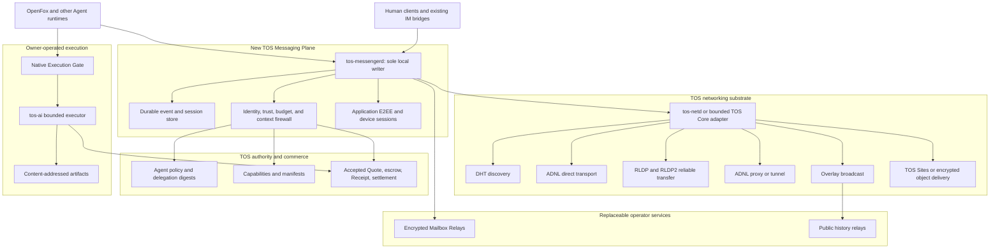

# TOS Decentralized Agent-Native Messenger Architecture

**Document status:** Incubation architecture and implementation inventory  
**Status date:** 2026-08-19  
**Candidate protocol family:** `tos.messaging.*`  
**Relationship to TOS Service Protocol:** complementary; this document does not change the authority model or normative schema of `tos_service_v1`

## 1. Purpose

This document defines how the existing TOS ecosystem can be extended into a
decentralized, Agent-native Messenger for human-to-Agent and Agent-to-Agent
communication.

The design starts from infrastructure that already exists in the TOS
repositories:

- finalized Agent and Capability identity on TOS;
- bounded controller policies and delegation digests;
- DHT, ADNL, RLDP/RLDP2, Overlay, ADNL proxy/tunnel, and TOS Sites networking
  primitives;
- Agent Packet V1 and signed Contact Cards;
- A2A and MCP execution adapters;
- Quote, escrow, Receipt, and settlement foundations;
- the `tos-ai` bounded execution and artifact foundation; and
- the OpenFox always-on Agent runtime.

The missing product is not another blockchain. It is an off-chain messaging
plane that uses TOS for identity, authorization, revocation, optional commerce,
and independently verifiable service outcomes.

This document deliberately distinguishes existing implementation from proposed
work. It must not be used to advertise a target feature as deployed merely
because a lower-level primitive exists.

## 2. Status convention

- **✅ Implemented** — qualifying code and repository evidence exist for the
  stated component. Public deployment or independent operator acceptance may
  still be governed by `ROADMAP.md`.
- **🟡 Partial** — a reusable primitive, reference implementation, or design
  exists, but Messenger-specific behavior or production acceptance is missing.
- **⬜ To be developed** — no qualifying implementation for the stated
  Messenger component was found.
- **🔒 Roadmap-locked** — design may be reviewed, but implementation or
  commercial acceptance is blocked by the current TOS Service Protocol roadmap.

Status in this document is narrower than release readiness. For example, ADNL
code may be implemented while a production Mailbox Relay product using ADNL is
still pending. Likewise, a local adapter may be implemented while an external
interoperability gate remains incomplete.

## 3. Governance and delivery boundary

`docs/ROADMAP.md` is the authority for TOS Service Protocol gate ordering and
acceptance evidence. This Messenger document is an incubation design:

- it does not add a `tos_service_v1` object or alternate authority path;
- it does not count as evidence for Gate C, D, E, F, or G;
- it does not reorder the software-work commercial lifecycle;
- it does not authorize work merely by describing it; and
- Relay, attachment-storage, and inbox-bond commercial profiles remain locked
  until the Expansion Gate permits them.

Separately approved technical incubation may explore reachability, E2EE,
single-writer local storage, and OpenFox-to-OpenFox transport without changing
TOS Service Protocol gate status. Such work must remain isolated from canonical
Registry, Quote, escrow, Receipt, and settlement semantics.

The implementation sequence in this document therefore distinguishes:

```text
technical messaging milestones
  identity binding, reachability, E2EE, delivery, storage, rooms

commercial messaging profiles
  Relay lease, attachment storage, inbox bond, paid history service
```

The first category can be prototyped as incubation when separately approved.
The second category inherits the Expansion Gate lock unless `ROADMAP.md` and
`PRODUCT_STRATEGY.md` are explicitly changed.

## 4. Executive architecture decision

TOS should add a dedicated **Messaging Plane** between Agent runtimes and the
existing networking substrate:

```text
Human clients / OpenFox / other Agent runtimes
                       |
                       v
              TOS Messaging Plane
     sessions, E2EE, inboxes, rooms, event logs,
     delivery semantics, policy, and local history
                       |
                       v
       DHT / ADNL / RLDP / Overlay / TOS Sites
                       |
                       v
      TOS identity / authorization / settlement
```

The core architectural rule is:

> TOS finality establishes who an Agent is and what authority it has. The
> Messenger establishes a private, asynchronous, durable conversation with
> that Agent. A transport, Gateway, Relay, push provider, or UI never becomes
> identity or payment authority.

The first technical product should be an OpenFox-to-OpenFox Messenger with:

- finalized Agent and delegated Messaging Endpoint verification;
- a route strategy selected from measured reachability data;
- application-layer end-to-end encryption;
- one single-writer `tos-messengerd` per local state directory;
- durable local event and replay state;
- direct, tunnel, Relay, or bounded HTTPS delivery according to policy; and
- no dependency on a central Gateway or central message database.

Group rooms, public channels, native mobile clients, and commercial Relay
profiles should follow only after their prerequisites are accepted.

## 5. Current implementation inventory

### 5.1 Already implemented and reusable

| Foundation | Status | Existing evidence | Reuse in the Messenger |
|---|---:|---|---|
| Finalized Agent and Capability objects | ✅ | `NATIVE_IDENTITY_V1.md`, Native Registry state machines, `tos`, and `tos-service-protocol` | Permanent Agent identity, live/tombstoned checks, controller authorization, Capability ownership |
| Weighted Ed25519 controller policies and purpose separation | ✅ | `NATIVE_IDENTITY_V1.md` | Keep root and policy keys outside the messaging daemon; authorize bounded messaging keys through delegation |
| Off-chain delegation documents committed by digest | ✅ | `NATIVE_IDENTITY_V1.md` | Bind a Messaging Endpoint delegation without storing endpoint details or message data on-chain |
| DHT implementation and DHT server | ✅ | `tos/dht`, `tos/dht-server` | Publish and resolve short-lived signed locators and content digests |
| ADNL peer, channel, address, proxy, and tunnel primitives | ✅ | `tos/adnl` | Direct node transport and network-level routing primitives |
| RLDP and RLDP2 reliable transfer | ✅ | `tos/rldp`, `tos/rldp2` | Reliable transfer of larger envelopes, history segments, descriptors, and attachments |
| Overlay broadcast primitives | ✅ | `tos/overlay`, including simple, FEC, Plumtree, and two-step broadcast implementations | Future public channels and optional ciphertext distribution |
| TOS Sites and RLDP HTTP proxy primitives | ✅ | `tos/rldp-http-proxy`, including `DNSResolver` and `PeerCapabilityRouting`, plus `tos/doc/TosSites.md` | Serve signed descriptors, prekey bundles, encrypted attachments, and public history segments |
| Generic HTTP stack and simple HTTP proxy | ✅ | `tos/http`, containing the `toshttp` library and `http-proxy` executable | Bootstrap and fallback HTTP transport only; it links neither ADNL nor RLDP and is not a TOS Sites component |
| Agent Packet V1 signing and strict wire codec | ✅ | `tos-service-protocol/pkg/agentpacket` | Independently signed task or control packets with optional Accepted Quote binding |
| Signed Contact Card reference implementation | ✅ | `tos-service-protocol/pkg/agentpacket/contact.go` | Bootstrap HTTPS discovery and migration input for a richer Messaging Contact Descriptor |
| Finalized Agent verification for Agent Packets | ✅ | `tos-service-protocol/pkg/agentpacket` | Reject unknown, revoked, or unauthorized senders before application delivery |
| A2A and MCP execution adapters | ✅ | `tos-ai/pkg/a2aadapter`, `tos-ai/pkg/mcpadapter` | Preserve standard task and tool semantics inside a Messenger conversation |
| Shared Native Execution Gate | ✅ | `tos-service-protocol/pkg/executiongate` | Verify finalized escrow, Agent, Capability, manifest, transport binding, signer authorization, and one purchase claim |
| A2A-to-MCP duplicate-execution test | ✅ | `tos-ai/pkg/adapterinterop/interop_test.go` | Proves A2A and MCP contend for one purchase slot and execute the runner once |
| Bounded execution and content-addressed artifacts | ✅ | `tos-ai/pkg/executor`, `tos-ai/pkg/artifactstore` | Execute paid work after Messenger policy and finalized escrow checks; re-verify SHA-256 addressed content on read |
| Crash-safe single-owner software-work journal | ✅ | `tos-ai/pkg/softwarework/journal.go` and `tos-ai/internal/dirlock` | Reuse atomic file creation, fsync, rename, private-directory, and process-ownership patterns |
| OpenFox always-on runtime and existing human IM channels | ✅ | `tosnetwork/openfox` | First Agent runtime and human-control bridge for the Messenger |

### 5.2 Partially implemented foundations

| Foundation | Status | What exists | What is still missing |
|---|---:|---|---|
| Agent Packet as a general chat envelope | 🟡 | Sender/recipient Agent IDs, mandatory Capability ID, nonce, sequence, payload digest, signature, optional Quote commitment, and strict JSON | No conversation or room identity, application E2EE, multi-device model, delivery ACK model, or ordinary-chat profile without a Capability |
| Agent Packet replay protection | 🟡 | Reference `ReplayGuard` uses an in-process mutex and map to reject repeated `sender_agent_id + nonce` while the process lives | Durable replay state across restart is missing |
| Agent Packet execution-gate integration | 🟡 | Agent Packet can carry a signed commercially bound payload | No production Agent Packet-to-Execution-Gate adapter and no three-transport A2A/MCP/Agent Packet replay matrix exist |
| Reusable local journal pattern | 🟡 | `softwarework.Journal` is durable and crash-safe for one process that exclusively owns its directory | It is not a concurrent cross-process claim store; Messenger-specific event, ACK, retry, expiry, and compaction semantics remain undefined |
| Contact Card discovery | 🟡 | Signed Agent ID, network tuple, one HTTPS endpoint, optional Capability IDs, and bounded expiry | No ADNL ID, Messaging Endpoint ID, device set, prekey bundle, Mailbox Relay set, protocol negotiation, admission policy, or rotation metadata |
| ADNL proxy and tunnel support | 🟡 | Proxy/tunnel protocol code exists in TOS Core | A supported home/site reverse-tunnel service, operator runbook, health model, quotas, abuse controls, and multi-operator failover remain product work |
| Overlay for rooms or channels | 🟡 | Broadcast, peer-management, private/semiprivate construction, and membership-certificate primitives exist | No Messenger room identity, MLS state, roles, moderation, history synchronization, or room-level conformance tests exist |
| TOS service commerce | 🟡 | Software-work Quote, escrow, Receipt, settlement, SDK, and execution-gate foundations exist | Relay lease, attachment storage, public history, and inbox-bond profiles do not exist and cannot be inferred from the software-work profile |
| OpenFox economic bridge | 🟡 | Architecture and required interfaces are documented in `OPENFOX_ECONOMIC_BRIDGE_V1.md` | A production TOS Messenger channel, durable conversation integration, and fresh OpenFox buyer/provider session are missing |
| Mobile TOS clients | 🟡 | Owner-controlled mobile service-client architecture is documented | Messenger session storage, best-effort push wake-up, multi-device keys, room UI, and messaging conformance are missing |
| Attachment storage primitives | 🟡 | TOS Sites, RLDP, and `tos-ai` content-addressed artifact storage exist | A private Messenger attachment format, encryption policy, retention, authorization, scanning, and garbage collection are missing |

### 5.3 Messenger components that must be developed

| Messenger component | Status |
|---|---:|
| M0-R measured reachability study and route-strategy decision | ⬜ To be developed |
| Messaging Endpoint delegation schema and verifier | ⬜ To be developed |
| Messaging Contact Descriptor and DHT locator profile | ⬜ To be developed |
| One-to-one application-layer E2EE | ⬜ To be developed |
| Multi-device session and key-rotation model | ⬜ To be developed |
| Single-writer durable conversation store and replay journal | ⬜ To be developed |
| Delivery, storage, application, and optional read acknowledgements | ⬜ To be developed |
| Encrypted offline Mailbox Relay | ⬜ To be developed |
| Multi-Relay redundancy and failover | ⬜ To be developed |
| Private group encryption and membership epochs | ⬜ To be developed |
| Public Agent channels over Overlay with history synchronization | ⬜ To be developed |
| Messenger-specific encrypted attachment protocol | ⬜ To be developed |
| OpenFox `tos-messenger` channel adapter | ⬜ To be developed |
| Agent message policy engine and prompt-injection firewall | ⬜ To be developed |
| First-contact admission policy and sybil resistance | ⬜ To be developed |
| Agent Packet-to-Execution-Gate adapter and three-transport replay tests | ⬜ To be developed |
| Native desktop, Web, iOS, and Android Messenger clients | ⬜ To be developed |
| Relay, attachment, history, and inbox-bond commercial profiles | 🔒 Roadmap-locked |
| Cross-implementation positive vectors and adversarial corpus | ⬜ To be developed |
| Independent multi-operator interoperability evidence | ⬜ To be developed |

## 6. Goals and non-goals

### 6.1 Goals

The Messenger should provide:

1. persistent TOS Agent identity independent of any Gateway, Relay, domain, or
   device;
2. direct communication when measured network conditions permit it;
3. encrypted asynchronous delivery when either endpoint is offline or
   unreachable;
4. application E2EE independent of ADNL, HTTPS, Proxy, Relay, or push transport;
5. one-to-one conversations, multi-device synchronization, private rooms, and
   public Agent channels;
6. typed Agent events rather than text-only messages;
7. A2A and MCP interoperability without replacing their task or tool semantics;
8. optional binding to Accepted Quotes, escrow, Receipts, and settlement;
9. replaceable discovery services and Mailbox Relays;
10. safe integration with OpenFox and physical edge AI nodes; and
11. implementation status that never confuses a primitive with a complete
    product.

### 6.2 Non-goals

The Messenger must not:

- store ordinary messages, contacts, private room membership, model traces, or
  attachments on-chain;
- introduce a second source of Agent, Capability, payment, or Receipt authority;
- require one central Gateway or one central Relay;
- settle every token, progress update, or chat message on-chain;
- treat ADNL channel encryption as sufficient application E2EE;
- give remote messages automatic tool, wallet, host, sensor, or actuator
  authority;
- replace A2A task semantics or MCP tool semantics;
- claim that Agent Packet already provides a complete Messenger;
- expose controller, wallet, executor, or hardware-custody keys to the
  Messenger;
- put blockchain consensus in a physical AI real-time control loop; or
- claim mobile push is decentralized, reliable, or part of message authority.

## 7. System architecture



### 7.1 Authority plane — ✅ implemented foundation

Finalized TOS state remains the sole canonical authority for:

- Agent identity, controller policy, delegation digests, recovery, and
  revocation;
- Capability ownership, version commitments, and revocation;
- Accepted Quote terms and selected execution authority;
- escrow, Receipt, dispute, release, refund, and settlement state; and
- network domain and reviewed contract code.

No DHT record, Contact Descriptor, Relay receipt, chat history, push
notification, Gateway response, or local database may override these facts.

### 7.2 Messaging plane — ⬜ to be developed

`tos-messengerd` should own:

- local messaging keys and device sessions, but not Agent controller or wallet
  keys;
- E2EE;
- conversation and room state;
- durable send, receive, retry, replay, and deduplication journals;
- Relay selection and failover;
- attachment encryption and retrieval;
- typed event validation;
- local trust, approval, and rate policy; and
- an authenticated owner-private API for Agent runtimes and clients.

### 7.3 Network adapter — 🟡 primitives exist; product API pending

The adapter should expose only Messenger operations, for example:

```text
ResolveDHT
PublishDHT
OpenADNLSession
SendADNLDatagram
SendRLDPObject
ServeRLDPObject
JoinOverlay
PublishOverlayEvent
SubscribeOverlay
GetReachability
```

It should run behind an owner-private Unix socket or equivalent local boundary.
It must not expose validator, wallet, container runtime, or arbitrary host
control to a remote Agent.

## 8. Data placement and privacy boundary

| Location | Permitted data | Prohibited authority or data |
|---|---|---|
| TOS finalized state | Agent policy, delegation digest, Capability commitments, Accepted Quote, escrow, Receipt, settlement | Chat plaintext, contact graph, private room membership, session keys, ordinary delivery ACKs |
| DHT | Short-lived signed locator, descriptor digest, Relay locator, expiry | Message bodies, complete history, secret prekeys, canonical identity facts |
| ADNL/RLDP/HTTPS | Application ciphertext and public routing data | Decrypted content except at the intended endpoint |
| Mailbox Relay | Opaque mailbox ID, bounded ciphertext, expiry, storage token, delivery state | Plaintext, session keys, controller keys, canonical payment state |
| TOS Sites or object storage | Signed public descriptors, public history, encrypted attachments, encrypted history chunks | Private attachment keys or unencrypted private history |
| Local Agent/device store | Session state, message history, contact policy, replay journal, attachment keys, owner approvals | Unbounded remote-controlled execution authority |
| Gateway or search index | Derived discovery views and routing hints | Canonical Agent, Capability, Quote, balance, or message-history authority |

Bulk message data remains off-chain. Optional on-chain commitments are allowed
only for explicit high-value workflows, not as a default message log.

## 9. Identity and key hierarchy

### 9.1 Existing Agent identity — ✅ implemented

The permanent identity is the finalized TOS `AgentID`. Existing bounded,
weighted Ed25519 policies, purpose separation, revocation, recovery, and
delegation digests remain unchanged.

### 9.2 Messaging Endpoint identity — ⬜ to be developed

A Messaging Endpoint is an online service authorized by an Agent. It is not the
Agent itself and must be independently replaceable and revocable.

A provisional `MessagingEndpointDelegationV1` should contain at least:

```text
schema
network_domain
agent_id
messaging_endpoint_id
messaging_identity_public_key
adnl_id_or_transport_key_commitment
allowed_protocol_versions
allowed_event_classes
not_before
expires_at
maximum_session_lifetime
contact_descriptor_policy_digest
mailbox_policy_digest
```

The Agent account commits only the immutable delegation digest. The full
document remains off-chain. Verification must:

1. resolve the Agent from finalized TOS state;
2. reject a tombstoned Agent;
3. obtain exact delegation bytes;
4. reproduce the committed digest;
5. verify scope, time bounds, network domain, and purpose; and
6. verify authorization under the live Agent policy.

Root Agent controller keys remain in a wallet or dedicated signer. An online
Endpoint key may authenticate descriptors and sessions but must not
implicitly control Agent policy, Capabilities, escrow, or funds.

### 9.3 Device identity — ⬜ to be developed

Each OpenFox host, mobile client, desktop client, or edge terminal should have a
separate Device ID and device key authorized by one Messaging Endpoint. Device
addition and removal must trigger session or group-key changes where required.

### 9.4 Session keys — ⬜ to be developed

Session keys are ephemeral application-layer keys derived through an audited
asynchronous handshake. They are not published on-chain and are not reused as
Agent, Capability, wallet, or execution keys.

## 10. Discovery and addressing

### 10.1 Existing Contact Card — 🟡 partial

The current Contact Card proves that a live Agent controller authorized one
HTTPS endpoint for a bounded period. It is useful for bootstrap, QR, and file
exchange, but it is insufficient for a decentralized multi-device Messenger.

### 10.2 Messaging Contact Descriptor — ⬜ to be developed

A provisional `MessagingContactDescriptorV1` should contain:

```text
schema
network_domain
agent_id
messaging_endpoint_id
delegation_digest
supported_messaging_versions
supported_a2a_versions
supported_mcp_versions
adnl_id
optional_https_endpoint
prekey_bundle_digest
mailbox_relay_set_digest
attachment_service_digest
inbox_admission_policy_digest
maximum_envelope_bytes
issued_at
expires_at
endpoint_signature
```

The descriptor is signed and non-canonical. Its validity always depends on
current finalized Agent and delegation state.

`inbox_admission_policy_digest` commits to an off-chain policy document. It may
represent open, invite-only, allow-listed, proof-limited, or future economically
bonded first contact. The descriptor itself does not create payment authority.

### 10.3 DHT locator profile — ⬜ over ✅ DHT primitives

DHT locates a current descriptor; it does not store chat history. A bounded DHT
value should contain only retrieval and verification material, for example:

```text
schema
network_domain_digest
agent_id_digest
messaging_endpoint_id
descriptor_digest
descriptor_locator
expires_at
endpoint_signature
```

The complete descriptor and prekey bundle may be fetched through TOS Sites,
RLDP, HTTPS, QR, a local file, or another authenticated rendezvous path. Every
path must produce the same digest-authenticated bytes.

### 10.4 Resolution algorithm — ⬜ to be developed

A client should:

1. resolve the Agent and live delegation digests from finalized TOS state;
2. obtain candidate Messaging Contact Descriptors;
3. match network tuple and delegation digest;
4. verify Endpoint signature, expiry, and protocol bounds;
5. resolve ADNL or an approved fallback route;
6. fetch and verify the prekey bundle;
7. evaluate local and recipient-published inbox policy; and
8. establish or resume an E2EE session.

A stale DHT value may cause temporary unavailability, but it must never restore
a revoked Endpoint or change Agent identity.

## 11. M0-R reachability study and route-strategy gate

**Status: ⬜ To be developed. This blocks M1 scope freeze and implementation
start, not merely M1 acceptance.**

The architecture must not assume that direct ADNL is the normal path before it
is measured under consumer and mobile network conditions. The study must be
completed before the team freezes a direct-first, tunnel-first, or Relay-first
M1 design.

### 11.1 Required dimensions

The study must use a stratified matrix rather than one laboratory pair:

| Dimension | Required coverage |
|---|---|
| Address family | IPv4-only, IPv6-only where available, and dual stack |
| Public reachability | both public, one public, neither public |
| NAT behavior | full-cone or endpoint-independent, restricted, port-restricted, symmetric where observed |
| Carrier network | consumer ISP NAT, carrier-grade NAT, mobile carrier NAT |
| UDP policy | allowed, rate-limited, and blocked environments |
| Network mobility | Wi-Fi to mobile, mobile to Wi-Fi, address change, sleep/wake |
| Endpoint class | server, desktop, low-cost ARM/RISC-V edge device, mobile device |
| Mapping assistance | none, static port mapping, and any supported discovery/traversal mechanism |

Low-cost hardware is a cross-cutting endpoint dimension, not a substitute for a
network scenario.

### 11.2 Required metrics

Every sampled cell must record:

- sample size and operator diversity;
- direct session success rate;
- p50 and p95 session-establishment latency;
- p50 and p95 reconnect latency;
- session survival time;
- failure classification;
- Proxy/tunnel fallback share;
- Mailbox Relay fallback share;
- bounded HTTPS fallback share;
- CPU, memory, bandwidth, and energy cost where measurable; and
- exact client and network-adapter commits.

The study must predeclare minimum sample sizes and the thresholds that select:

```text
direct-first
proxy/tunnel-first
relay-first
hybrid by network class
```

Two public hosts are a smoke test, not acceptance evidence.

### 11.3 Architectural consequence

If direct establishment succeeds reliably across the target strata, direct
ADNL may be the normal online path. If it does not, Proxy/tunnel and Mailbox
Relay become primary delivery infrastructure and must move into the first
implementation scope with corresponding reliability, quota, abuse, and
operator requirements.

M1 work may not be substantially implemented and then use the final
reachability report to justify a different architecture after the fact.

## 12. Transport strategy

### 12.1 Route selection — ⬜ frozen after M0-R

The selected policy must preserve one encrypted Event ID and event semantics
when routes change. A provisional route order may be:

```text
measured viable direct ADNL
  -> approved ADNL proxy/tunnel
  -> recipient-selected Mailbox Relays
  -> bounded HTTPS bootstrap/fallback
```

The actual order is frozen only after M0-R.

### 12.2 Direct path — 🟡 primitives implemented; integration pending

ADNL is the direct transport candidate. RLDP/RLDP2 should carry reliable larger
objects. Direct transport cannot bypass Endpoint verification, E2EE, inbox
policy, durable deduplication, or the Native Execution Gate.

### 12.3 Proxy or tunnel path — 🟡 primitives implemented; service pending

A production service still needs:

- Endpoint enrollment and revocation;
- health and reachability reporting;
- bandwidth and connection quotas;
- abuse prevention and operator isolation;
- discovery and failover;
- deployment and recovery runbooks; and
- independent multi-operator tests.

### 12.4 Offline Mailbox path — ⬜ to be developed

If direct delivery is unavailable, the sender deposits the same application
ciphertext with one or more recipient-selected Relays. The recipient pulls or
is awakened by a best-effort push hint, verifies and decrypts locally, commits
the Event ID, and acknowledges delivery.

### 12.5 HTTPS fallback — 🟡 bootstrap only

Agent Packet HTTP and Contact Card can support early interoperability.
Redirects, origins, response sizes, timeouts, and credentials remain bounded.
HTTPS must not become identity or payment authority.

## 13. Application-layer end-to-end encryption

**Status: ⬜ To be developed.**

ADNL or TLS protects one transport connection. It does not provide complete
Messenger E2EE when ciphertext is stored by a Relay, routed through a Proxy,
synchronized across devices, or transported by different protocols.

The cryptographic profile must provide:

- asynchronous establishment while the recipient is offline;
- binding to finalized Agent identity and an authorized Endpoint;
- forward secrecy and post-compromise recovery;
- authenticated device addition, removal, and rotation;
- replay and out-of-order handling;
- encrypted attachments;
- algorithm identifiers and a bounded upgrade path;
- a hybrid post-quantum migration path; and
- independent vectors and security review.

Implementations must use reviewed libraries and standardized constructions.
They must not invent a new cipher, MAC, signature, ratchet, or group key
schedule.

### 13.1 Private-group default candidate

MLS, RFC 9420, is the default candidate to beat for private groups because it
provides membership epochs, forward secrecy, post-compromise security, and
authenticated add/remove operations under an untrusted delivery-service model.
An alternative may be selected only after a written comparison against MLS.

This architecture does not claim that MLS is implemented or frozen. The exact
suite, library, credential mapping, external-sender policy, recovery model, and
multi-device model remain M0 decisions.

## 14. Messaging event model

### 14.1 Outer Relay Envelope — ⬜ to be developed

A Relay should see only the minimum resource and routing information required
to store ciphertext:

```text
RelayEnvelopeV1 {
  schema
  opaque_mailbox_id
  message_id
  ciphertext
  ciphertext_size
  expires_at
  optional_storage_token
  optional_admission_token
}
```

`optional_admission_token` is an opaque, bounded token under the recipient's
published inbox policy. It is not automatically an on-chain commitment and
must not reveal sender identity, contact graph, conversation ID, or plaintext.
Its exact verifier and privacy properties are M0 decisions.

The Relay Envelope is not an Agent signature, payment Receipt, or proof that an
application accepted the message.

### 14.2 Inner Messaging Event — ⬜ to be developed

After decryption, the recipient obtains a typed event such as:

```text
MessagingEventV1 {
  schema
  network_domain
  conversation_id
  event_id
  sender_agent_id
  sender_messaging_endpoint_id
  sender_device_id
  room_id_optional
  thread_id_optional
  reply_to_event_id_optional
  causal_parents
  created_at
  expires_at_optional
  event_kind
  idempotency_key_optional
  content
  attachment_references
  service_binding_optional
}
```

The normal authentication mechanism is the E2EE session. High-value control
events may additionally carry an independently verifiable Agent or delegated
Endpoint signature.

### 14.3 Initial event kinds — ⬜ to be developed

```text
text
conversation.invite
conversation.accept
presence.hint
agent.task.request
agent.task.progress
agent.task.result
approval.request
approval.grant
approval.deny
a2a.message
mcp.call
mcp.result
artifact.offer
artifact.reference
service.quote.reference
service.escrow.reference
service.receipt.reference
delivery.ack
application.ack
room.invite
room.membership.commit
room.message
```

Unknown event kinds must not be interpreted as tools, approvals, payments, or
side-effect authority by default.

### 14.4 Relationship to Agent Packet V1 — 🟡 reuse, not replacement

Agent Packet V1 remains a compact, independently signed packet with optional
commercial binding. It is suitable for a task or control object that must be
verified outside a live session.

Ordinary conversation events should not be forced into Agent Packet V1 because
the current packet requires a Capability ID and lacks conversation, room,
device, encryption, and delivery semantics.

An `agent.task.request` may carry:

- exact Agent Packet V1 bytes;
- an Agent Packet digest plus retrieval reference; or
- an A2A message mapped under existing adapter rules.

No Messenger schema should be added as a second canonical object family inside
`tos.service.v1/native.proto`.

## 15. Local storage, delivery, ordering, and acknowledgements

### 15.1 Single-writer local-store decision — frozen for the first implementation

The first implementation uses one `tos-messengerd` process as the **sole writer
for one local state directory**.

OpenFox, CLI, desktop, Web, and owner-control processes use authenticated local
IPC. They do not open or mutate the Messenger database directly.

This decision matches the strongest reusable evidence available today:

- `tos-ai/pkg/softwarework/journal.go` demonstrates crash-safe file claims,
  fsync, atomic rename, and private state directories; and
- `tos-ai/internal/dirlock` demonstrates exclusive process ownership.

Those packages do **not** implement a shared multi-process claim store. The
Messenger may reuse their durability and ownership patterns, but it needs its
own event, retry, ACK, expiry, compaction, and migration state machine.

If a future release requires active-active writers on one host, it must define a
new transactional store, atomic uniqueness constraints, crash recovery, and
concurrent-process conformance. It may not describe the existing directory lock
as that implementation.

### 15.2 Delivery semantics

Transport delivery is at least once. Application processing is idempotent
through a durable claim on authenticated Event ID, sender Endpoint, and
conversation context.

The local store must atomically persist:

- inbound ciphertext identity;
- verification and decryption outcome;
- sender/Endpoint binding;
- Event ID and ordering metadata;
- application-delivery state;
- retry and expiry state; and
- acknowledgement state.

Restart, Relay retry, or route switch must not erase replay protection.

### 15.3 Ordering

One-to-one conversations may use per-device sequence numbers plus causal
parents. Private rooms require epoch and sender ordering. Public channels use
signed event identities and deterministic local presentation rather than one
trusted server clock.

### 15.4 Acknowledgement classes

The wire protocol distinguishes:

- `StoredAck` — a Relay durably stored ciphertext;
- `DeliveryAck` — a recipient device durably accepted and deduplicated it;
- `ApplicationAck` — an Agent runtime accepted the typed event;
- `ReadAck` — optional user-facing read state; and
- TOS `Receipt` — a canonical commercial result commitment under an Accepted
  Quote.

No transport or Messenger ACK is a TOS Receipt or settlement authorization.

## 16. Encrypted Mailbox Relay

**Technical status: ⬜ To be developed. Commercial profile: 🔒 Roadmap-locked.**

A decentralized Messenger still requires servers when recipients are offline.
Decentralization means Relays are replaceable and cannot read messages or own
identity; it does not mean no Relay process exists.

A reference `tos-mailboxd` should:

- accept bounded opaque ciphertext envelopes;
- use recipient-generated opaque mailbox IDs;
- enforce size, count, rate, and retention limits;
- return a signed storage acknowledgement;
- support pull, bounded long-poll, or wake-up hints;
- delete or expire ciphertext under authenticated recipient policy;
- hold no Agent controller, wallet, or execution key;
- maintain crash-safe storage and deletion journals; and
- publish a signed Relay descriptor.

Recipients should select two or more independently operated Relays. Duplicate
Relay delivery is collapsed by durable Event ID deduplication.

The first release must document visible metadata rather than claim perfect
traffic-analysis resistance.

### 16.1 First-contact admission and sybil resistance — ⬜ to be developed

Relay quotas protect Relay operators; they do not protect recipients. Agents
can generate contacts faster than humans can evaluate them, and each admitted
event may consume storage, policy checks, and model tokens.

The recipient therefore publishes an Inbox Admission Policy digest in its
Contact Descriptor. Initial policy modes should include:

```text
open with bounded rate limits
invite-token required
local allow-list
prior Accepted Quote or prior counterparty
optional bounded computational proof, if M0 selects one
future economically bonded first contact
```

A zero-cost open inbox must remain supported.

#### Current economic boundary

The existing fixed-price Software-Work Escrow cannot implement the proposed
first-contact bond. Its successful path releases the full fixed price to the
provider after a canonical software-work Receipt; its refund path follows the
committed objective timeout rule. It does not express:

- recipient acceptance followed by refund to the sender;
- rejection followed by forfeiture;
- arbitrary bond release without software-work execution; or
- a bidirectional inbox-admission outcome.

An economic first-contact mechanism therefore requires a separate,
roadmap-approved Inbox Admission Profile and may require a new bond escrow state
machine. It may reuse finalized Agent identity, asset identity, finality, and
chain-derived settlement principles, but it must not claim to reuse the current
software-work escrow unchanged.

#### Relay enforcement boundary

Direct and Relay paths must enforce the same recipient policy. The exact design
must balance abuse resistance with metadata privacy:

- a Relay may verify an opaque recipient-scoped admission token;
- the recipient may enforce identity or economic evidence after decryption;
- an on-chain reference in the outer envelope may leak linkable metadata; and
- any anonymous or zero-knowledge token construction requires separate review.

M0 must choose and document that boundary. A Relay cannot be said to enforce an
on-chain sender bond when the envelope carries no verifiable admission proof.

Economic first contact is **not** mandatory for the first Messenger demo. The
first demo may use invite-only or allow-listed contact plus bounded rate limits.

### 16.2 Technical and commercial Relay milestones

The Relay work is split deliberately:

- **M2-T Technical Relay** — encrypted offline storage, redundancy, ACKs,
  retention, quotas, crash recovery, and failover. This is technical incubation.
- **M2-C Commercial Relay Lease** — a fixed-price Relay lease profile under
  TOS Service Protocol. This is blocked until the Expansion Gate opens or the
  governing strategy and roadmap are explicitly changed.

The minimal future commercial profile should start with a fixed-price lease:

```text
one approved Relay Capability
  -> one Quote for a fixed period and fixed maximum quota
  -> one objective lease-activation result
  -> one profile-specific Receipt and settlement
```

It should not begin with per-byte metering, availability proofs, or
operator-self-reported usage as settlement authority. Those belong to M7.

The existing software-work Receipt and escrow do not automatically become a
Relay Lease Receipt or Relay Lease escrow. A Relay profile needs its own frozen
manifest, objective acceptance evidence, Receipt semantics, vectors, and any
required contract changes.

## 17. Rooms and channels

### 17.1 Private rooms — ⬜ to be developed

Private rooms require:

- stable Room ID;
- signed invitations;
- explicit member and role state;
- membership epochs;
- forward-secure group encryption;
- removal that prevents decryption of later epochs;
- bounded administrator and moderator powers;
- multi-device synchronization; and
- deterministic conflict and recovery behavior.

Room membership remains off-chain by default.

#### Room membership is not Overlay membership

TOS Core exposes private and semiprivate Overlay construction and methods such
as `add_certificate` and `update_member_certificate`. These are transport-layer
membership primitives. They are not the Messenger room-membership state
machine and must not be mapped one-to-one without a separate design.

A removed room member may still receive later ciphertext from a network or
untrusted delivery service. The required security property is that the removed
member cannot authenticate, decrypt, or derive secrets for later epochs.
Transport delivery does not need to prove that it stopped receiving bytes.

#### First private-room transport decision

The first implementation defaults to per-device fan-out over one-to-one
sessions, combined with the selected group key-management protocol. Reasons:

- it avoids making Overlay membership a direct disclosure of Room membership;
- it reuses the first accepted delivery and retry path;
- it simplifies small-room offline delivery and device-specific ACK handling;
- it does not depend on Overlay membership certificates for MLS authorization;
  and
- it keeps the initial failure model bounded.

The cost is sender or Relay bandwidth proportional to member-device count, so
M0 must freeze an initial room-size limit.

This is an MVP routing choice, not a cryptographic security invariant. A later
revision may distribute opaque MLS ciphertext over an Overlay while preserving
separate MLS Room membership. It must document what membership and traffic
metadata Overlay peers can observe.

### 17.2 Public Agent channels — 🟡 Overlay primitive implemented; product pending

Public channels may use Overlay propagation and RLDP/TOS Sites history. The
Messenger must still define:

- publisher authorization;
- roles and moderation;
- event signatures and deduplication;
- history commitments;
- catch-up and gap repair;
- spam and resource policy; and
- multi-operator failover.

Overlay success is not proof of publisher authority or payment state.

## 18. Attachments and artifacts

**Status: 🟡 storage primitives exist; Messenger profile ⬜.**

Private attachments are encrypted before upload. The content address commits to
ciphertext; the decryption key and plaintext metadata remain inside the E2EE
Messaging Event.

The profile must define:

- maximum size and chunking;
- ciphertext digest and optional plaintext-digest disclosure;
- media type and filename handling;
- per-recipient or per-room key wrapping;
- expiry and deletion behavior;
- interrupted download recovery;
- decompression, archive, parser, and content-bomb limits; and
- sandbox or scanning rules before Agent consumption.

`tos-ai` artifact primitives may be reused at library level, but a Messenger
attachment is not automatically a software-work Artifact or Receipt input.

## 19. Agent runtime and prompt-injection boundary

### 19.1 OpenFox integration — ⬜ Messenger adapter pending

OpenFox should be the first Agent runtime:

```text
OpenFox and local clients
   |
   | authenticated owner-private IPC
   v
tos-messengerd: sole local state writer
```

OpenFox decides whether and how to respond, which model or tool to use, whether
owner approval is required, and whether to buy or sell a service.
`tos-messengerd` handles discovery, encryption, transport, storage,
deduplication, and typed delivery.

Existing human IM channels may serve as owner-control bridges. They do not
become TOS identity providers.

### 19.2 Context firewall — ⬜ to be developed

A valid signature proves origin, not safety. Before remote content reaches an
Agent loop, integration must:

1. validate schema and authenticated sender/Endpoint;
2. classify event kind;
3. apply contact, room, rate, Capability, and budget policy;
4. mark remote content as untrusted input;
5. prevent it from entering system or developer instruction channels;
6. require structured tool and approval objects;
7. route side effects through owner policy and local approval;
8. bind paid execution to finalized Quote and escrow state; and
9. log a privacy-minimized decision record.

Remote text must never grant MCP tools, wallet signing, shell, containerd, file,
sensor, or actuator authority merely by being signed.

### 19.3 Physical AI safety — 🟡 foundation exists; profile pending

A physical edge node may run OpenFox and `tos-messengerd`, but events terminate
at local policy and safety boundaries. Messenger must not replace real-time
controllers or safety interlocks. Raw sensors and actuators remain unavailable
unless a separately authorized local Capability permits a bounded operation.

## 20. A2A, MCP, Agent Packet, and TOS commerce

### 20.1 Separation of responsibilities

```text
TOS Messenger
  identity-bound sessions, E2EE, asynchronous delivery, rooms, and history

A2A
  Agent task, progress, artifact, result, and cancellation semantics

MCP
  Agent-to-tool invocation semantics

Agent Packet V1
  independently signed bounded task/control packet

TOS Service Protocol
  identity, Capability, Quote, escrow, Receipt, dispute, and settlement
```

No layer replaces another's authority.

### 20.2 Paid task flow — 🟡 foundations implemented; Messenger path pending

```text
Agent A resolves Agent B and Capability from finalized TOS state
  -> validates Quote Proposal
  -> commits and funds Accepted Quote escrow
  -> establishes or resumes a Messenger session
  -> sends encrypted typed task carrying A2A or Agent Packet data
  -> Agent B passes the purchase through the Native Execution Gate
  -> tos-ai executes once
  -> encrypted progress and result events return
  -> execution authority creates canonical Receipt
  -> settlement is resolved from finalized TOS state
```

The Messenger may carry references to Quote, escrow, and Receipt objects, but it
cannot create them through a chat acknowledgement.

### 20.3 Cross-transport replay status

Current evidence proves:

```text
A2A first execution
  -> MCP retry reaches the same Gate
  -> runner executes once
```

It does not prove Agent Packet participation. Before Agent Packet is marked
complete, implementation and tests must cover:

- Agent Packet-to-Execution-Gate mapping;
- A2A then Agent Packet;
- MCP then Agent Packet;
- Agent Packet then A2A;
- Agent Packet then MCP; and
- concurrent submissions over all enabled transports.

Every path must produce one purchase claim and at most one runner execution.

### 20.4 Session economics

Do not settle per message. Preferred patterns are:

```text
one finalized Quote and bounded budget
  -> many encrypted off-chain events
  -> one or a few profile-specific Receipts
  -> one final settlement
```

New Relay, storage, history, or inbox-bond services must define their own
profile-specific objective result and Receipt semantics. They cannot relabel a
software-work Receipt.

## 21. Mobile push boundary

**Status: ⬜ client integration pending.**

Apple and Android push services are a known non-replaceable platform dependency
for timely background wake-up. They are restricted to a contentless hint that
contains no:

- plaintext;
- session key;
- sender Agent or Device identity;
- conversation or Room identity;
- Quote, escrow, Receipt, or settlement state; or
- action authority.

Push is a latency optimization, not a delivery-correctness mechanism. Push may
be delayed, rate-limited, coalesced, or lost. The client must recover through
ordinary Messenger synchronization when the user opens the app, a permitted
background task runs, or another network activity occurs.

The project must disclose this residual centralization and must not call mobile
push a fully decentralized delivery path.

## 22. Repository and process boundaries

### 22.1 Existing repositories

| Repository | Messenger responsibility |
|---|---|
| `tos` | Keep consensus and generic DHT/ADNL/RLDP/Overlay/TOS Sites primitives; expose a bounded local adapter if required |
| `tos-service-spec` | Record authority compatibility, incubation status, integration rules, and acceptance requirements; do not add general chat objects to Native Registry schema |
| `tos-service-protocol` | Reuse finalized resolvers, Agent verification, Agent Packet, and commerce builders; do not become a chat database |
| `tos-service-gateway` | Optional derived discovery or HTTPS routing; no message-history or identity authority |
| `tos-ai` | Preserve bounded execution, artifacts, A2A/MCP adapters, and Native Execution Gate integration |
| `openfox` | Add first `tos-messenger` channel, owner policy, and Agent-loop integration |
| `android` / `ios` | Add owner-controlled clients after protocol and daemon stability |

### 22.2 New implementation repository — ⬜ to be developed

Create `tosnetwork/tos-messenger` rather than putting the runtime in a
validator, Gateway, or worker repository.

Suggested layout:

```text
cmd/tos-messengerd
cmd/tos-mailboxd
cmd/tos-messenger-cli

pkg/identity
pkg/directory
pkg/netadapter
pkg/session
pkg/e2ee
pkg/envelope
pkg/eventlog
pkg/mailbox
pkg/room
pkg/attachments
pkg/policy
pkg/contextfirewall
pkg/a2abridge
pkg/mcpbridge
pkg/agentpacketbridge
pkg/openfoxbridge
pkg/store
```

A separate `tos-messaging-spec` repository may be created after M0 if wire
protocol governance should be independent. Until then this remains incubation,
not a frozen specification.

## 23. Security requirements and negative tests

### 23.1 Existing reusable tests — ✅ or 🟡

- strict Agent Packet and Contact Card JSON decoding;
- sender authorization against finalized Agent state;
- sender and recipient live-state checks;
- in-process Agent Packet nonce replay rejection;
- bounded Agent Packet payloads;
- A2A/MCP shared execution-gate replay protection;
- bounded executor and artifact-store conformance;
- crash-safe single-owner software-work journal patterns; and
- finalized Quote, escrow, Receipt, and settlement checks.

### 23.2 Required Messenger matrix — ⬜ to be developed

The Messenger cannot be accepted without tests covering at least:

1. revoked Agent, Endpoint, and Device keys;
2. stale DHT locators and Contact Descriptors;
3. descriptor substitution across network domains;
4. prekey replay, exhaustion, and equivocation;
5. duplicate, reordered, delayed, expired, and cross-Relay messages;
6. crash during send, store, pull, decrypt, application delivery, and ACK;
7. exclusive single-writer ownership and rejection of a second local writer;
8. authenticated IPC from multiple local clients to the sole writer;
9. malicious Relay deletion, withholding, reordering, and duplication;
10. oversized envelopes, attachments, decompression bombs, and parser abuse;
11. group member removal and inability to decrypt later epochs;
12. ciphertext still delivered to a removed member without confidentiality loss;
13. compromised device removal and session recovery;
14. Gateway or Relay takeover without controller keys;
15. metadata leakage and residual traffic-analysis documentation;
16. A2A/MCP/Agent Packet duplicate task submission once all adapters exist;
17. prompt injection, tool escalation, wallet requests, and unsafe attachments;
18. message ACK presented as a forged TOS Receipt;
19. finality disagreement and network-domain mismatch;
20. offline edge-node reconnect and bounded reconciliation;
21. remote physical-control attempts outside local policy;
22. lost, delayed, or duplicated mobile push hints; and
23. inbox-policy bypass attempts on direct and Relay paths.

Every positive vector needs an independent encoder, decoder, or verifier. Every
security-sensitive state transition needs crash and replay tests.

## 24. Implementation plan

### M0 — Architecture, threat model, and protocol freeze

**Status: ⬜ To be developed.**

Deliver:

- authority and data-placement rules;
- formal threat model;
- Endpoint delegation schema;
- Contact Descriptor, inbox-policy commitment, and DHT locator schema;
- selected reviewed cryptographic suites;
- one-to-one envelope and event schemas;
- sole-writer local-store contract and IPC boundary;
- durable replay, retry, ACK, expiry, and migration contract;
- typed errors and retry dispositions;
- positive vectors and adversarial corpus; and
- repository ownership and versioning rules.

Accept when two independent implementations reproduce all hashes and reject all
negative vectors.

### M0-R — Reachability and route-strategy decision

**Status: ⬜ To be developed; prerequisite for M1 scope freeze and start.**

Deliver the study in section 11 with predeclared sample sizes, thresholds,
network strata, metrics, exact commits, and a resulting direct-first,
tunnel-first, Relay-first, or hybrid decision.

Accept only when target consumer, CGNAT, mobile, IPv4/IPv6, UDP-policy, and
low-cost-device conditions have qualifying measurements. Two public servers do
not satisfy this milestone.

### M1 — One-to-one Messenger

**Status: ⬜ over ✅ network primitives.**

M1 scope is frozen only after M0-R. Deliver:

- `tos-messengerd` as sole local writer;
- authenticated local IPC;
- finalized Agent and Endpoint verification;
- selected online transport and bounded fallback strategy;
- application E2EE;
- durable local event and replay journals;
- text and basic typed Agent events; and
- OpenFox local IPC prototype.

Accept when independently operated Agents exchange encrypted messages, restart,
resend duplicates, rotate one Endpoint key, and recover without a central
Gateway or message database under the route strategy selected by M0-R.

### M2-T — Technical offline Mailbox and multi-Relay failover

**Status: ⬜ To be developed.**

Deliver `tos-mailboxd`, opaque mailbox IDs, bounded encrypted storage,
Stored/Delivery/Application ACKs, two-Relay redundancy, retention, quotas,
abuse controls, crash recovery, and documented metadata exposure.

Accept when a recipient remains offline, receives after reconnect, processes
once despite duplicate Relay delivery, and continues after one Relay disappears.
No payment claim is required for M2-T.

### M2-C — Minimal commercial Relay lease

**Status: 🔒 Roadmap-locked by the Expansion Gate.**

When unlocked, deliver one fixed-price Mailbox Relay Capability and profile,
one Quote for a fixed period and bounded quota, objective lease activation, a
profile-specific Receipt, settlement, vectors, and independent resolution.

M2-C does not block M2-T technical acceptance while the Expansion Gate is
locked. It may become a separate commercial acceptance milestone only after the
governing roadmap permits the profile.

### M3 — OpenFox, A2A, MCP, Agent Packet, and commercial execution

**Status: 🟡 execution foundations; Messenger integration ⬜.**

Deliver OpenFox channel, context firewall, typed A2A/MCP events, Agent Packet
carriage, Agent Packet execution-gate adapter, Quote/escrow references, result
return, Receipt verification, and the three-transport replay matrix.

Accept when an independent OpenFox buyer pays an independent provider, sends
the task through encrypted Messenger, receives the result, and a third resolver
reconstructs settlement without a shared private database.

### M4 — Multi-device and private rooms

**Status: ⬜ To be developed.**

Deliver device authorization and removal, history synchronization, private Room
membership, selected group encryption, role policy, fan-out limits, and
member-removal conformance.

Accept when removed devices and members cannot decrypt later events, even when
an untrusted transport still delivers later ciphertext to them.

### M5 — Public Agent channels over Overlay

**Status: 🟡 Overlay primitive implemented; product ⬜.**

Deliver signed events, publisher and moderator roles, Overlay propagation,
content-addressed history, gap repair, anti-spam policy, and history-Relay
failover.

Accept when independent nodes converge on valid events despite one malicious or
unavailable Relay and reject unauthorized publishers.

### M6 — Native clients

**Status: ⬜ To be developed.**

Deliver Web/desktop, Android, and iOS clients with secure key storage,
background recovery, QR/contact import, owner approvals, rooms, attachments,
and independent finality checks for commercial events.

Accept when changing Gateway or Mailbox Relay does not change identity, keys,
conversation authority, or payment interpretation, and when push loss does not
lose messages.

### M7 — Full Relay and storage economics

**Status: 🔒 Roadmap-locked.**

When unlocked, deliver Relay, attachment, and public-history profiles; bounded
Quote and quota-token flows; objective usage or availability evidence where
selected; Receipt rules; refunds; accounting; and independent auditability.

Accept when one funded agreement covers many off-chain messages, usage remains
bounded and independently checkable, and no per-message chain transaction is
required.

## 25. Work-package matrix

| ID | Work package | Target repository | Status |
|---|---|---|---:|
| MSG-001 | Threat model and invariants | `tos-service-spec` | ⬜ |
| MSG-002 | Endpoint delegation schema and vectors | `tos-service-spec` / future messaging spec | ⬜ |
| MSG-003 | Contact Descriptor, inbox-policy digest, and DHT locator | future messaging spec | ⬜ |
| MSG-004 | Bounded local TOS network adapter | `tos` / `tos-messenger` | 🟡 primitives exist |
| MSG-005 | One-to-one E2EE profile and vectors | future messaging spec | ⬜ |
| MSG-006 | Sole-writer durable event, replay, retry, and ACK store | `tos-messenger` | ⬜ reuse atomic-file and dirlock patterns; do not claim a shared multi-process store |
| MSG-007 | Relay Envelope and Messaging Event codec | `tos-messenger` | ⬜ |
| MSG-008 | Direct ADNL and RLDP integration | `tos-messenger` | 🟡 primitives exist |
| MSG-009 | HTTPS bootstrap/fallback adapter | `tos-messenger` | 🟡 Agent Packet HTTP exists |
| MSG-010 | Encrypted Mailbox Relay | `tos-messenger` | ⬜ |
| MSG-011 | Multi-Relay selection and failover | `tos-messenger` | ⬜ |
| MSG-012 | Delivery/Application ACK state machine | `tos-messenger` | ⬜ |
| MSG-013 | Encrypted attachment profile | `tos-messenger` | 🟡 storage primitives exist |
| MSG-014 | OpenFox channel and local IPC | `openfox` | ⬜ |
| MSG-015 | Context firewall and approval policy | `openfox` / `tos-messenger` | ⬜ |
| MSG-016 | A2A event bridge | `tos-messenger` / `tos-ai` | 🟡 A2A execution adapter exists |
| MSG-017 | MCP event bridge | `tos-messenger` / `tos-ai` | 🟡 MCP execution adapter exists |
| MSG-018 | Agent Packet carriage and Execution Gate adapter | `tos-messenger` / `tos-service-protocol` / `tos-ai` | 🟡 Agent Packet exists; adapter and replay matrix pending |
| MSG-019 | Quote/escrow/Receipt reference profile | `tos-messenger` / `tos-service-protocol` | 🟡 commerce foundation exists |
| MSG-020 | Multi-device synchronization | `tos-messenger` | ⬜ |
| MSG-021 | Private Room protocol and MLS comparison | `tos-messenger` | ⬜ |
| MSG-022 | Public channel Overlay integration | `tos-messenger` / `tos` | 🟡 Overlay exists |
| MSG-023 | Desktop/Web client | selected client repository | ⬜ |
| MSG-024 | Android client | `android` | ⬜ |
| MSG-025 | iOS client | `ios` | ⬜ |
| MSG-026 | Relay and storage commercial profiles | `tos-service-spec` | 🔒 Expansion Gate |
| MSG-027 | Cross-implementation conformance harness | multiple | ⬜ |
| MSG-028 | Independent multi-operator deployment | deployments/runbooks | ⬜ |
| MSG-029 | Reachability matrix and route-strategy gate | `tos-messenger` / deployments | ⬜ blocks M1 scope freeze and implementation start |
| MSG-030 | First-contact admission policy and sybil resistance | future messaging spec / `tos-messenger` | ⬜ |
| MSG-031 | Inbox Admission Bond profile and any required escrow | `tos-service-spec` / `tos` | 🔒 Expansion Gate; current software-work escrow is insufficient |
| MSG-032 | Fixed-price Mailbox Relay Lease profile | `tos-service-spec` | 🔒 Expansion Gate |

## 26. Minimum viable demonstration

The first public technical demonstration should prove the messaging trust
boundary, not require every future economic profile:

```text
Human owner
  -> existing OpenFox human channel or local UI
  -> OpenFox Agent A
  -> TOS Messenger E2EE session
  -> route selected by M0-R
  -> OpenFox Agent B
  -> typed Agent event
  -> durable restart and duplicate recovery
```

Minimum technical acceptance:

- Agents are controlled by different operators;
- identity and Endpoint delegation are checked from finalized TOS state;
- Relay or Proxy, if used, cannot decrypt content;
- both daemons survive restart without duplicate application events;
- a second local writer is rejected and local clients use authenticated IPC;
- changing or disabling one Relay does not change Agent identity;
- delivery ACKs are visibly distinct from TOS Receipts;
- invite-only, allow-listed, or open bounded first-contact policy is enforced;
- push loss does not lose a message; and
- no central Gateway or private shared message database is required.

A later commercial demonstration may add:

```text
finalized Capability and funded Accepted Quote
  -> encrypted A2A/MCP/Agent Packet task
  -> Native Execution Gate
  -> tos-ai execution
  -> encrypted result
  -> canonical Receipt and settlement
```

Commercial acceptance additionally requires:

- all enabled transports contend for one purchase slot;
- the result Artifact is content-addressed and verified; and
- a third resolver reconstructs Quote, escrow, Receipt, and settlement without
  the original Gateway or Messenger database.

Paid Relay storage and economic first-contact bonds are not mandatory until
their roadmap-approved profiles exist.

## 27. Non-negotiable invariants

1. Finalized TOS state is the only authority for Agent identity, delegation,
   Capability, Accepted Quote, escrow, Receipt, and settlement.
2. Ordinary messages, private contact graphs, private Room membership, and
   session keys do not become consensus input.
3. DHT stores locators and digests, not message history.
4. ADNL, RLDP, HTTPS, Proxy, and Relay transport application ciphertext;
   transport encryption does not replace Messenger E2EE.
5. Controller, wallet, and execution-custody keys never belong to a Gateway,
   Relay, remote peer, or general Messenger process.
6. A Gateway, Relay, HTTP response, ADNL acknowledgement, DeliveryAck,
   ApplicationAck, or ReadAck is never a TOS Receipt.
7. Network delivery may be at least once; application events and paid execution
   remain idempotent and crash-safe.
8. The first implementation has one local state writer per directory; existing
   `dirlock` evidence is not misrepresented as a shared multi-process store.
9. A signed remote message remains untrusted until local policy admits its event
   kind and side effects.
10. Remote messages cannot bypass the Native Execution Gate or physical safety
    controls.
11. Room removal requires inability to decrypt or derive later Epoch secrets;
    it does not require the network to stop delivering ciphertext.
12. Overlay membership and Messenger Room membership are separate states.
13. Current software-work escrow and Receipt semantics are not relabeled as a
    Relay Lease or Inbox Bond profile.
14. Every Relay and Gateway is replaceable without changing identity, session
    authority, or commercial truth.
15. Mobile push is a best-effort contentless wake-up exception, not a
    decentralized or reliable delivery authority.
16. No feature is marked implemented without code, tests, and acceptance
    evidence required for that layer.

## 28. Open decisions for M0

The following remain explicitly unresolved:

- exact one-to-one E2EE suite and library;
- hybrid post-quantum migration schedule;
- MLS credential and ciphersuite profile, or justified alternative;
- maximum initial private-Room member and device counts;
- whether and when opaque MLS ciphertext uses Overlay distribution;
- Endpoint and Device identifier derivation;
- DHT key derivation, update rule, and locator bounds;
- prekey publication, replenishment, and equivocation detection;
- durable store schema, migrations, compaction, and recovery;
- IPC authentication and client authorization;
- Mailbox sender privacy, quota token, and abuse policy;
- non-economic first-contact modes and admission-token privacy;
- whether an economic Inbox Bond is ever justified;
- mobile push privacy and recovery behavior;
- public-channel ordering and moderation;
- private-history backup and recovery;
- attachment retention and deletion guarantees;
- whether the wire specification remains here or moves to
  `tos-messaging-spec`; and
- independent implementations and operators required for acceptance.

The reachability study is not an open design preference. It is evidence that
must be collected before M1 scope is frozen.

## 29. Completion criterion

The decentralized Agent-native Messenger is complete only when independently
operated Agents can discover one another from TOS-backed identity, establish an
application-layer encrypted session, communicate through the measured and
accepted route strategy, survive crashes and duplicates, synchronize devices,
use typed A2A/MCP workflows, optionally complete a paid TOS service lifecycle,
and independently verify commercial state without sharing a central account,
message, or payment database.

Until then, describe the project precisely:

> TOS already has substantial identity, networking, execution, and settlement
> foundations. The decentralized Messenger product, its cryptographic profile,
> its route strategy, its Relay service, and its security acceptance remain
> development work.
