# OpenFox Autonomous Earning — Implementation Plan

## Status

- Document type: design proposal and implementation plan
- Status: proposed, non-normative
- Target repository: `tosnetwork/openfox`
- Protocol: `tos_service_v1`
- Source baseline: OpenFox PR
  [#13](https://github.com/tosnetwork/openfox/pull/13), commit
  `d4d5e165831ace2e1e01e04f9fc17e90853814ef`
- Source status: open draft and documentation-only at the pinned commit
- Specification baseline: the `tos-service-spec` commit containing this plan
  and its linked discovery and paid-demand Quote-binding profiles
- Scope: an owner-controlled agent that discovers paid work, competes for it,
  executes it with approved skills, settles payment, and operates continuously
  under bounded economic policy

This document incorporates the complete OpenFox-local design proposed in PR
#13 and adapts it to the current TOS Service Protocol authority model. It turns
OpenFox's autonomous-earning product promise into a concrete application-layer
implementation plan by auditing the OpenFox baseline and defining the
remaining OpenFox work.

This plan does not freeze a wire schema, open an expansion gate, or claim that
autonomous earning is implemented or accepted. The repository audit is pinned
to the source baseline above and must be revalidated against the OpenFox commit
selected for implementation. Where this plan conflicts with a normative
protocol specification, finalized TOS state, or a later reviewed safety
requirement, the authoritative source wins.

Related specifications and plans:

- [`OPENFOX_AUTONOMOUS_EARNING_CROSS_REPOSITORY_DESIGN.md`](OPENFOX_AUTONOMOUS_EARNING_CROSS_REPOSITORY_DESIGN.md)
- [`AGENT_PAID_DEMAND_DISCOVERY_V1.md`](AGENT_PAID_DEMAND_DISCOVERY_V1.md)
- [`PAID_DEMAND_ACCEPTED_QUOTE_BINDING_V1.md`](PAID_DEMAND_ACCEPTED_QUOTE_BINDING_V1.md)
- [`ARCHITECTURE.md`](ARCHITECTURE.md)
- [`SETTLEMENT.md`](SETTLEMENT.md)
- [`NATIVE_EXECUTION_GATE_V1.md`](NATIVE_EXECUTION_GATE_V1.md)
- [`SOFTWARE_WORK_EXECUTION_V1.md`](SOFTWARE_WORK_EXECUTION_V1.md)
- [`AGENT_ECONOMY_METRICS_V1.md`](AGENT_ECONOMY_METRICS_V1.md)
- [`ROADMAP.md`](ROADMAP.md)

**Blocking status:** a bounded read-only scout may proceed only after its
minimal discovery schema is frozen. Provider Offer acceptance, paid execution,
and automatic commercial action remain blocked until the D2 two-source failure-
independence and independent-verifier gate in
[`AGENT_PAID_DEMAND_DISCOVERY_V1.md`](AGENT_PAID_DEMAND_DISCOVERY_V1.md), and the
complete `BuyerHandoffProfile`, `PaidDemandQuoteBindingBodyV1`, exact Provider
proof, per-Offer deterministic versioned Quote/escrow construction, Provider-
wide rollback-resistant writer fencing and aggregate admission, existing-rail
resolver and Gate integration, and proof-of-possession private-input delivery in
[`PAID_DEMAND_ACCEPTED_QUOTE_BINDING_V1.md`](PAID_DEMAND_ACCEPTED_QUOTE_BINDING_V1.md)
are frozen, implemented, and independently verified.

## Executive Summary

At the pinned PR #13 source baseline, OpenFox did not implement the complete
loop described in its project README:

```text
discover signed paid demand
  -> verify the observed mutation, authority, terms, and freshness
  -> estimate profit and risk
  -> preallocate Offer identity and construct PaidDemandQuoteBindingBodyV1
  -> derive body digest and stable semantic action ID
  -> reserve local exposure and runtime capacity
  -> pass Provider-wide custody admission and create the signed Provider Offer
  -> deterministic versioned escrow starts in pending_acceptance
  -> bound buyer wallet finalizes its on-chain accept transition
  -> QUOTE_ACCEPTED_AWAITING_FUNDING, then asynchronous finalized funding
  -> buyer-push private input and the existing Native Execution Gate
  -> execute with approved skills
  -> validate and submit the result
  -> observe settlement
  -> reconcile realized profit
  -> repeat
```

The audited OpenFox repository contained credible foundations for parts of
this loop:

- `pkg/opportunity` periodically discovers and verifies TOS service
  capabilities and can advance policy-gated purchases.
- `pkg/servicebridge` implements buyer and provider projections for Quote,
  escrow, task execution, Receipt, and settlement flows.
- `pkg/servicebridge/nativeimpl` contains compilable native buyer, provider,
  purchase, and opportunity-coordinator commands.
- `pkg/actionauth` provides a narrow authorization seam for spend, key use,
  tool calls, configuration changes, and other side effects.
- the agent runtime provides skills, tools, routing, scheduled work, durable
  sessions, event provenance, isolation, and self-evolution infrastructure.

However, at that baseline these foundations did not form an autonomous earning
product. The opportunity service was buyer-oriented: it discovered
Capabilities that OpenFox could purchase. The provider service was
seller-oriented but passive: it waited for a funded task and exposed one
fixed, bounded Go-testing contract. No production control plane discovered
paid demand, matched it to approved skills, computed conservative profit,
prepared Provider Offers or later competitive bids, dispatched execution,
submitted results, and maintained a realized P&L ledger.

Deploying the source-baseline binaries was therefore sufficient to operate a
narrow, passive paid Go-testing provider, but not to deliver the autonomous
earning promise. The implementation phase must re-audit current OpenFox before
classifying each remaining item as deployment work or product development.

## Goal

Build OpenFox into:

> An owner-controlled agent that continuously finds diverse profitable tasks,
> competes for work, executes accepted tasks through approved skills and
> capacity, proves delivery, receives payment, and keeps operating without
> exceeding deterministic safety, budget, or authority limits.

"Autonomous" means that the owner may delegate bounded decisions in advance.
It does not mean that OpenFox owns the wallet, can expand its own authority, or
may optimize profit ahead of safety, law, privacy, or explicit owner policy.

## Source-Baseline Audit

The statements in this section describe the pinned PR #13 baseline. Source
presence or a later merge is not acceptance evidence; each implementation
phase must record the exact OpenFox commit and independently verified behavior.

### What existed at the source baseline

| Area | Existing implementation | What it proves |
|---|---|---|
| Capability discovery | `pkg/opportunity`, `pkg/gateway/opportunity.go`, and `tos-service-opportunity-coordinator` | OpenFox can perform bounded recurring searches and independently verify finalized capability identity. |
| Policy-gated purchasing | `pkg/opportunity.Service.advancePurchase` and the native purchase coordinator | OpenFox can mirror a crash-safe buyer flow without holding custody in the AgentLoop process. |
| Provider execution | `pkg/servicebridge.Provider` and `tos-service-provider` | A funded task can pass an execution gate, run once in a bounded executor, produce a Receipt, release escrow, and reconcile provider credit. |
| Authorization | `pkg/actionauth` | Sensitive effects can be separated from model planning and committed with retry-stable idempotency keys. |
| Agent execution | `pkg/agent`, skills, tools, isolation, and turn profiles | OpenFox can plan and invoke bounded local capabilities. |
| Scheduling and durability | cron, heartbeat, JSONL/SQLite stores, runtime events, and journals | Long-running background workflows and restart-safe records are established patterns in the repository. |
| Learning | `pkg/evolution` | Completed work can produce learning records and reviewable skill drafts. |

### What deployment of the source baseline could enable

With production configuration, a registered Agent identity, TOS RPC quorum,
`tosctl` custody, TLS, containerd, published endpoints, and a compatible
market, that provider could sell its fixed software-work Capability. It could
receive a funded task, execute `go test ./... -count=1` in its pinned runtime,
and reconcile settlement.

That is a valuable vertical slice, but it is passive and specialized. It does
not search for buyers or arbitrary paid tasks.

### What remains a development gap

| Required behavior | Source-baseline gap |
|---|---|
| Discover paid demand | Current opportunity records describe provider capabilities to buy, not open tasks that pay OpenFox for completion. |
| Compete for work | No bid, claim, negotiation, reservation, or expiration control plane exists in AgentLoop. |
| Match work to skills | Markdown skills are prompt context, not typed, owner-approved commercial capability contracts. |
| Estimate profit | No deterministic cost model combines payout, success probability, compute, model/API/tool cost, fees, failure/refund reserve, and opportunity cost. |
| Enforce earning policy | Existing authorization primitives do not yet express task-category, minimum-margin, exposure, counterparty, or portfolio constraints. |
| Execute diverse work | The source-baseline provider command pinned one image, toolchain, manifest, and Go-test operation. |
| Validate and submit | There is no general result-validation/evidence pipeline selected by an earning skill contract. |
| Account for the business | No double-entry-style economic journal reconciles estimates, reservations, accrued costs, payouts, refunds, write-offs, and realized net income. |
| Operate a portfolio | There is no capacity allocator, maximum unresolved exposure, loss circuit breaker, or profitability-aware queue. |
| Improve safely | Evolution output is not connected to verified economic outcomes, and automatic skill application must not expand live earning authority. |

## Architectural Decisions

### 1. Keep buying and earning separate

The `pkg/opportunity` package should retain its buyer-facing
meaning. A verified service capability is something OpenFox may purchase; a
verified paid task is work OpenFox may perform for revenue. These objects have
opposite cash-flow directions and different authority rules.

Introduce a new `pkg/earning` control plane and top-level `earning`
configuration. Shared protocol identity types may be factored only when their
semantics are exactly identical. Do not reuse a purchase record as an earning
task record.

### 2. Keep the model outside the authority boundary

The LLM may classify a task, propose a plan, estimate uncertain work, and
explain a recommendation. Deterministic code must independently enforce:

- task and counterparty allowlists;
- skill and executor compatibility;
- price, cost, margin, loss, exposure, and concurrency limits;
- exact deadlines, finality, escrow, bid, and settlement terms;
- approval requirements;
- tool and network permissions;
- idempotency and state transitions.

Model output never directly signs, bids, claims, spends, submits, changes
policy, installs a skill, or selects credentials.

### 3. Use external, policy-enforced signing

OpenFox must not receive an unrestricted owner key. Provider Offer, later bid,
result-submission, Receipt, and settlement actions must use their existing
purpose-limited custody boundary, such as a hardened `tosctl` or equivalent
signer. A TOS Messenger exchange may transport an approval or signed object; it
is not custody or signing authority unless a separately specified and reviewed
signer implementation enforces that role. Finalized delegation limits, portable
historical authority, current authorization eligibility, local policy, and
acceptance-time revocation ordering must all authorize the exact action.

### 4. Treat all market content as hostile

Task titles, descriptions, attachments, schemas, counterparty messages,
catalog fields, model output, and tool output are untrusted data. They cannot
select tools, network destinations, credentials, runtimes, plugins, MCP
servers, models, or skill revisions.

### 5. Make every economic action durable and idempotent

Every externally visible transition receives a stable semantic action ID
derived from Provider scope, exact Demand Mutation, action kind, canonical
terms, and Offer or obligation identity. Retry attempt number and Provider
writer fencing generation are separate audit/admission fields; changing either
cannot mint a new action. A restart, takeover, duplicate event, indexer replay,
RPC ambiguity, or model retry must query or resume the same action and must not
create a second Offer, later bid, acceptance, execution, submission, or payment
action.

### 6. Consume the canonical discovery and existing-rail binding profiles

OpenFox implements a local control plane; it does not define market authority.
Discovery, Mutation verification, and Provider Offer distribution must consume
the artifact and verification rules in
[`AGENT_PAID_DEMAND_DISCOVERY_V1.md`](AGENT_PAID_DEMAND_DISCOVERY_V1.md),
while commercial handoff must consume
[`PAID_DEMAND_ACCEPTED_QUOTE_BINDING_V1.md`](PAID_DEMAND_ACCEPTED_QUOTE_BINDING_V1.md).
Together they impose these boundaries:

- an off-chain observer can prove an observed Demand Mutation chain, source
  provenance, and freshness, but cannot prove that it has the globally latest
  or globally complete market state;
- V1 starts with one buyer-specific, single-use fixed-price Provider Offer, not
  a unilateral local claim that creates commercial acceptance;
- every active Demand Mutation binds the exact `BuyerHandoffProfile`, including
  buyer Agent and signed Demand context, bound settlement wallet, authority
  references and validity bounds, upload proof-of-possession key, and accepted
  version set needed before the Provider signs; changing that context requires
  a new Mutation, never an ordinary Messenger completion;
- OpenFox atomically reserves capacity before it authorizes or signs the Offer;
- the Provider authorizes one canonical `PaidDemandQuoteBindingBodyV1`, and the
  body plus its exact Provider proof determine one versioned existing Accepted
  Quote commitment and deterministic escrow StateInit;
- permissionless deployment creates only `pending_acceptance`; the exact bound
  buyer wallet's finalized on-chain `accept` transition is commercial
  acceptance; exact stablecoin funding is a separate, later, asynchronous
  finalized transition;
- different Provider Offers are independent purchases. V1 has no global winner
  or atomic cross-escrow selection rule;
- execution begins only after finalized funding, when the existing Native
  Execution Gate uses its existing claim slot and additionally compares the
  complete paid-demand binding; and
- private input is buyer-pushed to the Provider-selected, Offer-bound ingress
  with proof of possession, never fetched from a task-selected target or with
  task-selected credentials.

No local database row, Selection Notice, Messenger acknowledgement, Gateway
response, model conclusion, or signature detached from its canonical proof
context may substitute for any of these facts.

## Repository Boundaries

| Repository or component | Responsibility |
|---|---|
| `tos-service-spec` | Normative schemas, authority invariants, bounds, public errors, state ownership, and frozen conformance vectors. |
| OpenFox | Discovery orchestration, skill matching, planning, economics, deterministic policy, durable local task projection, owner-private process locking, Provider writer-lease client/recovery, local portfolio/exposure reservation, execution coordination, accounting, and operator controls. |
| `tos-service-protocol` | Generated types; canonical Demand/Offer/binding codecs and digests; deterministic handoff into the versioned existing Quote builder; finalized resolver output; existing-Gate comparisons; conformance helpers; and portable recovery. |
| `tos-service-gateway` | Replaceable bounded publication, discovery, lookup, search, cursor, provenance, and negotiation transport without canonical authority. |
| `tos-ai` and other vertical runtimes | Durable Offer-bound capacity leases, proof-of-possession private-input ingress and admission, bounded execution, resource metering, validation, and vertical evidence. |
| TOS chain and contracts | Authoritative identity, delegation, the versioned existing Accepted Quote/escrow representation and resolver, settlement, and finalized state; schema-1 remains unchanged and no global Offer-selection coordinator is added. |
| Purpose-limited custody tooling | Provider-wide exclusive writer lease and fencing generation, durable unresolved-Offer/obligation and aggregate-exposure admission ledger, stable action replay/conflict handling, policy-enforced signatures and broadcast; no model-facing raw key API. |
| TOS Messenger | Authenticated negotiation, direct delivery, and owner-approval transport where selected; no implicit custody or settlement authority. |

OpenFox should consume released protocol SDKs. Missing market messages and
authority rules must be specified and frozen in `tos-service-spec`, then
implemented by `tos-service-protocol`; they must not be improvised as private
OpenFox-only wire formats.

## Target Architecture

```mermaid
flowchart TB
    Sources["Paid-task sources<br/>TOS task index / gateways / direct offers"]
    Scout["Discovery adapters<br/>bounded cursors + provenance"]
    Verify["Independent observation verifier<br/>authority + mutation + freshness"]
    Match["Skill matcher<br/>typed earning contracts"]
    Planner["Agent planner<br/>bounded execution proposal"]
    Econ["Economics engine<br/>cost + margin + exposure"]
    Policy["Deterministic policy gate<br/>reject / review / offer / later bid"]
    Writer["Provider writer lease<br/>exclusive + rollback-resistant fence"]
    Body["PaidDemandQuoteBindingBodyV1<br/>Offer ID + body/action digests"]
    Portfolio["OpenFox reservation<br/>portfolio + exposure"]
    Capacity["Runtime capacity lease<br/>Offer-bound + single-use"]
    Admission["Final custody admission<br/>aggregate exposure + atomic issuance"]
    Offer["Provider Offer<br/>exact body + Provider proof"]
    Select["Buyer selection<br/>local and non-authoritative"]
    Quote["Versioned escrow<br/>pending_acceptance"]
    Accept["Buyer-wallet accept<br/>awaiting_funding"]
    Funding["Existing asynchronous funding<br/>finalized stablecoin notification"]
    Ingress["Runtime private-input ingress<br/>buyer push + proof of possession"]
    Gate["Existing Native Execution Gate<br/>same slot + binding comparisons"]
    State["Durable earning journal<br/>state + idempotency"]
    Exec["Execution adapters<br/>OpenFox skills / tos-ai / approved services"]
    Validate["Validation + evidence<br/>schema / tests / verifier"]
    Protocol["Protocol client<br/>submit + Receipt + settlement resolution"]
    Signer["External signer<br/>delegated authority"]
    Ledger["Accounting + audit<br/>estimated and realized P&L"]
    Owner["Owner controls<br/>policy + approvals + pause"]

    Sources --> Scout --> Verify --> Match --> Planner --> Econ --> Policy
    Owner --> Policy
    Policy <--> State
    Policy --> Writer --> Body --> Portfolio --> Capacity --> Admission --> Signer --> Offer
    Offer --> Select --> Quote --> Accept --> Funding --> Ingress --> Gate --> Exec --> Validate --> Protocol
    Protocol --> State
    State --> Ledger
    Writer --> State
    Portfolio --> Ledger
    Capacity --> Ledger
    Exec --> Ledger
    Protocol --> Ledger
```



### Proposed package layout

```text
pkg/earning/
  types.go             # paid-task and exact economic domain types
  source.go            # bounded discovery adapter interface
  verifier.go          # authoritative verification interface
  matcher.go           # typed skill/capacity compatibility
  economics.go         # fixed-precision conservative estimates
  policy.go            # deterministic decisions and limits
  state.go             # transition rules and idempotency
  store.go             # durable bounded journal
  admission.go         # Provider writer-lease and custody admission client
  process_lock.go      # lifetime FD lock for canonical owner-private state
  coordinator.go       # orchestration, no custody
  accounting.go        # estimates, reservations, accruals, realized P&L
  events.go             # redacted runtime events and metrics

pkg/earning/adapters/
  tos_tasks.go          # released TOS paid-task discovery/protocol client
  direct_offer.go       # authenticated direct offers, if standardized
  static.go             # deterministic fixtures for tests and demos

pkg/earning/execution/
  agent_skill.go        # restricted AgentLoop execution
  tos_ai.go             # bounded terminal reservation/invocation
  service.go            # approved external service dependency

cmd/openfox/internal/earning/
  command.go            # inspect, pause, resume, reconcile, and explain
```

The first read-only prototype may keep source adapters directly under
`pkg/earning` while it has only one adapter. Commercial code must still enforce
the multi-source gate below; package boundaries should follow actual
interfaces, not this diagram mechanically.

## Domain Model

### Verified paid-demand observation

A candidate eligible for scoring must contain or resolve to the exact immutable
Demand Mutation bytes observed from one or more bounded sources. A verified
observation proves the named mutation, authorization history, provenance, and
freshness checks that were actually performed; it does not prove a globally
complete market head or that no unseen successor, withdrawal, or fork exists.
It records at least:

- network domain and portable finalized authority references;
- stable demand identity, mutation sequence and digest, every observed source,
  source cursor, provenance, freshness bound, and fork evidence;
- buyer or requester Agent identity and exact settlement wallet;
- the complete mutation-bound `BuyerHandoffProfile`: signed Demand authority
  context, Agent generation, controller-policy/delegation digest, proof profile,
  portable issuance-authority reference, validity bounds, upload proof-of-
  possession key/profile, and accepted Quote, escrow, task, and private-input
  profile versions;
- task category and exact input commitment;
- required output schema and validation/evidence profile;
- fixed-price terms, exact TOS-network stablecoin identity, atomic amount, and
  separate native TOS fee responsibility;
- proposed existing-rail Quote/escrow, paid-demand binding, private-input,
  objective release, and timeout-refund terms;
- Offer acceptance, input, execution, submission, and settlement deadlines;
- confidentiality, retention, region, and permitted-egress constraints;
- cancellation, rejection, partial-completion, and refund behavior.

Display text and marketplace ranking remain advisory. They are never copied
into an authorization object. Quote acceptance and escrow funding do not exist
at discovery time. Deterministic escrow deployment later creates only
`pending_acceptance`; a finalized `accept` transition authenticated to the
exact bound buyer wallet establishes commercial acceptance. The existing
asynchronous stablecoin notification establishes funding only after its own
finality.

The Provider must be able to construct the complete candidate
`PaidDemandQuoteBindingBodyV1` deterministically from the exact verified
Mutation and its `BuyerHandoffProfile` plus Provider-owned Offer fields before
making any Provider signature. It must not guess a wallet, authority reference,
proof profile, upload key, or accepted version from untyped conversation data. A
missing handoff field makes the observation display-only. Any intended rotation
requires a new active Demand Mutation; if the committed Demand or Provider
authorization expires or is revoked before Quote finality, the old Offer is
non-actionable and cannot be repaired after signing.

### Earning skill contract

As a proposed OpenFox-local implementation detail, an earning-capable skill
should have an owner-approved manifest adjacent to `SKILL.md`, for example
`EARNING.json`. This is not a protocol artifact. Its exact schema should be
versioned before implementation. It should declare:

- stable skill name and revision digest;
- accepted task categories and I/O schemas;
- approved execution adapter and runtime profile;
- maximum runtime, CPU, memory, disk, model tokens, API cost, and egress;
- allowlisted tools and network destinations;
- validator and evidence requirements;
- minimum payment and margin policy overrides;
- permitted data classes and retention behavior;
- retry, cancellation, and failure semantics;
- approval provenance and expiry.

The manifest grants no authority by itself. Runtime policy may narrow it but
cannot widen it. A remote task cannot create or edit this manifest.

## Durable Task State Machine

This is a local, non-authoritative projection. It never creates a Demand,
Provider Offer, Accepted Quote, execution right, Receipt, or settlement fact.

```text
DISCOVERED
  -> OBSERVATION_VERIFIED
  -> MATCHED
  -> SCORED
  -> POLICY_REVIEW
  -> WRITER_LEASED
  -> OFFER_PREPARED
  -> PORTFOLIO_RESERVED
  -> RUNTIME_CAPACITY_RESERVED
  -> OFFER_AUTHORIZED
  -> OFFER_SENT
  -> QUOTE_ACCEPTANCE_RESOLVING
  -> ESCROW_PENDING_ACCEPTANCE
  -> QUOTE_ACCEPTED_AWAITING_FUNDING
  -> FUNDING_RESOLVING
  -> FUNDED
  -> INPUT_DELIVERING
  -> INPUT_READY
  -> EXECUTING
  -> VALIDATING
  -> SUBMITTING
  -> SUBMITTED
  -> SETTLING
  -> SETTLED

OFFER_SENT
  -> SELECTION_OBSERVED
  -> QUOTE_ACCEPTANCE_RESOLVING

Any primary non-terminal state
  -> AMBIGUOUS(origin_state, operation, action_id)

Any state before OFFER_AUTHORIZED
  -> REJECTED | EXPIRED | WITHDRAWN | FAILED

OFFER_AUTHORIZED | OFFER_SENT | SELECTION_OBSERVED
  | QUOTE_ACCEPTANCE_RESOLVING | ESCROW_PENDING_ACCEPTANCE
  -> WITHDRAWAL_OBSERVED | CANCELLATION_RESOLVING
     | AMBIGUOUS(origin = same signed pre-Quote state)

WITHDRAWAL_OBSERVED
  | AMBIGUOUS(origin in signed pre-Quote states)
  -> CANCELLATION_RESOLVING

CANCELLATION_RESOLVING
  -> QUOTE_ACCEPTED_AWAITING_FUNDING | WITHDRAWN | EXPIRED
     | AMBIGUOUS(origin = CANCELLATION_RESOLVING)

QUOTE_ACCEPTED_AWAITING_FUNDING
  -> FUNDING_RESOLVING

FUNDING_RESOLVING
  -> FUNDED | UNFUNDED_EXPIRED
     | AMBIGUOUS(origin = FUNDING_RESOLVING)

FUNDED | INPUT_DELIVERING | INPUT_READY | EXECUTING | VALIDATING
  | SUBMITTING | SUBMITTED | SETTLING
  -> REFUND_RESOLVING(origin_state)

REFUND_RESOLVING(origin_state)
  -> REFUNDED | AMBIGUOUS(origin = REFUND_RESOLVING)
```

`AMBIGUOUS(origin_state, operation, action_id)`, `WITHDRAWAL_OBSERVED`,
`CANCELLATION_RESOLVING`, and `REFUND_RESOLVING(origin_state)` are recovery
states, not irreversible terminal states. An ambiguity resolver is specific to
the recorded operation and may converge only to that operation's legal
predecessor or successor after querying its exact idempotency identity and
authoritative status. It cannot
erase the origin, jump to an unrelated phase, or regress funded/executing/
submitted/settling work to an earlier execution-eligible state for replay. Only
ambiguity originating in the signed pre-Quote Offer/acceptance phase may enter
`CANCELLATION_RESOLVING`; execution, submission, Receipt, refund, and settlement
ambiguities resolve within their own phase. Funding ambiguity resolves only by
querying the exact deterministic existing escrow and finalized stablecoin
notification. `SETTLED`, `REFUNDED`, and a safely resolved pre-Quote `REJECTED`,
`EXPIRED`, `WITHDRAWN`, `UNFUNDED_EXPIRED`, or `FAILED` are terminal.

`UNFUNDED_EXPIRED` is legal only after the funding deadline and finalized
resolution prove that the exact funding notification cannot still become
authoritative. It releases retained capacity, creates no receivable, and does
not masquerade as a refund of funds that were never accepted by escrow.

A refund resolver preserves its recorded origin and follows only the committed
objective timeout-refund path. It may converge only to `REFUNDED` or remain
ambiguous; it cannot invent cancellation, discretionary dispute, partial
payment, or reopen a terminal state. `SETTLED` has no outgoing transition.

Later competitive bidding may introduce typed `BID_PREPARED` and `BID_SENT`
states only after its protocol profile is frozen. A future unilateral claim
mode must define the same per-Offer determinism, existing-rail binding, and
recovery guarantees before it can enter this production state machine.

Requirements:

- transitions are append-first and crash-safe;
- every action records the exact verified inputs and policy revision;
- terminal states cannot silently reopen;
- each Demand Mutation has a new immutable sequence and digest under the stable
  demand identity; each Offer and versioned Quote binding remains bound to one
  exact Mutation, while an incompatible fork is quarantined rather than silently
  replacing it;
- `BuyerHandoffProfile` or upload-profile rotation is represented only by a
  verified successor Demand Mutation. An `OFFER_PREPARED` or later record is
  never rebound in place; revocation before Quote finality makes it non-
  actionable, while a finalized Quote permanently retains its original profile;
- OpenFox atomically reserves local portfolio exposure, and the selected
  runtime or terminal durably grants an Offer-bound capacity lease before
  Offer signing. Permissionless deployment of the one deterministic escrow
  creates only `ESCROW_PENDING_ACCEPTANCE`. Its finalized `accept` transition,
  authenticated to the bound buyer wallet, converts both to an accepted
  obligation awaiting funding.
  Only a later finalized stablecoin funding notification makes it execution-
  eligible, and release occurs only after deterministic Quote/funding resolution
  or an authoritative existing-rail terminal outcome;
- if those reservations cannot share one transaction, the coordinator uses an
  append-first idempotent saga: reserve locally, acquire and query the runtime
  lease, sign only after both are confirmed, and compensate only after any
  ambiguous lease, Quote, or funding state has been resolved. Failure or ambiguity
  cannot fall back to signing without a runtime lease;
- before any Provider Offer action, the coordinator holds the lifetime file-
  descriptor process lock on the canonical owner-private state directory and a
  custody-issued exclusive Provider-scope writer lease with authority-clock
  expiry and monotonically increasing fencing generation. A PID file is
  diagnostic only, and the host-local process lock is not cross-host fencing;
- purpose-limited custody durably tracks all signed/unexpired Offers,
  accepted/unsettled obligations, exact-asset aggregate exposure, stable
  action results, and the unresolved `(provider scope, demand identity,
  mutation digest)` constraint across every instance, signer key, mandate, and
  runtime in that Provider scope;
- every sign request carries the current writer lease token/generation, stable
  semantic action ID, durable Offer identity, exact
  `paid_demand_binding_body_digest`, and references to matching private local-
  reservation and runtime-lease records. Custody atomically rejects stale
  fencing, conflicting bodies, missing capacity, duplicate unresolved tuples,
  and aggregate-limit violations; exact retry returns the prior result. Writer
  generation and private reservation/lease data remain out of public Offer,
  body, and proof bytes;
- writer takeover increments the generation before signing and inherits every
  unresolved Offer. Neither takeover nor retry changes the semantic action ID;
  a stale or partitioned coordinator cannot sign, and admission-ledger loss or
  ambiguous migration fails closed;
- custody caps writer-lease TTL independently of configuration and persists the
  generation high-water mark, complete Provider-authorization issuance result,
  and resulting exposure in one linearizable rollback-resistant domain before
  returning signature bytes. Configuration may only narrow that TTL;
- after restore or migration, inability to prove that high-water mark and
  issuance ledger disables all affected signing keys and mandates. Recovery
  requires finalized authority revocation/rotation, reserves the old mandate's
  full possible exact-asset exposure and capacity ceiling, and blocks fresh
  signing for every affected Provider/owner scope. No exhaustive external Offer
  source or unknown-address scan exists, so neither may re-enable signing.
  Custody resolves every known Quote, escrow, and obligation and waits until all
  protocol- and mandate-bounded Offer-acceptance, funding, obligation, and
  refund windows have elapsed after finalized revocation. Copied or observed
  subsets, an older snapshot, a claimed complete index, or a reset counter cannot
  shorten that fail-closed recovery;
- authoritative state is re-read before Offer authorization, Quote-acceptance
  conversion, funding conversion, private-input admission, execution dispatch,
  submission, and every settlement-sensitive action;
- bounded reconciliation resumes ambiguous actions instead of repeating them;
- before Provider signing, a verified terminal Demand withdrawal may compensate
  reservations once and finish as `WITHDRAWN`. From `OFFER_AUTHORIZED` until
  Quote finality, withdrawal or any local reject, expiry, cancellation, or
  failure signal stops further Offer transport and private-input admission but
  enters `WITHDRAWAL_OBSERVED` and `CANCELLATION_RESOLVING`, retaining local,
  Provider-private, and runtime reservations;
- cancellation resolution queries this Offer's one deterministic versioned
  Quote/escrow at an adequate finalized checkpoint. A finalized `accept`
  transition authenticated to the bound buyer wallet converges to
  `QUOTE_ACCEPTED_AWAITING_FUNDING`
  regardless of observation order. Another Provider Offer has no authority over
  this Offer. Only after the acceptance deadline and deterministic proof that
  this Quote can no longer finalize may the record become `WITHDRAWN` or
  `EXPIRED` and release once;
- a Demand withdrawal observed after Quote acceptance is evidence only and
  cannot undo the existing-rail obligation. The current objective V1 rail has
  no post-acceptance cancellation or dispute state; it permits only successful
  release or timeout refund;
- Quote acceptance stores the canonical `PaidDemandQuoteBindingBodyV1`, exact
  Provider proof, versioned Quote commitment, escrow address, and finalized
  buyer-wallet `accept` transition checkpoint. A separate observation may store
  the permissionless deployment checkpoint as non-authoritative provenance.
  Funding stores the later exact finalized stablecoin notification and cannot
  be inferred from deployment, acceptance, or broadcast acknowledgement;
- records, attachments, evidence, and unresolved exposure have explicit size,
  count, and retention bounds.

## Discovery and Verification

Separate bounded source observation from independent verification:

```go
type TaskSource interface {
    Discover(ctx context.Context, cursor Cursor, limit uint32) (ObservationBatch, error)
}

type DemandVerifier interface {
    Verify(ctx context.Context, observations []DemandObservation) (VerifiedDemandObservation, error)
}
```

The concrete TOS adapter should support provenance-preserving discovery of paid
demand. Search Gateways, indexes, channels, and direct peers return
observations or hints only. The independent verifier checks exact bytes,
digests, mutation-chain integrity, historical signing/delegation authority,
current buyer-Agent authorization eligibility, deadlines, source freshness,
and observed forks or withdrawals before scoring. It must never turn bounded
source coverage into a claim of global latest-state completeness or global
availability.

Discovery must be bounded by source, query, page size, cycle count, wall-clock
time, retained candidates, and cursor history. A source that cannot preserve
stable identity and exact bytes is display-only and cannot feed automatic
commercial action.

A single source may feed fixtures and a read-only observer, but it cannot unlock
Provider Offer signing, paid execution, production status, or MVP acceptance.
Before any commercial action is reachable, OpenFox must satisfy Section 9.1,
Phase D2, and the applicable V1 discovery acceptance criteria of
[`AGENT_PAID_DEMAND_DISCOVERY_V1.md`](AGENT_PAID_DEMAND_DISCOVERY_V1.md):

- at least two carriers or indexes are independent in operator,
  implementation, upstream dependency, persistent store, network path, and
  failure domain;
- the exact signed envelope remains discoverable and its Paid Demand Reference
  remains resolvable after one source and its complete database stop;
- a second independent codec/verifier consumes the frozen bytes and vectors
  without calling the first implementation's canonical codec or verifier; and
- the run retains distinct provenance and explicitly incomplete coverage for
  every source.

This is a promotion gate, not a claim that two sources establish a global
market head.

## Matching and Planning

Matching happens in two stages:

1. A deterministic matcher rejects tasks whose schemas, data policy, evidence,
   runtime, tools, deadlines, or resources are incompatible with every approved
   earning skill.
2. The model may propose a plan only from the compatible skill's declared
   tools and execution adapters. Deterministic validation checks the resulting
   plan before it can be scored or dispatched.

The plan should include bounded work units, predicted usage, validation steps,
external dependencies, cancellation points, and a maximum cost envelope. It
must not contain free-form authority such as "use any available tool."

## Economics Engine

All monetary values use exact asset identity and integer atomic units. Floating
point is forbidden for policy or accounting. V1 uses one owner-approved
TOS-network stablecoin for service payment and accounts for native TOS network
fees separately. Later cross-asset conversion may use only owner-approved,
time-bounded inputs recorded as non-canonical risk data; different assets are
never silently added.

For each compatible plan, calculate both a conservative expected value and a
worst-case exposure:

```text
expected revenue
  = payment_atomic
    * lower_bound(success_probability)
    * lower_bound(acceptance_probability)
    * lower_bound(settlement_probability)

expected net value
  = expected revenue
    - local compute and energy cost
    - model, API, tool, and subcontractor cost
    - network, bid, and settlement fees
    - expected retry and failure cost
    - failure and timeout-refund reserve
    - capacity opportunity cost

worst-case exposure
  = committed external spend
    + non-refundable execution cost
    + locked capital
    + refund and failure reserve
```

Every estimate records its source, timestamp, confidence class, and expiry.
Unknown material costs fail closed or require approval. Marketplace scores,
self-reported reputation, and LLM estimates cannot silently become trusted
prices or probabilities.

Initial probability estimates should use conservative static policy. Historical
calibration may be introduced only after enough verified outcomes exist, with
minimum sample sizes, bounded updates, holdout evaluation, and rollback.

## Policy Decisions

The policy engine returns one of:

- `reject`: incompatible or outside policy;
- `recommend`: show the owner a read-only opportunity;
- `approval-required`: prepare a bounded unsigned proposal that requires a
  separate exact owner one-shot authorization and grants no signing by itself;
- `auto-offer`: reserve capacity and authorize one exact buyer-specific,
  single-use fixed-price Provider Offer within a delegated mandate;
- `auto-bid`: submit a bounded typed competitive bid only after that later
  protocol profile is frozen; and
- `auto-claim`: disabled in V1 and available only if a future frozen profile
  defines unilateral claim semantics with equivalent per-Offer determinism,
  existing-rail binding, Provider admission, and recovery guarantees.

Policy must support:

- allowed task categories, skills, sources, buyers, assets, regions, and data
  classes;
- minimum payment, expected margin, confidence, and deadline slack;
- per-task and rolling cost, loss, and revenue-at-risk limits;
- maximum locked capital and unresolved settlement/refund exposure;
- concurrency and capacity reservations by skill and terminal;
- maximum bid count, bid revisions, retries, and counterparty concentration;
- required validation, evidence, finality, and reputation trust tier;
- approval thresholds and quiet hours;
- global pause, source pause, skill pause, and loss circuit breakers.

The local decision record commits the verified observation, plan digest,
estimate digest, policy and mandate revisions, exact requested action,
proposed capacity/exposure requirements, and idempotency key. An actual
reservation identity is absent for `reject`, `recommend`, and
`approval-required`; it is appended only when an exact one-shot or policy-gated
path successfully reserves after canonical body construction. The record is
audit evidence, not market or settlement authority.

## Provider Offers, Later Bidding, and Negotiation

Implement the buyer-specific, single-use fixed-price Provider Offer before
competitive bidding. It has fewer mutable terms and a smaller recovery surface.
A local `claim` or Selection Notice does not create commercial acceptance.
OpenFox consumes the discovery and direct-response semantics from
[`AGENT_PAID_DEMAND_DISCOVERY_V1.md`](AGENT_PAID_DEMAND_DISCOVERY_V1.md) and the
commercial handoff from
[`PAID_DEMAND_ACCEPTED_QUOTE_BINDING_V1.md`](PAID_DEMAND_ACCEPTED_QUOTE_BINDING_V1.md);
it does not invent either wire profile.

Only an active `policy-gated` mandate or a separately authenticated exact owner
one-shot authorization may enter the construction below. A recommendation or
approval marker alone cannot reserve capacity, call custody, or sign.

The fixed-price construction order is deterministic:

1. load the exact verified active Demand Mutation and its complete canonical
   `BuyerHandoffProfile`;
2. verify the signed Demand context, historical authority, current eligibility,
   typed bounds, portable issuance-authority reference, accepted version set,
   and Demand/upload validity;
3. acquire the owner-private process lock and current Provider writer lease;
4. copy every buyer-side field from the Mutation, select only Provider-owned
   fields and one durable Offer identity, construct the canonical
   `PaidDemandQuoteBindingBodyV1`, and derive its body digest and stable semantic
   action ID;
5. reserve local exposure and exact runtime capacity under Provider scope,
   stable action ID, Offer identity, and `paid_demand_binding_body_digest`
   without adding private reservation data to the body;
6. ask custody to atomically enforce Provider-wide admission and sign that
   exact body in the fixed Provider proof context;
7. transport the exact resulting Offer bytes without semantic completion;
8. let the buyer verify the exact Offer and select it locally; any Selection
   Notice remains optional, non-authoritative correlation;
9. derive the one deterministic versioned escrow whose StateInit embeds the
   complete body, exact Provider proof, bound buyer wallet, and initial
   `pending_acceptance` state; permissionless deployment creates no acceptance;
10. require the exact bound buyer wallet's versioned `accept` operation to
    transition that escrow once to `awaiting_funding`; a predeployment by
    another sender cannot consume or block this operation;
11. record finality of that transition as
    `QUOTE_ACCEPTED_AWAITING_FUNDING`;
12. resolve the later asynchronous stablecoin transfer notification and move
    through `FUNDING_RESOLVING` to `FUNDED` only after exact finality; and
13. dispatch private input and execution only from `FUNDED`.

No buyer Agent signature is added after the Offer. No handoff authority
reference, upload key, wallet, accepted version, nonce, or commercial field may
first arrive after step 4. Messenger transports canonical bytes only and cannot
complete or rotate the `BuyerHandoffProfile`. Escrow deployment alone is not
commercial acceptance; only the finalized bound-wallet `accept` transition is,
and acceptance is still not proof of stablecoin funding.

Before signing, OpenFox first holds the owner-private process lock and the
current custody-issued Provider-scope writer lease. After constructing the body
and stable action ID, it atomically reserves local portfolio exposure, and the
selected runtime or terminal durably grants the exact capacity lease. Both
private records bind Provider scope, stable action ID, durable Offer identity,
`paid_demand_binding_body_digest`, Demand identity and Mutation digest, resource
or exact-asset exposure terms, expiry, and `max_acceptances = 1`. A shared
runtime lease is authoritative for its own capacity and prevents
oversubscription by another coordinator; an OpenFox journal alone cannot do so.
If the two reservations cannot be atomic, the idempotent saga and phase-specific
ambiguity-resolution rules in the state machine fail closed before signing.

Purpose-limited custody receives the current writer fencing generation, stable
action ID, durable Offer identity, body digest, and matching private reservation
references. It atomically validates the unresolved Demand tuple, all signed/
unexpired Offers and obligations, aggregate exact-asset exposure, runtime
capacity, and mandate ceilings. It commits the generation high-water mark,
admission result, Provider authorization, and new exposure before returning any
signature bytes. `max_acceptances = 1` limits only this Offer; it does not
replace Provider-wide admission.

The public body copies the active Demand Mutation's exact buyer Agent, bound
settlement wallet, `BuyerHandoffProfile`, and upload proof-of-possession key/
profile. It commits the Provider Agent and Capability version, input/source,
output, validator, evidence, execution, private-input, exact asset/amount,
deadlines, objective release/timeout-refund terms, and equality constraints to
the existing typed Quote/escrow preimages, and `max_acceptances = 1`. It also names one purpose-
limited Provider key, proof profile, authority reference, validity bounds, and
owner mandate. Writer generation, private reservation/lease data, and admission-
ledger references remain private and never enter public Offer, body, or proof
bytes. No buyer field may be guessed or selected after this point.

The Provider signs the canonical `PaidDemandQuoteBindingBodyV1` digest in its
fixed proof context; the full Offer digest includes the exact canonical Provider
proof and therefore cannot appear in its own preimage. A different otherwise
valid signature or proof wrapper is a different conflicting Offer, not another
encoding of the same Offer. The body plus that exact Provider proof and the
matching existing typed rail preimages determine one versioned existing Accepted
Quote commitment and one deterministic escrow StateInit/address. Exact retry
resolves the same bytes. A buyer-selected nonce, wallet, proof wrapper, input,
deadline, or transport cannot derive a second purchase from that Offer.

Accepted Quote schema 1 remains unchanged and continues rejecting trailing
data. Commercial implementation therefore requires an explicit versioned Quote
schema successor or separately approved generic extension, the corresponding
escrow code/parser identity, and resolver, safe-handoff, and existing-Gate
support for that version. Schema 1 retains deployment-as-acceptance; only the
paid-demand successor introduces recoverable `pending_acceptance` and the bound-
wallet `accept` transition. OpenFox must not put an opaque application digest
next to a schema-1 Quote or create a parallel market escrow.

Different Provider Offers for the same Demand are independent purchases. If the
buyer finalizes and funds two, both exact Quotes remain valid and both Providers
may execute. Buyer custody may enforce a local preference to select one, but V1
has no globally unique winner or atomic cross-escrow selection contract. User
interfaces must describe an Offer as `selected locally`, `Quote accepted`, or
`accepted and funded`, never as a global winner.

Competitive bidding requires protocol support for typed, expiring offers. A
bid must commit to exact Demand Mutation, price, asset, deliverable, evidence,
deadlines, skill/runtime revision, and cancellation terms. The model may
recommend a price inside a deterministic interval; it cannot choose an
unbounded amount or alter non-price terms.

Do not implement open-ended natural-language negotiation in the production
path. If a protocol adapter lacks canonical Offer/bid messages,
one-Offer/one-versioned-Quote determinism, exact Provider authorization,
existing-rail resolver integration, query, and replay semantics, it remains
observe-only.

## Execution and Validation

Only a task in `FUNDED` may be dispatched through an approved execution adapter.
The existing Native Execution Gate retains its existing authority, claim fields,
and at-most-once slot keyed by `(Quote commitment, escrow address)`. It performs
its normal Capability, Quote, escrow, signer, funding-finality, and replay checks
and additionally decodes the versioned paid-demand extension and compares the
signed Demand Mutation, exact Provider proof, authority bounds and revocation
ordering, bound-wallet-authenticated escrow `accept` transition,
task/input/source, validation/evidence, transport, signer, amount, and
deadlines. The integration must not create a second Gate or a second execution
slot:

- restricted AgentLoop turn using a task-specific turn profile;
- owner-operated `tos-ai` terminal capability;
- pinned `servicebridge` software-work runner;
- explicitly approved external service capability.

Private bytes arrive only through buyer push to the Provider-selected,
Offer-bound proof-of-possession ingress operated by the selected runtime or
capacity owner. OpenFox verifies the bound admission receipt but does not
replace the runtime's capacity or ingress authority with local state. The
Provider never follows a task-selected URL, redirect, repository, host, object
store, proxy, or credential. Challenge consumption and immutable input
admission are one atomic durable operation, and replay or concurrent
replacement fails closed.

The ingress accepts only the upload key/profile copied without change from the
active Demand Mutation's `BuyerHandoffProfile` into
`PaidDemandQuoteBindingBodyV1` and the finalized versioned Quote extension. The
challenge may repeat that identity for correlation but cannot select, normalize,
or rotate it; a different key or profile conflicts.

The coordinator passes only schema-validated inputs and content-addressed
artifacts already bound by the finalized Quote and reconstructible extension.
Execution receives no signer, owner key, policy mutation API, market discovery
credential, upload secret, or ability to select a runtime, tool, model,
credential, or network destination.

Each earning skill selects deterministic validation where possible: schema
validation, unit tests, reproducible builds, checksums, static analyzers,
verifier signatures, or bounded independent evaluation. Model review alone is
not sufficient evidence for payment-bearing submission unless the task profile
explicitly permits it and policy requires approval.

Submission records the result commitment, evidence commitment, exact Demand,
Provider Offer, binding body, exact Provider proof, Quote, escrow, and execution
identities, executor revision, costs accrued, and a retry-stable submission key.
Large artifacts stay in bounded content-addressed storage rather than the
AgentLoop transcript.

The existing software-work Receipt remains the objective result and release
input. Its existing Quote commitment transitively binds the versioned paid-
demand payload, and its current input/source/result fields remain authoritative.
This plan adds neither a second Receipt nor a paid-demand execution ledger.

## Settlement and Accounting

Settlement state comes from the released protocol client and finalized chain
reads. Revenue is realized only after the exact provider wallet is credited in
finalized TOS state and the credit reconciles to the versioned Quote binding,
escrow, and existing Receipt identities. An indexer, Gateway, Messenger, model,
or local task state cannot declare revenue realized.

The accounting journal should record immutable entries for:

- estimated revenue and cost;
- reserved capacity and locked capital;
- bid and protocol fees;
- model/API/tool/subcontractor usage;
- accrued local execution cost;
- submitted receivables;
- released payment, timeout refund, and write-off;
- realized gross revenue, cost, and net income by task, skill, source, buyer,
  asset, and time window.

Reconciliation compares the local journal with finalized protocol and wallet
state. A difference above a configured threshold appears as an explicit proposed
pause or circuit-breaker effect in the canonical plan. Evaluation and dry-run do
not apply that effect; mutation occurs only through authorized
`reconcile --apply`. A separately frozen autonomous safety monitor could pause
without reconciliation, but this plan does not implicitly grant that authority
to dry-run.

Owner-facing reporting must distinguish:

- offered payment;
- expected profit;
- submitted but unsettled revenue;
- finalized gross revenue;
- realized cost;
- realized net income;
- locked capital and unresolved exposure.

## Continuous Operation and Learning

The service should run as a bounded scheduler with separate queues for
discovery, verification, decisions, execution, submission, and reconciliation.
Backpressure in a later stage must reduce earlier admission rather than create
unbounded goroutines or records.

Economic learning consumes only finalized outcomes and metered costs. It may
recommend changes to estimates, skill manifests, or policy, but production
authority changes require owner review. `pkg/evolution` may receive redacted
outcome records for draft generation; `evolution.mode=apply` must not modify an
earning skill manifest, economic policy, signer mandate, or tool permissions.

## Configuration Sketch

The final schema should be introduced with normal OpenFox config migration and
validation. A possible shape is:

```json
{
  "earning": {
    "mode": "observe",
    "admission": "accepting",
    "network_environment": "testnet",
    "state_dir": "/var/lib/openfox/earning",
    "provider_scope_id": "provider_owner_approved",
    "provider_admission_profile": "custody-fenced-v1",
    "writer_lease_ttl_seconds": 30,
    "sources": ["tos-public-channel", "independent-gateway"],
    "allowed_skills": ["go-test"],
    "discovery_interval_minutes": 15,
    "max_candidates_per_cycle": 100,
    "max_active_tasks": 2,
    "max_unsettled_tasks": 4,
    "policy_file": "/etc/openfox/earning-policy.json",
    "custody_profile": "owner-purpose-limited",
    "signer_socket": "/run/openfox-custody/signer.sock",
    "mandate_id": "mandate_owner_approved",
    "approval_mode": "required"
  }
}
```

The source names are illustrative; commercial validation must prove the
independence and shutdown properties above rather than count two adapters over
one operator, store, or upstream. `provider_scope_id` is a custody-issued value
bound to the network, Provider Agent, and owner portfolio policy. Configuration
may pin the expected scope but cannot choose another scope to reset counters.
The writer fencing generation is authority-assigned and never configurable.
Custody defines the maximum writer-lease TTL; `writer_lease_ttl_seconds` may
only request an equal or shorter duration, and an absent or excessive value is
rejected rather than widening the lease. Writable startup canonicalizes and
validates the owner-private `state_dir`, acquires and holds its OS-backed lock by
file descriptor, and fails closed in `policy-gated` mode unless both that lock
and Provider-wide custody fencing are active. Custody restore or migration also
fails closed unless its rollback-resistant generation high-water mark and
complete issuance ledger can be proved current.
If that proof is unavailable, startup disables the affected Offer keys and
mandates and enters the revocation, maximum-exposure/capacity reservation,
known-obligation resolution, and bounded-window recovery above; an external
index or unknown-address scan cannot clear the block.
`approval_mode = "required"` means that each Offer needs the exact authenticated
one-shot owner action above; it does not make `recommend` sign-capable or
silently switch the daemon to `policy-gated`.

Authority modes are ordered by their maximum permitted authority:

| Mode | Behavior |
|---|---|
| `off` | No polling or commercial action. |
| `observe` | Discover, verify, match, estimate, and report; no Offer, bid, execution, or signature. |
| `recommend` | Prepare an unsigned structured Offer proposal or later-bid intent for owner approval; construct no canonical market body, make no custody/signature call, and create no replayable market object. |
| `policy-gated` | Permit delegated production actions only under exact policy, mandate, reservation, and approval thresholds. |

`drain` is a separate admission state, not a higher authority mode. It accepts
no new work and may finish or safely unwind only obligations already accepted
under the current authority ceiling. Entering `drain` from `off`, `observe`, or
`recommend` grants no signing or execution power.

`recommend` mode itself never signs, including after a proposal is viewed or
marked approved. A separately authenticated one-shot Offer authorization may
name one exact decision and proposal digest; it is an owner action, not a mode
transition. The daemon re-verifies current authority, terms, policy, and expiry,
then constructs the canonical body and follows the same reservation, fencing,
custody, and audit path as `policy-gated`. It authorizes no later Offer and
cannot be generalized by learning or remote input.

There is no unrestricted mode. Testnet versus production is a separately
validated network and asset environment, not an authority mode. The default is
`off`; increasing authority requires explicit owner action and cannot happen as
a side effect of learning, draining, or remote content. The owner or a safety
control may downgrade authority at any time; no monotonicity rule delays pause,
revoke, drain, or return to `off`.

## Operator Interface

Add read-only inspection before mutation commands:

```text
openfox earning status
openfox earning opportunities
openfox earning show <task-id>
openfox earning explain <decision-id>
openfox earning ledger
openfox earning reconcile --dry-run [--checkpoint <finalized-ref>] [--out <plan-file>]
```

Mutating controls require local operator authorization:

```text
openfox earning pause
openfox earning resume
openfox earning reject <task-id>
openfox earning authorize-offer <decision-id> --proposal-digest <digest>
openfox earning reconcile --apply --plan <plan-file> \
  --plan-digest <digest> --action-id <stable-id>
```

When the daemon is running, every mutating CLI command uses an authenticated
local control RPC to that lock-holding daemon; the CLI never opens or rewrites
earning state files behind it. Offline mutation is permitted only after the
daemon is confirmed stopped and the CLI itself acquires the same canonical
state-directory file-descriptor lock and every additionally required custody
lease. Failure to obtain either path is a hard refusal. Direct unlocked journal
or cache mutation is forbidden.

`reconcile --dry-run` reads one pinned finalized checkpoint and one consistent
journal snapshot, emits canonical plan bytes and their digest to standard output
or the explicitly requested file, and makes no journal, cache, reservation,
pause, or circuit-breaker mutation. The plan digest is domain-separated and
binds network, every affected Provider scope, finalized checkpoint reference and
state digest, expected journal head, policy revision, all ordered correction
entries, and every proposed pause or circuit-breaker effect.

`reconcile --apply` requires canonical plan bytes, their expected digest, local
operator authorization, and the owner-private process lock for every apply. If
any policy-gated Provider scope is affected, apply additionally requires its
current custody writer lease and fencing generation. With those controls held,
apply first looks up the stable action ID before evaluating a fresh journal-head
precondition.

If an intent or result already exists for that action ID, the supplied plan
bytes and digest must exactly match the immutable recorded plan. A completed
action returns its recorded result. An unresolved exact action resumes its
recorded idempotent saga after verifying that the current journal is a valid
append-only descendant containing that intent; it does not require the current
head to equal the pre-intent head that its own append already changed. A
different plan under that action ID is a conflict.

Only when no prior action exists does apply independently reload the plan's
exact finalized checkpoint, expected journal head, and policy revision;
deterministically recompute the canonical plan; reject any byte, digest, scope,
checkpoint, head, policy, correction, or side-effect mismatch; and use the
expected-head compare-and-swap to append a durable intent before effects. It
then adds immutable correction entries rather than rewriting history. Any pause
or circuit-breaker transition is part of the same transaction or the recorded
crash-resumable saga. While an intent remains unresolved, a different action or
plan is blocked. Conflicting action-ID reuse and stale fresh-plan inputs fail
closed without stranding the exact crash-recovery path.

The Web UI may expose the same bounded API later. It must never display offered
payment as earned revenue or estimated profit as realized profit.

## Observability

Emit redacted runtime events for:

- discovery cycles and source failures;
- verification results and finality;
- match rejection reasons;
- estimate inputs and confidence classes;
- policy decisions and approvals;
- Offer, later bid, acceptance, private-input, execution, validation, and
  submission transitions;
- settlement reconciliation;
- circuit breakers and pauses.

Metrics should include bounded queue depth, candidates processed, acceptance
rate, execution success, validation failure, settlement latency, unresolved
exposure, estimate error, gross revenue, realized cost, and realized net income.
Raw task data, secrets, prompts, private artifacts, and signer material must not
enter logs or metric labels.

## Delivery Plan

### Phase 0: contracts and truth in product status

- Define versioned `VerifiedDemandObservation`, earning policy, earning skill
  manifest, decision record, accounting entry, and adapter interfaces.
- Consume the Demand Mutation, Provider Offer, discovery, and response semantics
  frozen under `AGENT_PAID_DEMAND_DISCOVERY_V1.md`; freeze the
  `BuyerHandoffProfile`, `PaidDemandQuoteBindingBodyV1`, exact Provider proof,
  private-input, and recovery semantics under
  `PAID_DEMAND_ACCEPTED_QUOTE_BINDING_V1.md`; implement only released schemas and
  vectors through `tos-service-protocol`.
- Add an explicit Accepted Quote schema successor or separately approved generic
  extension, its escrow code/parser identity, recoverable
  `pending_acceptance -> awaiting_funding` bound-wallet transition, and resolver,
  safe-handoff, and existing-Gate support. Keep schema-1 Quotes and escrow
  contracts unchanged.
- Define the Provider-private admission interface, stable semantic action ID,
  custody-side writer lease/fencing and aggregate-exposure ledger, owner-
  private process lock, takeover/recovery rules, and runtime capacity-lease
  binding before any signing implementation.
- Keep README claims clearly marked as the target until the acceptance criteria
  in this document are met.
- Add deterministic fixtures and conformance vectors before network adapters.

Exit criterion: the trust boundary, cash-flow direction, state identities, and
authority for every transition are unambiguous.

### Phase 1: read-only observer

- Implement `pkg/earning` types, store, source bounds, verifier, matcher,
  economics engine, and read-only policy decisions.
- Add `EARNING.json` support without executing tasks.
- Add CLI inspection, explanations, accounting estimates, and runtime events.
- Start with static fixtures and one released read-only TOS task source only as
  a non-commercial D1 observer; label its coverage incomplete and prohibit
  every custody, Offer-signing, execution, or spending path.

Exit criterion: OpenFox can run for seven days, survive restarts and replay,
and produce bounded, reproducible recommendations without signatures or task
execution.

This is D1 prototype evidence only. It cannot satisfy decentralized MVP
acceptance or unlock Phase 2 commercial action.

### Phase 2: policy-gated fixed-price testnet worker

Hard prerequisite: complete the normative D2 multi-source gate before enabling
any Provider Offer signature. Acceptance evidence must demonstrate at least two
sources satisfying paid-demand Section 9.1 independence, continued reference
resolution and discovery after one source and its complete database stop, and an
independent codec/verifier consuming frozen bytes without the first
implementation's canonical codec or verifier. D2 remains read-only; only a
completed D2 gate permits this phase to begin.

- Implement one buyer-specific, single-use fixed-price Provider Offer only.
- Keep `recommend` proposal-only; add a distinct locally authenticated exact
  one-shot owner authorization path, and prove it neither changes the persistent
  authority mode nor authorizes a later Offer.
- Add purpose-limited custody, portable historical authorization proofs,
  current eligibility checks, acceptance-time revocation ordering, and exact
  action commitments.
- Require every offer-eligible active Mutation to contain a complete verified
  `BuyerHandoffProfile`; copy it into `PaidDemandQuoteBindingBodyV1` before
  Provider signing, and reject Messenger or Selection completion and in-place
  rotation.
- Require the owner-private process lock plus custody-issued Provider-scope
  writer lease/fencing generation; custody must atomically enforce stable-
  action idempotency, unresolved Demand-tuple uniqueness, all unexpired Offers
  and obligations, and aggregate exposure across shared instances, keys,
  mandates, and runtimes, with a rollback-resistant generation/issuance high-
  water mark committed before any Provider signature leaves custody.
- Reserve capacity before Offer signing. Permissionless deployment of the one
  deterministic versioned escrow creates only `pending_acceptance`; convert the
  reservation to an accepted obligation only after the finalized `accept`
  transition is authenticated to the bound buyer wallet. Keep execution blocked through
  `QUOTE_ACCEPTED_AWAITING_FUNDING` and `FUNDING_RESOLVING` until the later exact
  stablecoin notification is finalized as `FUNDED`.
- Add Offer-bound buyer-push proof-of-possession private-input delivery.
- Dispatch one deterministic, allowlisted skill to a pinned executor.
- Validate, submit, and reconcile testnet settlement.
- Add global pause, per-source/skill pause, exposure limits, and loss circuit
  breakers.

Exit criterion: repeated crash, ambiguity, race, and replay tests prove one
exact Offer derives one deterministic versioned Quote/escrow and at-most-once
input admission, execution, submission, and settlement behavior for each funded
testnet task; two separately accepted and funded Offers remain independent;
same-host duplicate writers and stale or partitioned cross-host generations
cannot sign, and takeover preserves every unresolved Offer.

### Phase 3: bounded production vertical

- Complete security review and adversarial testing.
- Run one audited skill and one deterministic task profile with conservative
  owner limits, while maintaining at least two production carriers or indexes
  that satisfy paid-demand Section 9.1 independence and the source-shutdown
  recovery gate.
- Add finalized accounting reconciliation and approval thresholds.
- Publish an operator runbook, backup/restore procedure, and incident process.

Exit criterion: a real low-value task produces independently verifiable
delivery, finalized provider credit, correct realized P&L, and a complete audit
trail without exposing owner custody.

### Phase 4: competitive bidding and multiple skills

- Add typed expiring bids after protocol support is released.
- Add calibrated estimates, capacity-aware scheduling, and counterparty
  concentration limits.
- Support multiple reviewed execution adapters and earning skills.
- Add dispute or cancellation workflows only after a separately versioned
  committed policy and escrow contract define their authority and transitions.

Exit criterion: policy remains deterministic under concurrent bids, tasks,
failures, any approved future dispute profile, and settlements, and the
portfolio cannot exceed aggregate exposure limits.

### Phase 5: safe continuous improvement

- Compare estimates with finalized outcomes and publish calibration reports.
- Generate reviewable skill/economic-model proposals from successful and failed
  work.
- Add canary revisions, rollback, and minimum-sample promotion rules.

Exit criterion: learning improves measured estimate accuracy or execution
quality without automatically expanding authority or weakening policy.

## Test Strategy

### Unit and property tests

- fixed-precision arithmetic, overflow, rounding, and asset mismatch;
- policy boundary values and deny-overrides-allow behavior;
- recommend/approval records with zero canonical market body, reservation, or
  custody effect; exact one-shot proposal binding, revalidation, and no
  persistent authority-mode change;
- legal and illegal state transitions;
- stable semantic action IDs across retry attempts and writer generations,
  conflicting canonical bytes, and canonical encodings;
- canonical `PaidDemandQuoteBindingBodyV1` and exact Provider-proof digests;
  deterministic one-Offer/one-versioned-Quote/escrow derivation; exact replay;
  rejection of buyer-controlled nonce, wallet, or proof-wrapper variance; and
  unchanged schema-1 vectors and trailing-data rejection;
- legal separation of permissionless `pending_acceptance`, the bound-wallet
  `accept` transition, `QUOTE_ACCEPTED_AWAITING_FUNDING`,
  `FUNDING_RESOLVING`, and later finalized `FUNDED` state;
- process-lock exclusion, writer-lease acquire/renew/takeover CAS, monotonic
  fencing, aggregate Offer/exposure accounting, and unresolved-tuple
  cardinality;
- bounded stores, queues, retries, cursors, and retention;
- matcher rejection and plan validation;
- accounting invariants and reconciliation;
- reconciliation plan bytes/digest, unchanged dry-run state, deterministic
  recomputation, journal-head CAS, append-only corrections, and crash-resumable
  same-action apply idempotency.

### Adversarial tests

- prompt injection in every market-controlled field and attachment;
- forged gateway ranking, identity, escrow, reputation, and settlement state;
- unseen withdrawal, mutation fork, stale source, and mutation replacement
  after scoring, without any false global-head claim;
- missing, expired, revoked, unresolvable, or substituted mutation-bound
  `BuyerHandoffProfile`; Messenger/Selection/Gateway completion; successor
  profile rebound into an old Offer; and handoff/upload-key rotation after
  Provider signing;
- fee, deadline, asset-decimal, and price manipulation;
- duplicate, reordered, delayed, and conflicting events;
- RPC disagreement, reorganization, ambiguous broadcast, and stale finality;
- signer refusal, timeout, crash, conflicting response, alternate delegated
  key, authorization path, signature encoding, proof wrapper, and revocation
  race;
- Provider Offer replay, a second Quote/escrow identity from the same exact
  Offer, Quote/escrow nonce or wallet substitution, and capacity-reservation
  races;
- independent acceptance and funding of different Provider Offers, including
  third-party predeployment, wrong-sender and duplicate `accept`, both valid
  accept/funding orders across escrows, restart, exact retry, and resolver
  recovery, without treating either purchase as a global winner;
- public Offer, body, or proof bytes containing private writer generation,
  reservation, runtime-lease, or admission-ledger data;
- two writers for one state directory, two partitioned hosts, stale fencing
  after takeover, multiple signer keys/mandates sharing one Provider scope,
  aggregate exposure overflow across distinct Offers, exact retry versus
  conflicting body, and admission-ledger loss/rollback/ambiguous migration;
- restoration below the generation/issuance high-water mark, excessive lease
  TTL, signing disablement, authority rotation/revocation, full-mandate exposure
  and capacity reservation, resolution of all known obligations, rejection of
  an alleged exhaustive external Offer source or unknown-address scan, and
  continued signing block through every bounded Offer-acceptance, funding,
  obligation, and refund window;
- withdrawal, expiry, reject, failure, or cancellation racing deterministic
  Quote finality and later asynchronous funding in every event order, restart
  during cancellation/funding resolution, and post-Quote Demand withdrawal;
- private-upload bearer-only authorization, replay, concurrent overwrite,
  challenge substitution, redirect, decompression bomb, and buyer-selected
  egress;
- executor escape attempts, decompression bombs, oversized output, and egress
  attempts;
- model attempts to select tools, credentials, endpoints, or policy;
- forged/stale/substituted one-shot proposal digest, approval marker replay, and
  attempts to turn one owner authorization into a persistent mode increase or a
  second Offer;
- accounting drift and loss-circuit-breaker activation;
- reconciliation dry-run state mutation; altered or unavailable plan bytes;
  digest/checkpoint/head/policy/correction/effect mismatch; unauthorized apply;
  conflicting action-ID reuse; exact intent resume; and crash after durable
  intent.

### End-to-end tests

- discover through finalized settlement with a deterministic task;
- discover the same exact envelope through at least two carriers or indexes
  satisfying paid-demand Section 9.1, with distinct provenance;
- stop the original source and its complete database, then continue reference
  resolution, discovery, acceptance recovery, and settlement reconstruction
  through the remaining source;
- reproduce frozen artifact digests and rejection vectors with a second
  independent codec/verifier that does not call the canonical implementation;
- restart at every state transition;
- retry every external action and prove at-most-once effects;
- derive one deterministic versioned Quote/escrow from one exact Offer and
  reject every second identity from that Offer; separately accept and fund valid
  Offers from two Providers or Demand revisions and prove that each remains an
  independent existing-rail purchase;
- reject a second same-host writer, reject a partitioned stale generation, and
  take over with every unresolved Offer and obligation intact;
- resolve ambiguous Offer send, escrow predeployment, buyer-wallet `accept`,
  asynchronous funding, input upload, Receipt, and settlement outcomes before
  any retry or reservation release;
- resolve execution, submission, Receipt, and settlement ambiguity only within
  the recorded origin phase and action ID, without regression to an earlier
  execution-eligible state or duplicate execution/submission;
- exact one-shot owner Offer authorization, rejection, pause, revocation, and
  recovery, proving recommend mode itself never signs;
- reconcile one pinned finalized checkpoint through dry-run and authorized
  crash/retry-safe apply without rewriting journal history;
- failed validation followed only by the committed timeout-refund path;
- multi-task capacity pressure and bounded backpressure;
- long-running soak with no unbounded memory, disk, goroutine, or exposure
  growth.

## MVP Acceptance Criteria

The autonomous earning MVP is complete only when the V1 acceptance criteria in
Section 21 of
[`AGENT_PAID_DEMAND_DISCOVERY_V1.md`](AGENT_PAID_DEMAND_DISCOVERY_V1.md) and
Section 13 of
[`PAID_DEMAND_ACCEPTED_QUOTE_BINDING_V1.md`](PAID_DEMAND_ACCEPTED_QUOTE_BINDING_V1.md),
plus all OpenFox-specific criteria below, are demonstrated on a supported TOS
testnet:

1. OpenFox discovers the same exact signed Demand Mutation through at least two
   carriers or indexes satisfying paid-demand Section 9.1 operator,
   implementation, upstream, store, network-path, and failure-domain
   independence; it retains distinct provenance and explicitly incomplete
   coverage for every observation.
2. After the original source and its complete database stop, another separately
   operated source continues Paid Demand Reference resolution and discovery of
   the exact envelope without a hidden shared market database.
3. A second independent codec/verifier consumes the frozen bytes without
   calling the first implementation's canonical codec or verifier, reproduces
   all required digests, and rejects the adversarial corpus.
4. OpenFox independently verifies the observed mutation chain, historical
   signing and delegation authority, current authorization eligibility, the
   complete mutation-bound `BuyerHandoffProfile`, terms, deadline,
   provenance, freshness, and forks without claiming a globally complete head.
5. It matches the demand to an owner-approved earning skill and rejects an
   incompatible task without model override.
6. It produces reproducible cost, exposure, and expected-margin calculations
   in checked atomic units for one approved stablecoin, with native TOS fees
   accounted separately.
7. The writable runtime holds the owner-private process lock and current
   custody-issued Provider-scope writer generation; aggregate admission spans
   every shared instance, key, mandate, runtime, signed/unexpired Offer, and
   accepted/unsettled obligation; a stale writer cannot sign; and snapshot
   restore cannot roll back the generation/issuance high-water mark or bypass
   the full-exposure recovery block.
8. Deterministic policy atomically reserves local exposure and runtime capacity,
   passes Provider-wide unresolved-tuple and aggregate admission, and
   authorizes one exact,
   buyer-specific, single-use fixed-price Provider Offer under a purpose-
   limited mandate.
9. Before Provider authorization, the active Demand Mutation has already fixed
   the complete `BuyerHandoffProfile`, including the settlement wallet,
   authority context and references, upload proof-of-possession key, and accepted
   version set. The Provider authorizes one canonical
   `PaidDemandQuoteBindingBodyV1`; that body, the exact Provider proof, and the
   matching existing typed rail preimages derive one versioned existing Quote
   and deterministic escrow without circular or substitutable proof paths.
   Permissionless deployment creates only `pending_acceptance`; the finalized
   `accept` transition authenticated to the bound buyer wallet is commercial
   acceptance, and the later exact stablecoin notification is separately
   finalized as funding. Wrong-sender deployment or `accept` cannot consume or
   block the buyer's canonical transition. One Offer cannot derive a second
   Quote or escrow, while separately accepted and funded Offers remain
   independently valid. Schema-1 Quotes and escrow contracts remain unchanged.
10. The buyer pushes the committed private input through the Offer-bound proof-
   of-possession ingress, which admits one immutable body without task-selected
   network targets or credentials, accepts only the upload key/profile fixed by
   that active Mutation, and opens only after `FUNDED` finality.
11. The existing Native Execution Gate retains its existing
   `(Quote commitment, escrow address)` claim slot, reconstructs the versioned
   binding and exact Provider proof, checks the bound-wallet `accept` transition,
   finalized funding, escrow, and exact input, and admits one pinned, sandboxed
   adapter at most once without creating a second Gate or execution slot.
12. Output passes the skill's declared deterministic validation and evidence
   checks; the result is submitted once against the exact Demand, Offer, Quote,
   escrow, and execution identities; and the existing Receipt remains the
   objective release/refund input.
13. Finalized settlement credits the exact provider wallet and reconciles with
    the append-only local accounting journal before revenue is realized.
14. Concurrent acceptance, restart, writer takeover, replay, ambiguity,
    withdrawal, revocation, failed validation, release, and timeout-refund tests
    do not duplicate an economic action or exceed aggregate exposure.
15. The operator can explain every decision and assumption, inspect P&L and
    unresolved exposure, run a truly read-only reconciliation, apply an
    authorized stable reconciliation plan, authorize exactly one proposal
    without widening `recommend`, pause or drain the system, revoke delegation,
    restart safely, and recover without hidden authority.

Until these criteria are met, OpenFox should describe autonomous earning as a
target architecture rather than a deployed capability.

## Non-Goals

- unrestricted wallet, owner-key, shell, plugin, MCP, or network access;
- accepting arbitrary customer-supplied executable code;
- speculative trading, token issuance, yield farming, or borrowing to fund
  operations;
- autonomous policy expansion or self-granted permissions;
- unbounded sub-agent creation or subcontracting;
- treating model confidence, discovery ranking, or reputation as payment
  authority;
- encoding protocol or settlement rules in prompts;
- claiming revenue before finalized reconciliation;
- guaranteeing profitability.

## Open Questions

1. Which released TOS Service Protocol version will implement the paid-demand
   Mutation and Provider Offer profile, `BuyerHandoffProfile`,
   `PaidDemandQuoteBindingBodyV1`, exact Provider proof, Accepted Quote schema
   successor, escrow code/parser identity, resolver/Gate integration, private-
   input, cursor, and recovery profiles, and what exact source-freshness
   guarantees will it expose?
2. Which initial task profile has deterministic validation and real buyer
   demand beyond the source-baseline Go-test provider?
3. Should earning skill manifests be signed standalone documents or committed
   by an owner-signed policy bundle?
4. Which costs can be authoritatively metered by the executor, and which require
   conservative configured ceilings?
5. What is the minimum evidence required for production settlement, objective
   failure, and timeout-refund handling in the first vertical?
6. After the one-stablecoin MVP, which owner-approved, time-bounded price source
   and conservative haircut policy may inform cross-asset profitability without
   becoming protocol or settlement authority?
7. What retention and privacy rules apply to commercial task inputs, outputs,
   evidence, and accounting records?

The MVP should prefer one stable asset, one deterministic task profile, and one
execution adapter until these questions are resolved, but it must retain at
least two independent discovery sources and the independent codec/verifier
required by the normative D2/V1 gates.
