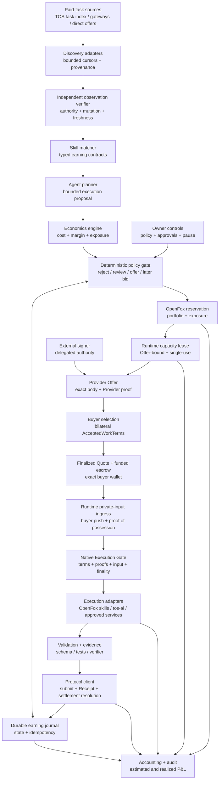

# OpenFox Autonomous Earning — Implementation Plan

## Status

- Document type: design proposal and implementation plan
- Status: proposed, non-normative
- Target repository: `tosnetwork/openfox`
- Protocol: `tos_service_v1`
- Source baseline: OpenFox PR
  [#13](https://github.com/tosnetwork/openfox/pull/13), commit
  `d4d5e165831ace2e1e01e04f9fc17e90853814ef`
- Source status: open draft and documentation-only at the pinned commit
- Specification baseline: `tos-service-spec`
  `2da8064ceafbbe72c50400d18f4aa4dbd76ef7aa`
- Scope: an owner-controlled agent that discovers paid work, competes for it,
  executes it with approved skills, settles payment, and operates continuously
  under bounded economic policy

This document incorporates the complete OpenFox-local design proposed in PR
#13 and adapts it to the current TOS Service Protocol authority model. It turns
OpenFox's autonomous-earning product promise into a concrete application-layer
implementation plan by auditing the OpenFox baseline and defining the
remaining OpenFox work.

This plan does not freeze a wire schema, open an expansion gate, or claim that
autonomous earning is implemented or accepted. The repository audit is pinned
to the source baseline above and must be revalidated against the OpenFox commit
selected for implementation. Where this plan conflicts with a normative
protocol specification, finalized TOS state, or a later reviewed safety
requirement, the authoritative source wins.

Related specifications and plans:

- [`OPENFOX_AUTONOMOUS_EARNING_CROSS_REPOSITORY_DESIGN.md`](OPENFOX_AUTONOMOUS_EARNING_CROSS_REPOSITORY_DESIGN.md)
- [`AGENT_PAID_DEMAND_DISCOVERY_V1.md`](AGENT_PAID_DEMAND_DISCOVERY_V1.md)
- [`ARCHITECTURE.md`](ARCHITECTURE.md)
- [`SETTLEMENT.md`](SETTLEMENT.md)
- [`NATIVE_EXECUTION_GATE_V1.md`](NATIVE_EXECUTION_GATE_V1.md)
- [`SOFTWARE_WORK_EXECUTION_V1.md`](SOFTWARE_WORK_EXECUTION_V1.md)
- [`AGENT_ECONOMY_METRICS_V1.md`](AGENT_ECONOMY_METRICS_V1.md)
- [`ROADMAP.md`](ROADMAP.md)

**Blocking status:** a bounded read-only scout may proceed only after its
minimal discovery schema is frozen. Provider Offer acceptance, paid execution,
and automatic commercial action remain blocked until the bilateral typed
accepted-work construction, portable historical authority proofs,
acceptance-time revocation ordering, single acceptance, deterministic
Quote/escrow derivation, extended Native Execution Gate, and proof-of-
possession private-input delivery are frozen, implemented, and independently
verified.

## Executive Summary

At the pinned PR #13 source baseline, OpenFox did not implement the complete
loop described in its project README:

```text
discover signed paid demand
  -> verify the observed mutation, authority, terms, and freshness
  -> estimate profit and risk
  -> reserve local exposure and runtime capacity
  -> prepare a fixed-price Provider Offer or later competitive bid
  -> buyer selection and bilateral accepted-work authorization
  -> finalized buyer-wallet Quote and funded escrow
  -> buyer-push private input and Native Execution Gate
  -> execute with approved skills
  -> validate and submit the result
  -> observe settlement
  -> reconcile realized profit
  -> repeat
```

The audited OpenFox repository contained credible foundations for parts of
this loop:

- `pkg/opportunity` periodically discovers and verifies TOS service
  capabilities and can advance policy-gated purchases.
- `pkg/servicebridge` implements buyer and provider projections for Quote,
  escrow, task execution, Receipt, and settlement flows.
- `pkg/servicebridge/nativeimpl` contains compilable native buyer, provider,
  purchase, and opportunity-coordinator commands.
- `pkg/actionauth` provides a narrow authorization seam for spend, key use,
  tool calls, configuration changes, and other side effects.
- the agent runtime provides skills, tools, routing, scheduled work, durable
  sessions, event provenance, isolation, and self-evolution infrastructure.

However, at that baseline these foundations did not form an autonomous earning
product. The opportunity service was buyer-oriented: it discovered
Capabilities that OpenFox could purchase. The provider service was
seller-oriented but passive: it waited for a funded task and exposed one
fixed, bounded Go-testing contract. No production control plane discovered
paid demand, matched it to approved skills, computed conservative profit,
prepared Provider Offers or later competitive bids, dispatched execution,
submitted results, and maintained a realized P&L ledger.

Deploying the source-baseline binaries was therefore sufficient to operate a
narrow, passive paid Go-testing provider, but not to deliver the autonomous
earning promise. The implementation phase must re-audit current OpenFox before
classifying each remaining item as deployment work or product development.

## Goal

Build OpenFox into:

> An owner-controlled agent that continuously finds diverse profitable tasks,
> competes for work, executes accepted tasks through approved skills and
> capacity, proves delivery, receives payment, and keeps operating without
> exceeding deterministic safety, budget, or authority limits.

"Autonomous" means that the owner may delegate bounded decisions in advance.
It does not mean that OpenFox owns the wallet, can expand its own authority, or
may optimize profit ahead of safety, law, privacy, or explicit owner policy.

## Source-Baseline Audit

The statements in this section describe the pinned PR #13 baseline. Source
presence or a later merge is not acceptance evidence; each implementation
phase must record the exact OpenFox commit and independently verified behavior.

### What existed at the source baseline

| Area | Existing implementation | What it proves |
|---|---|---|
| Capability discovery | `pkg/opportunity`, `pkg/gateway/opportunity.go`, and `tos-service-opportunity-coordinator` | OpenFox can perform bounded recurring searches and independently verify finalized capability identity. |
| Policy-gated purchasing | `pkg/opportunity.Service.advancePurchase` and the native purchase coordinator | OpenFox can mirror a crash-safe buyer flow without holding custody in the AgentLoop process. |
| Provider execution | `pkg/servicebridge.Provider` and `tos-service-provider` | A funded task can pass an execution gate, run once in a bounded executor, produce a Receipt, release escrow, and reconcile provider credit. |
| Authorization | `pkg/actionauth` | Sensitive effects can be separated from model planning and committed with retry-stable idempotency keys. |
| Agent execution | `pkg/agent`, skills, tools, isolation, and turn profiles | OpenFox can plan and invoke bounded local capabilities. |
| Scheduling and durability | cron, heartbeat, JSONL/SQLite stores, runtime events, and journals | Long-running background workflows and restart-safe records are established patterns in the repository. |
| Learning | `pkg/evolution` | Completed work can produce learning records and reviewable skill drafts. |

### What deployment of the source baseline could enable

With production configuration, a registered Agent identity, TOS RPC quorum,
`tosctl` custody, TLS, containerd, published endpoints, and a compatible
market, that provider could sell its fixed software-work Capability. It could
receive a funded task, execute `go test ./... -count=1` in its pinned runtime,
and reconcile settlement.

That is a valuable vertical slice, but it is passive and specialized. It does
not search for buyers or arbitrary paid tasks.

### What remains a development gap

| Required behavior | Source-baseline gap |
|---|---|
| Discover paid demand | Current opportunity records describe provider capabilities to buy, not open tasks that pay OpenFox for completion. |
| Compete for work | No bid, claim, negotiation, reservation, or expiration control plane exists in AgentLoop. |
| Match work to skills | Markdown skills are prompt context, not typed, owner-approved commercial capability contracts. |
| Estimate profit | No deterministic cost model combines payout, success probability, compute, model/API/tool cost, fees, dispute reserve, and opportunity cost. |
| Enforce earning policy | Existing authorization primitives do not yet express task-category, minimum-margin, exposure, counterparty, or portfolio constraints. |
| Execute diverse work | The source-baseline provider command pinned one image, toolchain, manifest, and Go-test operation. |
| Validate and submit | There is no general result-validation/evidence pipeline selected by an earning skill contract. |
| Account for the business | No double-entry-style economic journal reconciles estimates, reservations, accrued costs, payouts, refunds, disputes, and realized net income. |
| Operate a portfolio | There is no capacity allocator, maximum unresolved exposure, loss circuit breaker, or profitability-aware queue. |
| Improve safely | Evolution output is not connected to verified economic outcomes, and automatic skill application must not expand live earning authority. |

## Architectural Decisions

### 1. Keep buying and earning separate

The `pkg/opportunity` package should retain its buyer-facing
meaning. A verified service capability is something OpenFox may purchase; a
verified paid task is work OpenFox may perform for revenue. These objects have
opposite cash-flow directions and different authority rules.

Introduce a new `pkg/earning` control plane and top-level `earning`
configuration. Shared protocol identity types may be factored only when their
semantics are exactly identical. Do not reuse a purchase record as an earning
task record.

### 2. Keep the model outside the authority boundary

The LLM may classify a task, propose a plan, estimate uncertain work, and
explain a recommendation. Deterministic code must independently enforce:

- task and counterparty allowlists;
- skill and executor compatibility;
- price, cost, margin, loss, exposure, and concurrency limits;
- exact deadlines, finality, escrow, bid, and settlement terms;
- approval requirements;
- tool and network permissions;
- idempotency and state transitions.

Model output never directly signs, bids, claims, spends, submits, changes
policy, installs a skill, or selects credentials.

### 3. Use external, policy-enforced signing

OpenFox must not receive an unrestricted owner key. Provider Offer, later bid,
accepted-work, result-submission, Receipt, and settlement actions must use
purpose-limited custody such as a hardened `tosctl` or equivalent signer
boundary. A TOS Messenger exchange may transport an approval or signed object;
it is not custody or signing authority unless a separately specified and
reviewed signer implementation enforces that role. Finalized delegation limits,
portable historical authority, current authorization eligibility, local policy,
and acceptance-time revocation ordering must all authorize the exact action.

### 4. Treat all market content as hostile

Task titles, descriptions, attachments, schemas, counterparty messages,
catalog fields, model output, and tool output are untrusted data. They cannot
select tools, network destinations, credentials, runtimes, plugins, MCP
servers, models, or skill revisions.

### 5. Make every economic action durable and idempotent

Every externally visible transition receives a stable key derived from the
verified task identity, exact terms, action kind, and attempt generation. A
restart, duplicate event, indexer replay, RPC ambiguity, or model retry must
not create a second Offer, later bid, acceptance, execution, submission, or
payment action.

### 6. Consume the canonical paid-demand profile

OpenFox implements a local control plane; it does not define market authority.
The implementation must consume the artifact and verification rules in
[`AGENT_PAID_DEMAND_DISCOVERY_V1.md`](AGENT_PAID_DEMAND_DISCOVERY_V1.md),
including these boundaries:

- an off-chain observer can prove an observed Demand Mutation chain, source
  provenance, and freshness, but cannot prove that it has the globally latest
  or globally complete market state;
- V1 starts with one buyer-specific, single-use fixed-price Provider Offer, not
  a unilateral local claim that creates accepted work;
- OpenFox atomically reserves capacity before it authorizes or signs the Offer;
- the Provider and buyer separately authorize the same canonical
  `AcceptedWorkBody`, producing an acyclic Provider proof, Offer digest, buyer
  proof, and `AcceptedWorkTerms` construction;
- only the exact buyer-wallet transaction, finalized Quote and funded escrow
  convert the reservation into an accepted obligation;
- execution begins only after the extended Native Execution Gate reconstructs
  and verifies those exact terms and both authorization histories; and
- private input is buyer-pushed to the Provider-selected, Offer-bound ingress
  with proof of possession, never fetched from a task-selected target or with
  task-selected credentials.

No local database row, Selection Notice, Messenger acknowledgement, Gateway
response, model conclusion, or signature detached from its canonical proof
context may substitute for any of these facts.

## Repository Boundaries

| Repository or component | Responsibility |
|---|---|
| `tos-service-spec` | Normative schemas, authority invariants, bounds, public errors, state ownership, and frozen conformance vectors. |
| OpenFox | Discovery orchestration, skill matching, planning, economics, deterministic policy, durable local task projection, local portfolio/exposure reservation, execution coordination, accounting, and operator controls. |
| `tos-service-protocol` | Generated types, canonical codecs and digests, signature and finalized-state verification, released clients and provider SDKs, conformance helpers, and portable recovery. |
| `tos-service-gateway` | Replaceable bounded publication, discovery, lookup, search, cursor, provenance, and negotiation transport without canonical authority. |
| `tos-ai` and other vertical runtimes | Durable Offer-bound capacity leases, proof-of-possession private-input ingress and admission, bounded execution, resource metering, validation, and vertical evidence. |
| TOS chain and contracts | Authoritative identity, delegation, escrow, settlement, and finalized state. |
| Purpose-limited custody tooling | Policy-enforced signatures and broadcast; no model-facing raw key API. |
| TOS Messenger | Authenticated negotiation, direct delivery, and owner-approval transport where selected; no implicit custody or settlement authority. |

OpenFox should consume released protocol SDKs. Missing market messages and
authority rules must be specified and frozen in `tos-service-spec`, then
implemented by `tos-service-protocol`; they must not be improvised as private
OpenFox-only wire formats.

## Target Architecture



### Proposed package layout

```text
pkg/earning/
  types.go             # paid-task and exact economic domain types
  source.go            # bounded discovery adapter interface
  verifier.go          # authoritative verification interface
  matcher.go           # typed skill/capacity compatibility
  economics.go         # fixed-precision conservative estimates
  policy.go            # deterministic decisions and limits
  state.go             # transition rules and idempotency
  store.go             # durable bounded journal
  coordinator.go       # orchestration, no custody
  accounting.go        # estimates, reservations, accruals, realized P&L
  events.go             # redacted runtime events and metrics

pkg/earning/adapters/
  tos_tasks.go          # released TOS paid-task discovery/protocol client
  direct_offer.go       # authenticated direct offers, if standardized
  static.go             # deterministic fixtures for tests and demos

pkg/earning/execution/
  agent_skill.go        # restricted AgentLoop execution
  tos_ai.go             # bounded terminal reservation/invocation
  service.go            # approved external service dependency

cmd/openfox/internal/earning/
  command.go            # inspect, pause, resume, reconcile, and explain
```

The first implementation may keep adapters directly under `pkg/earning` if
there is only one production source. Package boundaries should follow actual
interfaces, not this diagram mechanically.

## Domain Model

### Verified paid-demand observation

A candidate eligible for scoring must contain or resolve to the exact immutable
Demand Mutation bytes observed from one or more bounded sources. A verified
observation proves the named mutation, authorization history, provenance, and
freshness checks that were actually performed; it does not prove a globally
complete market head or that no unseen successor, withdrawal, or fork exists.
It records at least:

- network domain and portable finalized authority references;
- stable demand identity, mutation sequence and digest, every observed source,
  source cursor, provenance, freshness bound, and fork evidence;
- buyer or requester Agent identity;
- task category and exact input commitment;
- required output schema and validation/evidence profile;
- fixed-price terms, exact TOS-network stablecoin identity, atomic amount, and
  separate native TOS fee responsibility;
- proposed escrow, accepted-work, private-input, and dispute/refund terms;
- Offer acceptance, input, execution, submission, and settlement deadlines;
- confidentiality, retention, region, and permitted-egress constraints;
- cancellation, rejection, partial-completion, and refund behavior.

Display text and marketplace ranking remain advisory. They are never copied
into an authorization object. Escrow funding and accepted work do not exist at
discovery time; they are established only by the later bilateral authorization
and finalized buyer-wallet Quote/escrow flow.

### Earning skill contract

As a proposed OpenFox-local implementation detail, an earning-capable skill
should have an owner-approved manifest adjacent to `SKILL.md`, for example
`EARNING.json`. This is not a protocol artifact. Its exact schema should be
versioned before implementation. It should declare:

- stable skill name and revision digest;
- accepted task categories and I/O schemas;
- approved execution adapter and runtime profile;
- maximum runtime, CPU, memory, disk, model tokens, API cost, and egress;
- allowlisted tools and network destinations;
- validator and evidence requirements;
- minimum payment and margin policy overrides;
- permitted data classes and retention behavior;
- retry, cancellation, and failure semantics;
- approval provenance and expiry.

The manifest grants no authority by itself. Runtime policy may narrow it but
cannot widen it. A remote task cannot create or edit this manifest.

## Durable Task State Machine

This is a local, non-authoritative projection. It never creates a Demand,
Provider Offer, Accepted Quote, execution right, Receipt, or settlement fact.

```text
DISCOVERED
  -> OBSERVATION_VERIFIED
  -> MATCHED
  -> SCORED
  -> POLICY_REVIEW
  -> PORTFOLIO_RESERVED
  -> RUNTIME_CAPACITY_RESERVED
  -> OFFER_PREPARED
  -> OFFER_AUTHORIZED
  -> OFFER_SENT
  -> SELECTION_OBSERVED
  -> ACCEPTANCE_RESOLVING
  -> ACCEPTED
  -> INPUT_DELIVERING
  -> INPUT_READY
  -> EXECUTING
  -> VALIDATING
  -> SUBMITTING
  -> SUBMITTED
  -> SETTLING
  -> SETTLED

Any permitted non-terminal state
  -> REJECTED | EXPIRED | WITHDRAWN | CANCELLED | FAILED | AMBIGUOUS

Any accepted or later state
  -> REFUNDED | DISPUTED
```

Later competitive bidding may introduce typed `BID_PREPARED` and `BID_SENT`
states only after its protocol profile is frozen. A future unilateral claim
mode must define the same accepted-work and single-acceptance guarantees before
it can enter this production state machine.

Requirements:

- transitions are append-first and crash-safe;
- every action records the exact verified inputs and policy revision;
- terminal states cannot silently reopen;
- each Demand Mutation has a new immutable sequence and digest under the stable
  demand identity; accepted work remains bound to one exact mutation, while an
  incompatible fork is quarantined rather than silently replacing it;
- OpenFox atomically reserves local portfolio exposure, and the selected
  runtime or terminal durably grants an Offer-bound capacity lease before
  Offer signing. Both are converted to an obligation only after the unique
  Quote and funded escrow are finalized, and safely released only after
  deterministic acceptance resolution or expiry;
- if those reservations cannot share one transaction, the coordinator uses an
  append-first idempotent saga: reserve locally, acquire and query the runtime
  lease, sign only after both are confirmed, and compensate only after any
  ambiguous lease or acceptance state has been resolved. Failure or ambiguity
  cannot fall back to signing without a runtime lease;
- authoritative state is re-read before Offer authorization, acceptance
  conversion, private-input admission, execution dispatch, submission, and
  every settlement-sensitive action;
- bounded reconciliation resumes ambiguous actions instead of repeating them;
- acceptance stores the canonical `AcceptedWorkBody`, Provider proof, buyer
  proof, unique Quote commitment, escrow address, and finalized checkpoints;
- records, attachments, evidence, and unresolved exposure have explicit size,
  count, and retention bounds.

## Discovery and Verification

Separate bounded source observation from independent verification:

```go
type TaskSource interface {
    Discover(ctx context.Context, cursor Cursor, limit uint32) (ObservationBatch, error)
}

type DemandVerifier interface {
    Verify(ctx context.Context, observations []DemandObservation) (VerifiedDemandObservation, error)
}
```

The concrete TOS adapter should support provenance-preserving discovery of paid
demand. Search Gateways, indexes, channels, and direct peers return
observations or hints only. The independent verifier checks exact bytes,
digests, mutation-chain integrity, historical signing/delegation authority,
current buyer-Agent authorization eligibility, deadlines, source freshness,
and observed forks or withdrawals before scoring. It must never turn bounded
source coverage into a claim of global latest-state completeness or global
availability.

Discovery must be bounded by source, query, page size, cycle count, wall-clock
time, retained candidates, and cursor history. A source that cannot preserve
stable identity and exact bytes is display-only and cannot feed automatic
commercial action.

## Matching and Planning

Matching happens in two stages:

1. A deterministic matcher rejects tasks whose schemas, data policy, evidence,
   runtime, tools, deadlines, or resources are incompatible with every approved
   earning skill.
2. The model may propose a plan only from the compatible skill's declared
   tools and execution adapters. Deterministic validation checks the resulting
   plan before it can be scored or dispatched.

The plan should include bounded work units, predicted usage, validation steps,
external dependencies, cancellation points, and a maximum cost envelope. It
must not contain free-form authority such as "use any available tool."

## Economics Engine

All monetary values use exact asset identity and integer atomic units. Floating
point is forbidden for policy or accounting. V1 uses one owner-approved
TOS-network stablecoin for service payment and accounts for native TOS network
fees separately. Later cross-asset conversion may use only owner-approved,
time-bounded inputs recorded as non-canonical risk data; different assets are
never silently added.

For each compatible plan, calculate both a conservative expected value and a
worst-case exposure:

```text
expected revenue
  = payment_atomic
    * lower_bound(success_probability)
    * lower_bound(acceptance_probability)
    * lower_bound(settlement_probability)

expected net value
  = expected revenue
    - local compute and energy cost
    - model, API, tool, and subcontractor cost
    - network, bid, and settlement fees
    - expected retry and failure cost
    - dispute and refund reserve
    - capacity opportunity cost

worst-case exposure
  = committed external spend
    + non-refundable execution cost
    + locked capital
    + dispute reserve
```

Every estimate records its source, timestamp, confidence class, and expiry.
Unknown material costs fail closed or require approval. Marketplace scores,
self-reported reputation, and LLM estimates cannot silently become trusted
prices or probabilities.

Initial probability estimates should use conservative static policy. Historical
calibration may be introduced only after enough verified outcomes exist, with
minimum sample sizes, bounded updates, holdout evaluation, and rollback.

## Policy Decisions

The policy engine returns one of:

- `reject`: incompatible or outside policy;
- `recommend`: show the owner a read-only opportunity;
- `approval-required`: prepare an exact intent for one-shot approval;
- `auto-offer`: reserve capacity and authorize one exact buyer-specific,
  single-use fixed-price Provider Offer within a delegated mandate;
- `auto-bid`: submit a bounded typed competitive bid only after that later
  protocol profile is frozen; and
- `auto-claim`: disabled in V1 and available only if a future frozen profile
  defines unilateral claim semantics with equivalent bilateral accepted-work,
  single-acceptance, and recovery guarantees.

Policy must support:

- allowed task categories, skills, sources, buyers, assets, regions, and data
  classes;
- minimum payment, expected margin, confidence, and deadline slack;
- per-task and rolling cost, loss, and revenue-at-risk limits;
- maximum locked capital and unresolved settlement/dispute exposure;
- concurrency and capacity reservations by skill and terminal;
- maximum bid count, bid revisions, retries, and counterparty concentration;
- required validation, evidence, finality, and reputation trust tier;
- approval thresholds and quiet hours;
- global pause, source pause, skill pause, and loss circuit breakers.

The local decision record commits the verified observation, plan digest,
estimate digest, policy and mandate revisions, exact requested action,
reservation identity, and idempotency key. It is audit evidence, not market or
settlement authority.

## Provider Offers, Later Bidding, and Negotiation

Implement the buyer-specific, single-use fixed-price Provider Offer before
competitive bidding. It has fewer mutable terms and a smaller recovery surface.
A local `claim` or Selection Notice does not create accepted work.

Before signing, OpenFox atomically reserves local portfolio exposure and the
selected runtime or terminal durably grants the exact Offer-bound capacity
lease for the Offer identity, resource profile, expiry, and
`max_acceptances = 1`. A shared runtime lease is authoritative for its own
capacity and prevents oversubscription by another coordinator; an OpenFox
journal alone cannot do so. If the two reservations cannot be atomic, the
idempotent saga and ambiguity-resolution rules in the state machine fail
closed before signing. The Offer commits the active Demand Mutation, buyer
Agent and settlement wallet, provider Agent and Capability version,
input/source, output, validator, evidence, execution, private-input, exact
asset/amount, deadlines, dispute and refund terms, plus the complete
deterministic accepted-work template. It also names one purpose-limited
Provider key, proof profile, authority reference, validity bounds, and owner
mandate.

The Provider signs the canonical `AcceptedWorkBody` digest in its fixed proof
context; the full Offer digest is derived afterward and cannot appear in its
own preimage. A selected buyer separately signs the same body digest in the
fixed buyer proof context. Only the resulting typed `AcceptedWorkTerms`, exact
buyer-wallet transaction, finalized Quote, and funded deterministic escrow
convert the reservation into an accepted obligation. Alternate keys, proof
paths, signature wrappers, nonces, wallets, or commercial terms conflict.

Competitive bidding requires protocol support for typed, expiring offers. A
bid must commit to exact Demand Mutation, price, asset, deliverable, evidence,
deadlines, skill/runtime revision, and cancellation terms. The model may
recommend a price inside a deterministic interval; it cannot choose an
unbounded amount or alter non-price terms.

Do not implement open-ended natural-language negotiation in the production
path. If a protocol adapter lacks canonical Offer/bid messages,
single-acceptance, bilateral authorization, deterministic Quote/escrow, query,
and replay semantics, it remains observe-only.

## Execution and Validation

Finalized, funded accepted work is dispatched through an approved execution
adapter only after the extended Native Execution Gate reconstructs and checks
the exact `AcceptedWorkTerms`, both authority proofs and revocation ordering,
buyer-wallet acceptance, escrow, input/source commitments, execution signer,
deadlines, and one-time execution identity:

- restricted AgentLoop turn using a task-specific turn profile;
- owner-operated `tos-ai` terminal capability;
- pinned `servicebridge` software-work runner;
- explicitly approved external service capability.

Private bytes arrive only through buyer push to the Provider-selected,
Offer-bound proof-of-possession ingress operated by the selected runtime or
capacity owner. OpenFox verifies the bound admission receipt but does not
replace the runtime's capacity or ingress authority with local state. The
Provider never follows a task-selected URL, redirect, repository, host, object
store, proxy, or credential. Challenge consumption and immutable input
admission are one atomic durable operation, and replay or concurrent
replacement fails closed.

The coordinator passes only schema-validated inputs and content-addressed
artifacts already bound by finalized terms. Execution receives no signer,
owner key, policy mutation API, market discovery credential, upload secret, or
ability to select a runtime, tool, model, credential, or network destination.

Each earning skill selects deterministic validation where possible: schema
validation, unit tests, reproducible builds, checksums, static analyzers,
verifier signatures, or bounded independent evaluation. Model review alone is
not sufficient evidence for payment-bearing submission unless the task profile
explicitly permits it and policy requires approval.

Submission records the result commitment, evidence commitment, exact Demand,
Provider Offer, accepted-work, Quote, escrow and execution identities,
executor revision, costs accrued, and a retry-stable submission key. Large
artifacts stay in bounded content-addressed storage rather than the AgentLoop
transcript.

## Settlement and Accounting

Settlement state comes from the released protocol client and finalized chain
reads. Revenue is realized only after the exact provider wallet is credited in
finalized TOS state and the credit reconciles to the accepted-work, escrow and
Receipt identities. An indexer, Gateway, Messenger, model, or local task state
cannot declare revenue realized.

The accounting journal should record immutable entries for:

- estimated revenue and cost;
- reserved capacity and locked capital;
- bid and protocol fees;
- model/API/tool/subcontractor usage;
- accrued local execution cost;
- submitted receivables;
- released payment, refund, dispute, and write-off;
- realized gross revenue, cost, and net income by task, skill, source, buyer,
  asset, and time window.

Reconciliation compares the local journal with finalized protocol and wallet
state. Differences pause new economic actions above a configured threshold.

Owner-facing reporting must distinguish:

- offered payment;
- expected profit;
- submitted but unsettled revenue;
- finalized gross revenue;
- realized cost;
- realized net income;
- locked capital and unresolved exposure.

## Continuous Operation and Learning

The service should run as a bounded scheduler with separate queues for
discovery, verification, decisions, execution, submission, and reconciliation.
Backpressure in a later stage must reduce earlier admission rather than create
unbounded goroutines or records.

Economic learning consumes only finalized outcomes and metered costs. It may
recommend changes to estimates, skill manifests, or policy, but production
authority changes require owner review. `pkg/evolution` may receive redacted
outcome records for draft generation; `evolution.mode=apply` must not modify an
earning skill manifest, economic policy, signer mandate, or tool permissions.

## Configuration Sketch

The final schema should be introduced with normal OpenFox config migration and
validation. A possible shape is:

```json
{
  "earning": {
    "mode": "observe",
    "admission": "accepting",
    "network_environment": "testnet",
    "state_dir": "/var/lib/openfox/earning",
    "sources": ["tos-tasks"],
    "allowed_skills": ["go-test"],
    "discovery_interval_minutes": 15,
    "max_candidates_per_cycle": 100,
    "max_active_tasks": 2,
    "max_unsettled_tasks": 4,
    "policy_file": "/etc/openfox/earning-policy.json",
    "custody_profile": "owner-purpose-limited",
    "signer_socket": "/run/openfox-custody/signer.sock",
    "mandate_id": "mandate_owner_approved",
    "approval_mode": "required"
  }
}
```

Authority modes progress monotonically:

| Mode | Behavior |
|---|---|
| `off` | No polling or commercial action. |
| `observe` | Discover, verify, match, estimate, and report; no Offer, bid, execution, or signature. |
| `recommend` | Prepare an unsigned canonical Offer or later-bid intent for owner approval; make no custody or signature call and create no replayable market object. |
| `policy-gated` | Permit delegated production actions only under exact policy, mandate, reservation, and approval thresholds. |

`drain` is a separate admission state, not a higher authority mode. It accepts
no new work and may finish or safely unwind only obligations already accepted
under the current authority ceiling. Entering `drain` from `off`, `observe`, or
`recommend` grants no signing or execution power.

There is no unrestricted mode. Testnet versus production is a separately
validated network and asset environment, not an authority mode. The default is
`off`; increasing authority requires explicit owner action and cannot happen as
a side effect of learning, draining, or remote content.

## Operator Interface

Add read-only inspection before mutation commands:

```text
openfox earning status
openfox earning opportunities
openfox earning show <task-id>
openfox earning explain <decision-id>
openfox earning ledger
openfox earning reconcile
```

Mutating controls require local operator authorization:

```text
openfox earning pause
openfox earning resume
openfox earning reject <task-id>
openfox earning approve <decision-id>
```

The Web UI may expose the same bounded API later. It must never display offered
payment as earned revenue or estimated profit as realized profit.

## Observability

Emit redacted runtime events for:

- discovery cycles and source failures;
- verification results and finality;
- match rejection reasons;
- estimate inputs and confidence classes;
- policy decisions and approvals;
- Offer, later bid, acceptance, private-input, execution, validation, and
  submission transitions;
- settlement reconciliation;
- circuit breakers and pauses.

Metrics should include bounded queue depth, candidates processed, acceptance
rate, execution success, validation failure, settlement latency, unresolved
exposure, estimate error, gross revenue, realized cost, and realized net income.
Raw task data, secrets, prompts, private artifacts, and signer material must not
enter logs or metric labels.

## Delivery Plan

### Phase 0: contracts and truth in product status

- Define versioned `VerifiedDemandObservation`, earning policy, earning skill
  manifest, decision record, accounting entry, and adapter interfaces.
- Freeze required Demand Mutation, Provider Offer, bilateral accepted-work,
  selection, private-input, result, dispute, cursor, and recovery semantics in
  `tos-service-spec`; implement only released schemas and vectors through
  `tos-service-protocol`.
- Keep README claims clearly marked as the target until the acceptance criteria
  in this document are met.
- Add deterministic fixtures and conformance vectors before network adapters.

Exit criterion: the trust boundary, cash-flow direction, state identities, and
authority for every transition are unambiguous.

### Phase 1: read-only observer

- Implement `pkg/earning` types, store, source bounds, verifier, matcher,
  economics engine, and read-only policy decisions.
- Add `EARNING.json` support without executing tasks.
- Add CLI inspection, explanations, accounting estimates, and runtime events.
- Start with static fixtures and one released read-only TOS task source.

Exit criterion: OpenFox can run for seven days, survive restarts and replay,
and produce bounded, reproducible recommendations without signatures or task
execution.

### Phase 2: policy-gated fixed-price testnet worker

- Implement one buyer-specific, single-use fixed-price Provider Offer only.
- Add purpose-limited custody, portable historical authorization proofs,
  current eligibility checks, acceptance-time revocation ordering, and exact
  action commitments.
- Reserve capacity before Offer signing; convert it only after bilateral
  accepted-work authorization and the unique funded Quote/escrow are finalized.
- Add Offer-bound buyer-push proof-of-possession private-input delivery.
- Dispatch one deterministic, allowlisted skill to a pinned executor.
- Validate, submit, and reconcile testnet settlement.
- Add global pause, per-source/skill pause, exposure limits, and loss circuit
  breakers.

Exit criterion: repeated crash, ambiguity, race, and replay tests prove one
Offer acceptance and at-most-once input admission, execution, submission, and
settlement behavior for a funded testnet task.

### Phase 3: bounded production vertical

- Complete security review and adversarial testing.
- Run one audited skill and task source with conservative owner limits.
- Add finalized accounting reconciliation and approval thresholds.
- Publish an operator runbook, backup/restore procedure, and incident process.

Exit criterion: a real low-value task produces independently verifiable
delivery, finalized provider credit, correct realized P&L, and a complete audit
trail without exposing owner custody.

### Phase 4: competitive bidding and multiple skills

- Add typed expiring bids after protocol support is released.
- Add calibrated estimates, capacity-aware scheduling, and counterparty
  concentration limits.
- Support multiple reviewed execution adapters and earning skills.
- Add dispute and cancellation workflows.

Exit criterion: policy remains deterministic under concurrent bids, tasks,
failures, disputes, and settlements, and the portfolio cannot exceed aggregate
exposure limits.

### Phase 5: safe continuous improvement

- Compare estimates with finalized outcomes and publish calibration reports.
- Generate reviewable skill/economic-model proposals from successful and failed
  work.
- Add canary revisions, rollback, and minimum-sample promotion rules.

Exit criterion: learning improves measured estimate accuracy or execution
quality without automatically expanding authority or weakening policy.

## Test Strategy

### Unit and property tests

- fixed-precision arithmetic, overflow, rounding, and asset mismatch;
- policy boundary values and deny-overrides-allow behavior;
- legal and illegal state transitions;
- stable idempotency keys and canonical encodings;
- bounded stores, queues, retries, cursors, and retention;
- matcher rejection and plan validation;
- accounting invariants and reconciliation.

### Adversarial tests

- prompt injection in every market-controlled field and attachment;
- forged gateway ranking, identity, escrow, reputation, and settlement state;
- unseen withdrawal, mutation fork, stale source, and mutation replacement
  after scoring, without any false global-head claim;
- fee, deadline, asset-decimal, and price manipulation;
- duplicate, reordered, delayed, and conflicting events;
- RPC disagreement, reorganization, ambiguous broadcast, and stale finality;
- signer refusal, timeout, crash, conflicting response, alternate delegated
  key, authorization path, signature encoding, proof wrapper, and revocation
  race;
- Provider Offer replay, concurrent double acceptance, Quote/escrow nonce or
  wallet substitution, and capacity-reservation races;
- private-upload bearer-only authorization, replay, concurrent overwrite,
  challenge substitution, redirect, decompression bomb, and buyer-selected
  egress;
- executor escape attempts, decompression bombs, oversized output, and egress
  attempts;
- model attempts to select tools, credentials, endpoints, or policy;
- accounting drift and loss-circuit-breaker activation.

### End-to-end tests

- discover through finalized settlement with a deterministic task;
- restart at every state transition;
- retry every external action and prove at-most-once effects;
- resolve ambiguous Offer send, acceptance, input upload, Receipt, and
  settlement outcomes before any retry or reservation release;
- owner approval, rejection, pause, revocation, and recovery;
- failed validation and disputed result;
- multi-task capacity pressure and bounded backpressure;
- long-running soak with no unbounded memory, disk, goroutine, or exposure
  growth.

## MVP Acceptance Criteria

The autonomous earning MVP is complete only when all of the following are
demonstrated on a supported TOS testnet:

1. OpenFox discovers the exact signed Demand Mutation through a provenance-
   preserving bounded source and retains all source observations used.
2. It independently verifies the observed mutation chain, historical signing
   and delegation authority, current authorization eligibility, terms,
   deadline, provenance, freshness, and forks without claiming a globally
   complete head.
3. It matches the demand to an owner-approved earning skill and rejects an
   incompatible task without model override.
4. It produces reproducible cost, exposure, and expected-margin calculations
   in checked atomic units for one approved stablecoin, with native TOS fees
   accounted separately.
5. Deterministic policy atomically reserves capacity and authorizes one exact,
   buyer-specific, single-use fixed-price Provider Offer under a purpose-
   limited mandate.
6. The Provider and buyer authorize the same canonical `AcceptedWorkBody`; the
   unique Quote and escrow are derived without circular or substitutable proof
   paths, funded by the exact buyer wallet, and observed finalized.
7. The buyer pushes the committed private input through the Offer-bound proof-
   of-possession ingress, which admits one immutable body without task-selected
   network targets or credentials.
8. The Native Execution Gate reconstructs the complete `AcceptedWorkTerms`,
   both authorization histories, finality, escrow and exact input before one
   pinned, sandboxed adapter executes once.
9. Output passes the skill's declared deterministic validation and evidence
   checks, and the result is submitted once against the exact Demand, Offer,
   Quote, escrow and execution identities.
10. Finalized settlement credits the exact provider wallet and reconciles with
    the append-only local accounting journal before revenue is realized.
11. Concurrent acceptance, restart, replay, ambiguity, withdrawal, revocation,
    failed validation, refund, and dispute tests do not duplicate an economic
    action or exceed aggregate exposure.
12. The operator can explain every decision and assumption, inspect P&L and
    unresolved exposure, pause or drain the system, revoke delegation, restart
    safely, and recover without hidden authority.

Until these criteria are met, OpenFox should describe autonomous earning as a
target architecture rather than a deployed capability.

## Non-Goals

- unrestricted wallet, owner-key, shell, plugin, MCP, or network access;
- accepting arbitrary customer-supplied executable code;
- speculative trading, token issuance, yield farming, or borrowing to fund
  operations;
- autonomous policy expansion or self-granted permissions;
- unbounded sub-agent creation or subcontracting;
- treating model confidence, discovery ranking, or reputation as payment
  authority;
- encoding protocol or settlement rules in prompts;
- claiming revenue before finalized reconciliation;
- guaranteeing profitability.

## Open Questions

1. Which released TOS Service Protocol version will implement the paid-demand
   mutation, Provider Offer, bilateral accepted-work, private-input, cursor,
   and recovery profiles, and what exact source-freshness guarantees will it
   expose?
2. Which initial task profile has deterministic validation and real buyer
   demand beyond the source-baseline Go-test provider?
3. Should earning skill manifests be signed standalone documents or committed
   by an owner-signed policy bundle?
4. Which costs can be authoritatively metered by the executor, and which require
   conservative configured ceilings?
5. What is the minimum evidence required for production settlement and dispute
   handling in the first vertical?
6. After the one-stablecoin MVP, which owner-approved, time-bounded price source
   and conservative haircut policy may inform cross-asset profitability without
   becoming protocol or settlement authority?
7. What retention and privacy rules apply to commercial task inputs, outputs,
   evidence, and accounting records?

The MVP should prefer one stable asset, one deterministic task profile, one
source, and one execution adapter until these questions are resolved.
